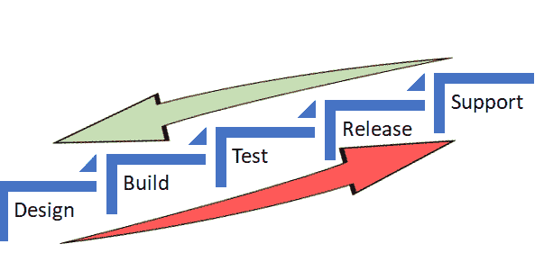

# ShiftLeft & DevOps:叙事中的叙事？

> 原文：<https://devops.com/shiftleft-devops-narrative-within-narrative/>

我推迟了观看《西部世界》第一季大结局的时间，只是因为我在一天后读到了多洛雷斯是如何结束这一集的！我不知道该怪谁:我的好奇心还是那个管不住自己的家伙。当你知道结局的时候，你会觉得有点乏味。

最后，我完成了对跨集的多重叙事的剔除，闪回叙事与当前的无缝融合。这让我想到用它来做类比，也许可以理解 **ShiftLeft** 的概念是否真的是# **DevOps** 的“叙事中的叙事”。

好的，那么什么是 ShiftLeft？

我在我最喜欢的资料来源,@[DevOps.com](https://devops.com)看到了这个术语，在那里[艾伦](https://devops.com/author/ashimmy/)写了关于向[左移](https://devops.com/shift-left-can-you-be-left-out/)的程度及其收益递减，以及另一篇[关于持续测试方法的非常老的文章](http://www.drdobbs.com/shift-left-testing/184404768)，它主要寻求尽早和经常地测试，以捕捉缺陷，是的，尽早！

然后，在识别可重复活动的背景下，它抛给了我，这些活动通常是由支持和运营团队执行的具有一致结果的手动活动，并且将工作**从级别 3 一直移动到级别 0。我会说，授权帮助台！**

在这两个场景中，潜在的目标是在周期的早期发现缺陷和/或减少生命支持活动(见下文),随着我们在食物链上的移动，这些活动的成本会越来越高，这反过来又会降低发布和后续维护的成本。

Alan 在同一篇文章中还提到了 IBM 的研究，修复一个最终的产品缺陷的成本几乎要高 100 倍，如果在实现阶段发现，成本要高 6 倍，如果在测试阶段发现，成本要高 15 倍。因此，“早期的识别和预防可以提高软件交付的可靠性”将成为一句口头禅。

现在，这篇文章的关键是，ShiftLeft 不是我们通过 DevOps 想要达到的目标吗？

DevOps 基本上创造了一种协作的、非孤立的文化变革，在游戏早期将开发和运营结合在一起。

投入一堆工具来促进 CI/CD，尽早引入安全人员，扩展自动化测试覆盖范围，包括变更和发布——谁是催化剂，正如我在我的早期文章[这里](https://devops.com/release-management-catalyst-devops/)中所称的这些功能——挤进一些监控工具和仪表板，瞧！您拥有一个完整的、非常成功的 DevOps 团队，可以反复端出最令人垂涎的优质软件盛宴。

两人桌(开发和运营)变成了六人桌！啊呀！！

因此，从 DevOps 的角度来看，我们不也是在做同样的事情吗，比如**shift left**(如果我可以创造这个词的话)从而带来成本效益，更有效率？

当我们作为一个团队进行短距离和频繁的冲刺时，我们会这样做；获得洞察力，不仅是关于如何更好或更精简地编码，而且通过向在他们日常监控和支持的基础设施上运行该软件的运营大师学习。或者尽早执行 VA 扫描，或者将场景作为单元测试而不是回归来推动，和/或对潜在的容量挑战进行标记。

所以，DevOps 团队不是已经将左移作为其章程的一部分了吗？

向左移动是有限制的，但是，如果您的组织仍然在瀑布下做线框，或者正在建立一个 DevOps 团队，那么这种方法可能是一种权宜之计，最终将一个叙述合并到一个新的叙述中。

但我的观点是，为什么要权宜之计，为什么不全面实施呢？为什么不接受 DevOps 模型，它预装了所有的左移可能性？

即使我们知道一集是如何结束的，拖延也会增加在快速交付高质量、高性价比产品的竞赛中落后的风险。

技术正在重新定义商业:交通是一个应用程序，很快可能会无人驾驶；在金融服务领域，银行正在更名为科技公司；冰箱可以重新订购牛奶；垃圾桶可以 Wi-Fi！啊，物联网。Alexa 在听吗？

我的其他相关岗位是[这里](https://www.linkedin.com/in/abdul-salaam-khurram-27222778/recent-activity/posts/)和[这里](https://devops.com/author/salaam-abdul/)。

谢谢你的时间。

阿卜杜勒·萨拉姆·胡拉姆