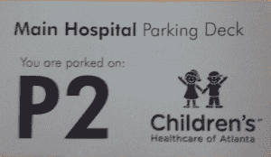
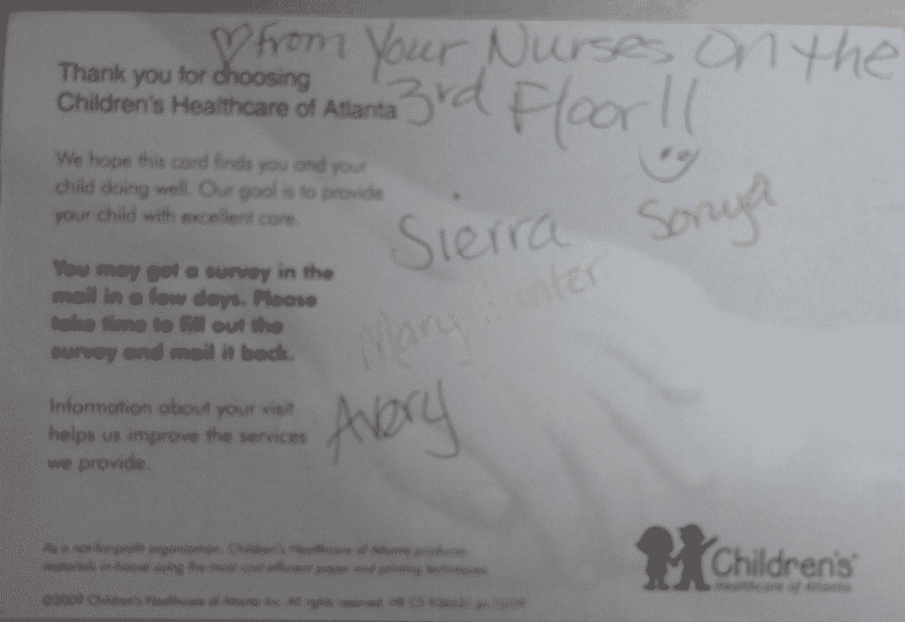
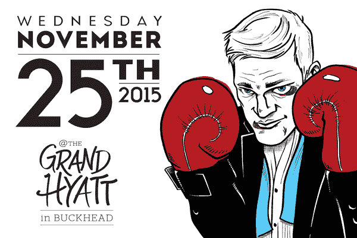

# 我报名参加了踢屁股比赛

> 原文：<https://devops.com/signed-ass-kicking/>

我想大多数人和我一样，如果能找到时间和精力，他们有很多想做的事情。最近，写作成了我的一件事。我想我们都有自己的优先权。参加科技活动和指导儿童足球队会让你看起来没有时间写作，然后一些合理的破坏性事情发生了，比如你的一个孩子进了医院。

我最近读了《与一群人一起设计交付》作为我们 devOps 读书俱乐部的创刊号。在《T2》一书中，Jeff Sussna 讨论了如何尽可能早、尽可能频繁地向客户提供优质体验。大多数人在一生中的某个时候都会因为旅行而筋疲力尽。书中的许多例子谈到了这种共同的经历。这让我们[能够理解](https://youtu.be/1Evwgu369Jw)许多航空公司和酒店客户在处理业务时试图应对的特定类型的痛苦。

设定期望的早期参与可以带来巨大的不同。通过提供现实的旅行时间，考虑到季节性道路施工等因素，航空公司更有可能让他们的客户准时到达，心情愉快。一个知道他们在处理时差问题的酒店，如果在酒吧没有饮料的话，当他们到达时，会很好地为他们提供新鲜的咖啡、水和水果。

如果没有倒时差，你可能会对旅行疲惫感同身受，但我怀疑你是否了解让你的一个孩子在紧急情况下住院会带来的疲惫和困惑，除非你去过那里。医院和酒店有很多共同点。医院并不总是拥有的一种奢侈是为病人和家属设定期望。在紧急情况下，在医院给你留下第一印象之前，你可以提前不到一个小时得到通知。当人们相当紧张和担忧时，你如何让他们感到舒适并帮助他们放松？

我的双胞胎在出生前就被诊断患有[双胞胎输血综合症](https://youtu.be/BLEiesgNCAc) (TTTS)。这种疾病需要在短时间内紧急前往罗德岛的妇婴医院。普罗维登斯距离亚特兰大有 16 个小时的车程。鉴于我还在上大学，我们住在麦当劳叔叔之家，这是为那些有生病的孩子在离家很远的医院的家庭准备的。

因为手臂骨折而去急诊室是一回事。不知道你的孩子是否或何时回家完全是另一回事。有些孩子被公交车接走去上学，有些父母去上班，而他们的其他家庭成员在医院或者在另一个城市的家里。我很感激我们的逗留时间很短，相对平静。妇婴医院是一家很棒的医院，麦当劳叔叔之家让我们有宾至如归的感觉。

从那以后，我的双胞胎在亚特兰大儿童保健中心一共被救过三次命。其中一个在出生后立即因心脏问题住院，并在 Egleston 做了球囊导管手术。两人都因呼吸问题在苏格兰仪式医院接受重症监护，其中包括过去 60 天内的一次访问。

一年多前，我和他们一起发起了 CookieOps，试图为这些组织筹集资金。我的女儿们说服了我，告诉我，“有些生病的孩子仍然不能回家和他们的兄弟姐妹一起玩，我们需要帮助他们”。最初的烘焙义卖变成了用 devOps 观点解决问题的模式。对我们来说，这意味着拥抱[三种方式](http://itrevolution.com/the-three-ways-principles-underpinning-devops/)并遵循 CALMS 模式(即 [CAMS](http://itrevolution.com/devops-culture-part-1/) 带一个“L”代表学习)。我们相信每个流程都有一个工件，并且都有优化它们的空间。正是这种类型的想法导致在枕头上放一颗薄荷糖，并理解所涉及的成本远远超过相关费用。往往是那些我们觉得令人愉快的小事让我们成为终身的忠实顾客。

比如在电梯附近留下卡片，帮助你记住你把车停在哪里，从甲板上进来找你的孩子。我曾经在医院停车场迷迷糊糊地四处寻找我的车。它们是大型建筑，通常有多层甲板。当你急着去查看更重要的事情时，很容易忘记你把车停在哪里了。

我女儿感觉好些后，收到护士寄来的明信片，真的很兴奋。我不确定写这些卡片花了多少时间，但我很感激。将医院的经验扩展到你在家的时候，一切恢复正常，这是值得庆祝的事情，也是值得付出的。

我已经为我的孩子调查了一些通过 cookieOps 筹集资金的方法，但是到目前为止，我们一直在分发 cookies 作为调查反馈。公布这些调查的数据是我想优先考虑的另一件事，但我没有时间去完成。当我们第一次开始进行调查时，为医院筹集资金一直是我们的首要目标，所以当机会出现时，我别无选择，只能尽可能高效地这样做。

[为一项事业而争吵](http://www.brawlforacause.com/)允许普通人通过步入拳击场参加他们的第一场业余拳击比赛来为他们所信仰的事业筹集资金。一个旅途劳顿的旅行者和一个有孩子住院的家庭之间的一个很大的区别是旅行者通常会被踢屁股。医院正在处理一些家庭的问题，这些家庭即使不去探望也会很好，孩子们肯定没有报名与他们的疾病作斗争。

因此，我很高兴在 11 月 25 日^日站在擂台上，为那些还不能回家的生病的孩子们而战，兑现我对我女儿们的承诺。我的对手正在拳击为他女儿的大学教育筹集资金。虽然我相信每个人都有受教育的权利，但我也相信他们需要活得足够长才能完成学业。通过像[卡恩学院](https://www.khanacademy.org/)这样的项目，你有机会将自己的教育掌握在自己手中。医院里的孩子们的生命掌握在看护他们的医生和护士手中。这些孩子并没有报名参加他们正在接受的屁股踢，但我愿意冒着挨打的风险，如果它能帮助孩子们成功地缓解一个家庭度过这样一个困难时期。

如果你在亚特兰大，我们将于 25 日在巴克海德的凯悦酒店举行拳击比赛。[现在开始售票](https://www.eventbrite.com/e/buckhead-brawl-tickets-18334245221)。无论你住在哪里，你都可以[捐赠](https://brawlforacause.fundly.com/brawl-3?ft_src=twtshare_donate#supporters/donors)来支持这些事业。我会接受，但我需要你今天捐款。

