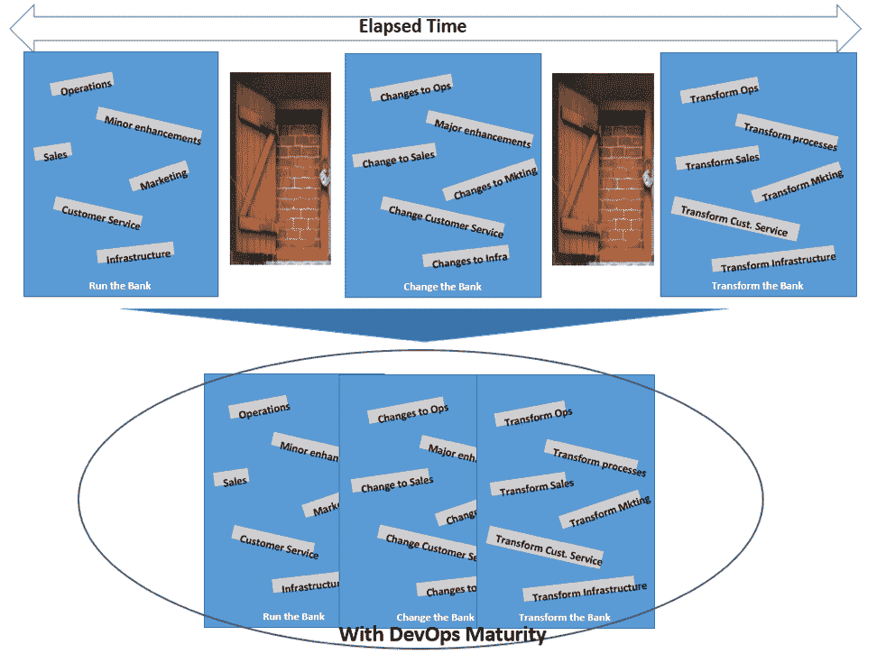

# 通过开发银行业务简化流程

> 原文：<https://devops.com/simplifying-through-devops-in-banking/>

互联网上有很多关于什么是 DevOps 以及 DevOps 的采用程度的资料。所以我们不会重复“什么”和“多远”相反，我们将重点关注银行组织简化和转型的前进道路和未来，以及 DevOps 在“经营银行(RTB)”、“改变银行(CTB)”和“转变银行(TTB)”这三个领域中可能扮演的角色

Figure 1: Change-Run-Transform Bank – POA with DevOps Maturity

在本文中，我们看一下我们认为开发运维驱动的财务组织简化在不久的将来会呈现什么样的形式，以及这种简化的一些机会。如图 1 所示，随着 DevOps 的成熟，CTB、RTB 和 TTB 各自为政的流程将会更加紧密，从而允许在一个地方执行共同的活动和流程。其他的将得到简化和自动化，从而大大减少从构思到生产和应用程序管理的周期时间。这不仅会在成本和时间方面带来好处，还会在功能对业务的可用性方面带来好处。

## 银行业焦点

在银行业，早期采用者正通过大量良好实践引领潮流，例如针对特定技术领域的标准化工具、流程编排、反馈回路设置、流程和技术合理化等。焦点需要继续保持不变。

我们认为，DevOps 架构师现在需要关注的**挑战**是能够使用 DevOps 来帮助金融机构通过简化之前被忽视的维护、运营和基础架构领域来降低非自由支出。这种 DevOps 驱动的简化的核心是需要将维护成本降至最低，从而将资金释放到“改变银行”和“改造银行”中的任意领域

虽然 DevOps 主导的转型的目标应该是“全自动化”和“零维护”，但这还有点遥远，因为实现这一目标所需的资金和工作的投资回报(ROI)需要证明这一点。我们看到关注点转移到通过应用程序或应用程序套件的转换为业务带来的价值。图 2 描述了 DevOps 领导的简化实践的核心可重复活动，同时记住这些改进周期需要在每个阶段建立反馈循环。

Figure 2: Repeatable activities for DevOps-led simplification

这就引出了我们的**下一个想法**，即支持 DevOps 的简化路线图需要用指标和衡量标准来铺设，并且这些指标不能随机选择。这些指标必须是实际可测量的，并分为业务指标和 IT 指标两个领域，正如我们在下面解释的那样，并且需要认真跟踪以帮助纠正过程。

例如，应用程序的**发布协调**流程非常复杂，需要大量的手动工作，具有严格的合规性要求和安全要求，由于部署周期缩短，现在需要更加频繁地执行，并且必须管理日益复杂的组件交互(上游和下游)。现在，发布协调也是整个 CI/CD 流程中非常重要的一步。因此，发布协调流程的标准化和简化意义重大。但是如何衡量成功和量化改进呢？

如前所述，在这个过程中，智能洞察(度量和测量)对于业务和技术团队成员都很重要，这样每个人都有一个关于当前状态和距离最终目标的距离的真实来源。这种自动化还有助于专注于 DevOps 采用的持续改进支柱，方法是记录所有重要的事情，为所有有帮助的事情提供逐帧数据。这些度量标准有助于分析成功和失败，从而推动持续改进的事业。

继续以发布流程编排为例，有许多重要的最佳实践有助于确保不会重复发明轮子。一些只有从业者才能让你了解的重要知识如下:

1.  需要脚本的工具将无法帮助您扩展和创建低维护的解决方案。
2.  您需要投资工具/流程编排解决方案，帮助您实现可视化，瞬间获得智能见解，并能够以各种形式和形状进行报告。
3.  工具也需要能够捕获和跟踪业务度量。
4.  您需要在组织级别的法规遵从性和安全性上花费精力。
5.  努力使你最费力和/或最冗长的过程自动化。

DevOps 成熟度等级的每一步都有许多这样的学习和最佳实践，必须在整个组织中共享。

## DevOps 与银行业:未来趋势预测

根据我们对金融机构的了解和认识，我们认为未来几年将会关注以下领域:

Figure 3: Trends in short-medium term in DevOps adoption

### 联邦内部的持续改进

*   技术团队将需要在工具集的联合边界内支持和鼓励本地化创新，这将及时使开发和运营工具集接近彼此的镜像。
*   对于联合，我们指的是一个详细的同质蓝图，它提供了灵活性，但在工具和过程的总体边界内，同时鼓励持续改进。
*   这还必须告知相关利益相关方哪些领域需要持续改进，对业务产生最大的进化影响，并适当使用指标来跟踪和奖励改进。

### 成果管理

*   我们还认为，DevOps 的采用需要由结果管理来推动，有证据表明影响占据了路线图管理的主导地位。
*   重点将放在结果管理的到达点(POA)和业务与 IT 指标的持续测量上。
*   我们也相信 DevOps 的文化-自动化-精益-测量-共享(CALMS)模型会找到更多的信徒。

### 影响的证据

*   度量和基于度量的过程校正将成为简化工作中的圣杯。指标收集需要关注业务和 IT 领域。度量和测量需要重新定义为:
    *   **交付或改进的商业价值的商业指标**，如推出的新产品/服务、转换率、净推介值(NPS)、客户保持率、CSAT、ESAT 等。
    *   **IT 衡量标准**用于价值改进和价值管理，如成本绩效指数、缺陷债务减少、变更准备时间缩短等。

### 设计思维

*   我们认为，这一领域的下一个大的颠覆者将是将设计思维融入其中，以确保开发运维主导的自动化更加以客户为中心和迭代。
*   我们认为关注整个组织的测试数据管理(TDM)是确保连续交付的重要一步。
*   我们认为，在基于风险的优先级和基于风险的测试用例设计、测试床分割、TDM 等流程的支持下，测试流程将经历彻底的反思。

### 知识管理、培训和治理

*   知识管理、培训和治理的工具和流程需要能够支持 DevOps 主导的简化。
*   这些过程需要系统的关注来创建和培养自学技术团队。
*   转变工作方式，使流程合理化，例如精益协作和改进工作包的移交。

### DevSecOps

*   在 DevOps 主导的简化过程中，安全性至关重要。所有自动化、云的采用、管道的创建、物联网的采用等等都引发了许多新的安全问题，从而导致了对 DevSecOps 的关注。
*   安全流程可能需要将它们的执行点在 CI/CD 管道中上移，并根据迭代大小和部署周期划分成不同的阶段。
*   重点左移应用安全和基于角色的安全。

## 结论

DevOps 将推动银行组织 IT 空间的下一波简化。为了寻找机会，开发运维的系统化方法将会有所帮助-忽视对现有空间的详细评估将是危险的，这些评估将详细说明当前状态、到达点简化状态、简化路线图以及转型的关键指导原则。

在 DevOps 中进行试点和概念验证不成问题；挑战在于所有领域的扩展:工具、培训和流程。关键是管理相同/相似工具集的水平和垂直分布，这也有助于提高与规模和标准化相关的效率。开发运维主导的简化将需要流程、技术和人员管理(文化)的变革。当前的角色结构可能需要拆除，以确保没有领地，跨职能团队处理开发-测试-运营的所有需求。最后，所有的变更都需要能够定义新的工作方式，以便将变更-运行-转换组织结合在一起。

*本文由塔塔咨询服务公司银行&保险技术集团负责人 **Babu Unnikrishnan 合著。***

-[安舒主席之手](https://devops.com/author/anshu-premchand/)