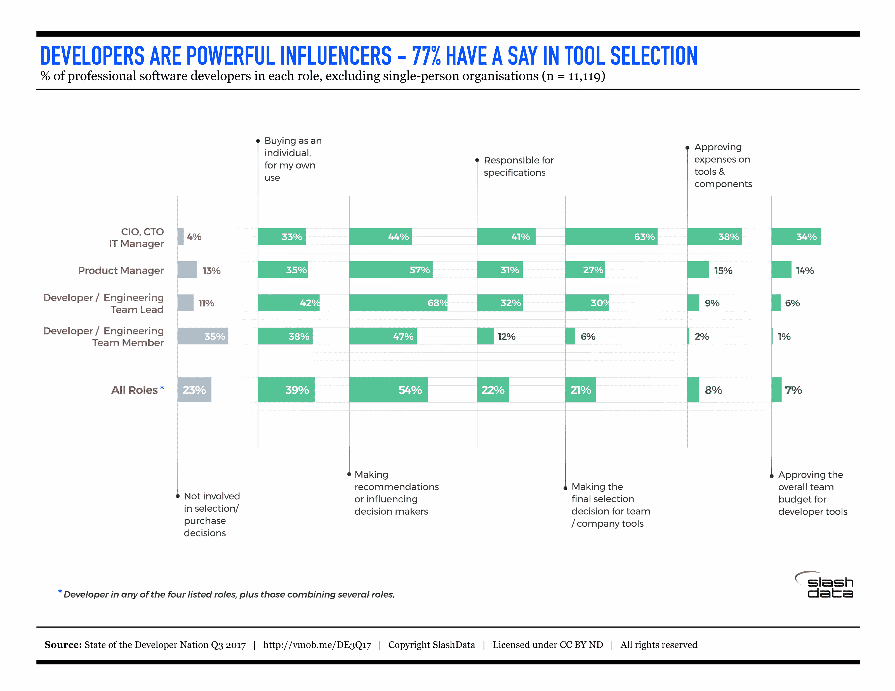

# SlashData 报告:开发者影响工具选择

> 原文：<https://devops.com/slashdata-report-developers-influence-tool-selection/>

SlashData 刚刚发布了其“[2017 年第三季度开发者国家报告](http://vmob.me/DE3Q17devops)”在 [Heavybit](http://Heavybit.com) 这个帮助开发者和基础设施初创公司将其产品推向市场的项目上，我们期待 SlashData 的报告，让我们能够及时了解开发者格局的变化。

2013 年，Stephen O'Grady 出版了《新的拥王者:开发者如何征服世界》(The New kingmarkers:How Developers converted The World)，这本书在生态系统中掀起了一股冲击波，讲述了个体开发者在公司技术采购决策中的重要性。

[SlashData](https://www.slashdata.co/) 提供了令人信服的数据来支持 O'Grady 的书，展示了开发人员在组织中的影响力，以及针对组织中的个人开发人员如何成为企业销售的可行策略。这项研究只包括购买工具或组件的组织中的专业开发人员，而不包括独狼——独自工作的开发人员，他们的购买决定完全是个人的。

主要报告亮点包括:

超过 87%的具有领导职能的开发人员，无论规模有多大，以及三分之二的一线编码人员，都以某种方式参与了购买决策。

对于没有处于最高领导位置的开发人员，一半到三分之二的人能够提出建议或影响决策。特别是团队领导(即高级开发人员)是很大的影响者(68%)。

39%的开发人员购买工具供个人使用。

开发人员选择和使用他们自己的工具的能力表明他们有能力做出自己的决定和预算(即使很少)。正是通过这种个人使用，一个工具可以被介绍给一个组织，这是向更大的开发人员社区传播该工具的第一步。

多达三分之一的中级开发人员领导(团队领导和产品经理)在编写工具规范时握着笔(分别为 32%和 31%)，甚至最终决定采用哪种工具(30%和 27%)。

这个事实更加证明了各个层次的开发人员都很重要。“即使在大多数情况下，开发人员仍然需要管理层批准购买，一个不合适的工具可以自上而下地推出，因为它似乎对 CFO 或高层有吸引力的日子已经过去了，”该报告指出。

当涉及到公司的技术决策时，开发者的影响力持续增长。为了驾驭这种转变，公司需要专注于创建开发人员会喜欢的工具，并在他们的组织内代表你进行宣传。

— [玛利亚·鲍尔斯](https://devops.com/author/mpowers/)