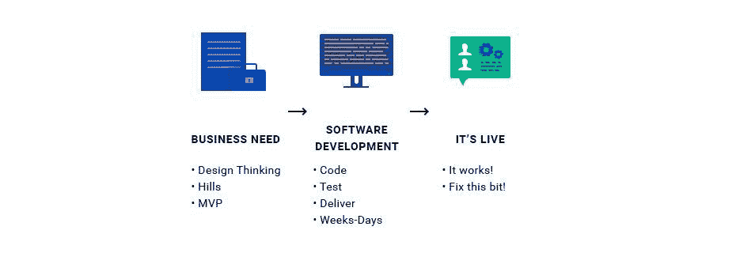
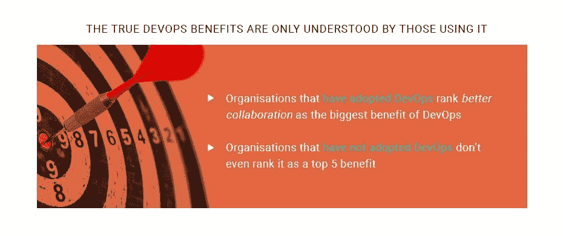

# 中小企业也可以从 DevOps 中受益

> 原文：<https://devops.com/smes-can-benefit-from-devops-too/>

DevOps 方法有几个明显的好处，其价值集中在几个关键的业务领域:提高市场灵活性，提高质量，改进合作文化和员工运营的有效性。通过在您的 SME 业务中推广和实施 DevOps 文化，开发和运营团队更加紧密地团结在一起，并且可以更好地共享中间知识。这让您可以更流畅地创建产品，并提高部署速度。评估商业理念、开发、测试和将成品转移到运营部门的时间大大减少。质量利润提高了，这反馈到你的团队不断微调你提供的产品的能力中。

只有当开发运维直接有助于公司提高效率、生产力，当然还有盈利能力时，企业才会明白采用开发运维的意义。对于中小型企业(SME)而言，实现这一目标的唯一途径是他们的 it 和 DevOps 团队同步工作，并简化解决业务需求的技术解决方案的提供。只有在您的组织内部成功、及时地采用 DevOps，才能帮助您的公司击败竞争对手，并在整个行业加速发展时保持活力。

在过去的几年里，我们已经看到了业务中应用交付的巨大转变。我们已经摆脱了基于单个项目及其持续维护的大规模系统实现的旧方式。中小型企业现在认为应用程序交付是一个持续的发展过程。DevOps 起着主导作用，因为这种软件工程趋势确保了这种重大转变是可能的。它将企业的所有不同部分聚集在一起:业务、开发和运营团队在不同的、更深入的层次上协作，目标是自动化流程。这有助于消除常见的限制，并消除上市时间问题。

[在关于在企业中采用 DevOps 的最新 ECS-Digital 研究](http://www.ecs-digital.co.uk/blog/7-devops-adoption-statistics-for-2017)中，57%的中小企业已经在日常工作中部分实施了 DevOps 实践。DevOps 对他们的主要好处是改善了部门间的协作。但是对于 43%还没有采用 DevOps 的人来说，协作问题是最不重要的。

## 高级开发运维生命周期分步指南

根据 IBM Cloud Director 的说法，相关 DevOps 实践的最终目标是减少开发时间并提高企业的效率。一个成长中的企业必须从公司的“业务需求”出发，并沿着这条路走下去，使它成为现实。在您的公司中采用 DevOps 的目标是更快更可靠地将您的业务需求投入生产。任何 DevOps 实践的目标都是减少时间并提高流程的效率。您需要从“业务需求”转移到“它是实时的！”舞台。

## 业务需求是 DevOps 的首要任务

但是你的生意一定要参与进来吗？当然，你的中小企业领导关注的是你公司的“业务需求”。但是，当我们看到已经实施了适当的 DevOps 实践的组织时，公司的内部结构转变为专注于在您的产品/服务提供的整个生命周期中交付出色的业务成果。

DevOps 还确保员工有能力在项目的整个生命周期内纠正他们的工作方向。事情和目标往往会发生变化，竞争对手可能会推出一些功能，这些功能可能会使项目的某些部分变得微不足道，所有这些都需要相应地调整您的项目。当您的业务需求与能够引导和推动这种目标一致性的开发和运营团队都很接近时，这很容易做到。

请看下面的信息图，它清楚地显示了 DevOps 交付周期的样子:

## 组织内部的冲突

衡量开发运维对业务至关重要的事情的影响至关重要。大多数中小企业都在试验 DevOps，公司内部也有人想阻止采用 DevOps。企业内部文化的转变过于剧烈和引人注目，尽管其影响大多是积极的。

这种转变正在影响所有的运营，其中软件开发受到的影响最大。与大型企业相比，中小企业更容易改变和适应，这让它们比大型企业更早地改变工作场所文化。

如果我们从历史的角度来看业务、运营和开发团队，在它们之间建立相互联系从来就不是我们的目标。只有在绝对有必要获得另一个团队的意见时，这些团队才开始合作。中小企业仍然面临着这种分离，因为大多数责任是为每个团队和员工个人确定的。所有业务部门都习惯于在封闭的环境中工作，并且缺乏离开舒适区和在预先定义的角色之外行动的意愿。这种行为在过去可能会被视为负面的。

虽然大多数希望实施 DevOps 的企业都有希望企业繁荣的员工，但很难强迫人们做超出其职责范围的事情。然而，为了实现任何业务的最终目标，即确保快速和高质量的产品交付，并在旅途中解决问题，人们必须将他们的职责联系起来，并超越他们的业务部门。通过适当的 DevOps 应用，这种协作可以顺利进行，并导致跨职能部门的改进。

## DevOps 代表内部业务结构的变化

许多中小企业面临着限制公司前景的内部结构问题:工程师不愿意随叫随到，运营团队对编写代码的人持消极态度，高管对自动化的接受速度缓慢。组织必须克服文化战争，才能接近 DevOps 模型所获得的敏捷性和生产力。他们越快实现这一目标，这些组织就能越快从传统企业手中夺走竞争优势。

DevOps 文化因组织而异。然而，无论企业实施开发运维方法，潜在的好处都是一样的。从更快的部署到更高的效率，以及朝向实验和远离僵化规划的文化变革，DevOps 文化有能力彻底转变一个组织。全心全意地采用 DevOps 文化对企业在市场上的定位有着真正的影响。随着许多行业面临不确定性，大量新贵打破现状，转向 DevOps 文化可能是重新定位业务的重要武器。

## 移情是 DevOps 采用的核心

DevOps 背后的一个基本理念是相互同情。运营部门与开发人员之间的同理心，以及其他业务相关和非技术公司部门的同理心，仍然至关重要。这不是拍拍你同事的肩膀。我们讨论的是开发人员的道德要求，他们只是创建软件的一部分，而不关心如何在生产中部署它。目标是推动员工跳出他们的小任务去思考，并考虑他们的工作成果:开发的应用程序安全吗？部署它有多难？保持运转容易吗？等等。如果这些问题得不到解决，开发者在 Ops 方面的同事将会为发布后出现的问题付出代价。

通过确保中小企业以相互同情为核心，企业将提供更好的产品/服务。而这样做正是 DevOps 旨在带给企业的。在这种观念根深蒂固之前，DevOps 将面临一场文化战争。

## 您最宝贵的 DevOps 资源

通过考虑采用 DevOps 方法来运行您的 SME，您可以更好地重新思考您的组织的运营方式——它如何在整个企业中部署其团队，以及它解决随着时间的推移出现的结构性问题的频率。现在你可以在合作和实验文化的基础上为你的中小企业打下一个新的基础。在 DevOps 文化的应用中，通过[适当的指导，您可以解决业务中时间、人力资源和金钱的浪费。](https://squadex.com/devops-training/)

成为一个 DevOps 组织不是一件容易的事情，接受这样的挑战需要相信改变现有的过程会带来好处。不管组织的规模、行业和目标如何，重新设计和优化组织是一种新的规范。对 DevOps 文化的信任是由公司和可量化的统计数据推动的，但企业文化的无形利益也同样引人注目。许多企业正在考虑实施 DevOps，甚至更多的中小企业正在积极应用它。当你的公司提前交付质量时，你的竞争对手很有可能会被甩在后面，因为你得到了更大的一块蛋糕。

## 关键要点

*   为了保持与时俱进，企业需要适应不断变化的环境，应对竞争对手并保持在创新周期的顶端，通过对变化的响应增加客户价值。
*   服务质量的提高取决于服务的可用性和将服务恢复到无错误状态的能力。由于快速反馈循环和高发布速度，服务故障可以比过去更快地消除。
*   DevOps 建立在通过持续改进减少等待时间和流程开销等浪费的合理原则之上。这有助于提高敏捷性，并对成本产生积极影响。
*   DevOps 的宗旨是通过有效的原则促进持续学习和改善文化。在快节奏、不可预测的环境中，持续改进对于保持竞争优势至关重要。这对于吸引优秀人才和保持高水平的员工满意度也很重要。

## 关于作者/ Stephan Pushkarev

 [斯捷潘·普什卡列夫](https://www.linkedin.com/in/stepanpushkarev/)是[Squadex.com](https://squadex.com/)的 DevOps 实践负责人，也是 [Hydrosphere.io](http://hydrosphere.io/) 的 CTO。共同创建和管理电子商务、物联网和广告技术公司的工程团队。他负责整个产品体系:数学模型、基础设施&运营、企业应用以及招聘、建立工程文化和交付流程。斯捷潘结合了强大的技术和管理技能，以及企业家精神。在 [LinkedIn](https://www.linkedin.com/in/stepanpushkarev/) 上和他联系。