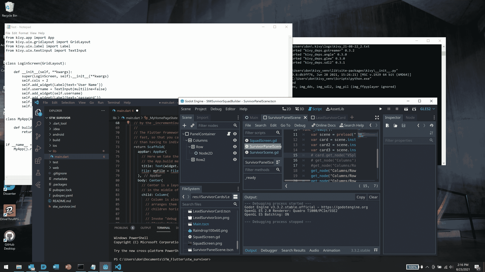

# 这么多选择，这么少时间

> 原文：<https://devops.com/so-many-options-so-little-time/>

如此多的语言/框架选项，如此少的测试时间。

最近，我正在从事的两个项目驱使我去尝试各种语言和/或框架来处理跨平台开发。虽然 Unity 和 Unreal 一直是我选择的游戏平台，我通常使用 Xamarin 进行跨平台开发(尽管原生开发对我们来说在苹果和 Android 上更常见)，但我决定我需要偶尔进行一次扫描，以了解那里有什么新东西。

这两个项目一个是我正在帮助一个新游戏开发者学习的游戏，另一个是不适合 web 开发的图形密集型应用程序。两者在跨平台环境下都能发挥最佳作用；两者都将受益于游戏引擎的图形操作。但是两者都可以用任何支持图形的语言来完成，因为对游戏没有很高的物理要求。

所以我去看看现在有什么可用的和它如何适合。从 [React Native](https://reactnative.dev/) 到 [Godot](https://godotengine.org/) 到 [Flutter](https://flutter.dev/) 甚至 [Kivy](https://kivy.org/#home) ，我对每一个都进行了测试，让它们运行起来，运行并跟踪样本，编写了一些我自己的代码，甚至与使用它们的朋友交谈以获得他们的意见。

唯一清晰响亮的声音是什么？安全和测试不可能跟上这种语言/框架的发展。Kivy 有一种语言(更像是一种规范而不是实际的语言，但仍然是源代码)可以运行在 Python 之上(不要求使用框架，但如果应用程序超过一定的规模，可以假设你会使用)；Godot 有一种语言，*是框架的一部分，你几乎可以在任何地方使用。React 有大量的附加代码，Flutter 和 Dart 都是新语言。*

我喜欢他们每个人的东西。我不喜欢我们越来越多地使用它们，我们希望测试保持在这些实现之上。这些平台/语言/环境中的每一个都有大量的追随者在做一些测试，但是因为它们都相对较新，“测试多少？”是一个合理的问题。测试必须用这些语言在*完成，这意味着编写人员需要了解这些语言，测试团队也是如此。*

我们最后去了哪里？我们还没有做出最后的决定，但是从我指导的人、同事和那些使用以上每一个的人那里，我们可能最终会使用 Godot。对于 2D 应用程序来说，这是一个炸弹。我们的团队很小，所以我可以提供我对 Godot 的了解来支持测试，每个人都同意它的类似 Python 的语言是可以接受的，而图形设计元素比竞争对手更好。这两个应用程序都将受益于 Godot 的图形处理能力，游戏也将受益于 Godot 引擎内置的游戏元素。

这里有一个有趣的补充说明:我们研究的所有产品都是开源的。我们(和其他人)为游戏选择的默认产品都是商业产品。这很有趣，但我们不需要那些商业解决方案的重量来制作一个简单的 2D 互动游戏/应用程序。

对你们所有人来说，这些问题可能更难回答。随着项目越来越大，对源代码大小、测试等等的要求也越来越高。慎重选择，着眼未来。我个人认为 React Native、Godot 和 Flutter 都将是跨平台应用的良好选择，其中 Godot 是跨平台 2D 游戏的最佳解决方案。这三种产品都有可能在很长一段时间内保持良好的规模，这使它们成为更安全的选择。Kivy 的情况则不太明朗，尽管 Python 的流行似乎推动了 Kivy 使用的增长。

无论您选择什么，都要为开发的所有阶段做好计划，而不仅仅是编写代码。任何事情都是如此，但新的跨平台工具是复杂的野兽，所以它值得提醒大家。

嘿，如果你有一个用这些工具开发的很酷的应用程序，给我指出来。很高兴看到你们都在做什么，也很高兴看到这些[语言](https://devops.com/?s=languages)可以创造的解决方案的广度。