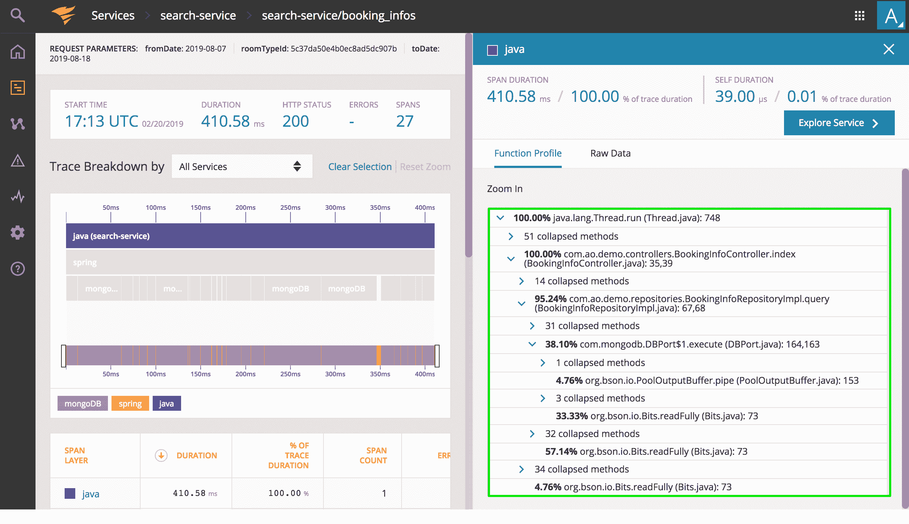

# 网络安全管理软件产品为 APM 平台增加了分析实时代码的能力

> 原文：<https://devops.com/solarwinds-adds-ability-to-profile-live-code-to-apm-platform/>

网络安全管理软件产品通过向网络安全管理软件产品应用性能监控(APM)平台添加实时代码剖析功能，推进其成为 DevOps 工具领先提供商的活动。

网络安全管理软件产品工程副总裁 Keith Kuchler 说，实时代码分析提供了一个事务中最常调用的函数和方法的细目分类，包括类、方法、文件名和行号。他说，这种能力使 DevOps 团队能够识别哪一行代码可能会导致性能问题，而无需对代码本身进行任何更改。

根据 Kuchler 的说法，剖析实时代码的能力扩展了分布式跟踪能力，这是网络安全管理软件产品以前集成到网络安全管理软件产品应用程序中的。库奇勒表示，这两款产品共同表明，网络安全管理软件产品致力于为 DevOps 团队提供先进的功能，而其成本只是作为软件即服务(SaaS)应用交付的竞争对手 APM 平台的一小部分。网络安全管理软件产品应用软件的起价是每月 7.5 美元。网络安全管理软件产品 AppOptics 是网络安全管理软件产品描述的 DevOps 工具包的一部分，它还包括 Pingdom，一个网站性能监控工具，Papertrail，一个日志管理服务，以及 Loggly，一个日志分析服务。

Kuchler 说，剖析实时代码的能力支持用 Java 和 PHP 编写的应用程序，并且即将支持其他编程语言。他补充说，目标是减少开发运维团队在应用程序部署或更新后猜测问题来源的时间。

随着应用程序的不断部署和更新，DevOps 团队需要能够在代码级别查明问题，以使开发人员能够尽快解决该问题。共享一堆通用警报通常不会为开发人员提供足够的可操作情报来解决问题。不足为奇的是，网络安全管理软件产品最近对 300 多名开发人员进行的调查发现，与编写新代码相比，他们中的大多数人花更多的时间来排除现有应用程序的故障。花在代码故障排除上的所有时间最终会对过渡到 DevOps 的能力产生负面影响。

总的来说，网络安全管理软件产品正试图通过将其工具作为任何规模的组织都可以调用的服务来扩展整个 APM 市场。从历史上看，主要由于成本原因，对 APM 工具的依赖仅限于任务关键型应用程序。但是随着时间的推移，被认为是任务关键型的应用程序的数量增加了。此外，由于应用程序之间的相互依赖性，一行代码对整个企业 IT 环境的潜在影响可能是巨大的。因此，对可负担得起的 APM 方法的需求变得更加迫切。

自然，看看未来一年 APM 定价会面临多大压力将是一件有趣的事情。APM 平台提供商之间的竞争已经非常激烈。面临的挑战将是找到一个 APM 平台的提供商，它不仅要提供所有需要的功能，还要有足够的资金长期存在。

— [迈克·维扎德](https://devops.com/author/mike-vizard/)