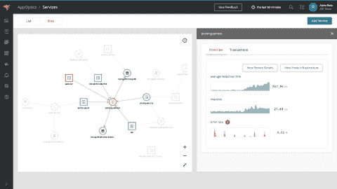

# 网络安全管理软件产品将 APM 延伸至基础设施

> 原文：<https://devops.com/solarwinds-extends-apm-reach-to-infrastructure/>

网络安全管理软件产品[更新了其应用性能管理](https://investors.solarwinds.com/news/news-details/2020/SolarWinds-Updates-APM-Suite-Designed-to-Simplify-Application-and-Infrastructure-Management/default.aspx) (APM)平台，以提供应用所依赖的 IT 基础设施的更多可见性。

网络安全管理软件产品应用管理产品副总裁 Jim Hansen 表示，网络安全管理软件产品 APM 套件中的 AppOptics 服务地图现在使 DevOps 团队能够可视化服务及其依赖关系之间的动态关系。IT 团队可以在服务跟踪拓扑中以时间序列数据的形式查看平均延迟、每分钟请求数、错误率和 CPU 使用率等指标。

Hansen 说，DevOps 团队可以查看哪些服务和依赖关系导致了资源限制，发现服务中未知的依赖关系和错误配置，并确定业务事务如何在应用服务之间流动。我们的目标是在软件和基础设施之间的依赖性从未如此之大或如此复杂的时候，让进行根本原因分析变得更加容易。

Hansen 指出，随着新冠肺炎疫情带来的经济衰退，人们对降低 IT 总成本的兴趣大增。他说，在许多情况下，今天的 IT 团队依赖于单独的工具来监控应用程序和 IT 基础设施，这往往不仅导致更高的成本，而且无法提供足够的环境。

与此同时，IT 团队内部的职责正在融合。根据网络安全管理软件产品最近对北美 227 名 IT 专业人员进行的调查，54%的受访者表示他们花在管理应用程序和服务上的时间比基础设施和硬件多。调查还指出，使用日志分析(58%)和跟踪(24%)的 IT 团队比以往任何时候都多。

网络安全管理软件产品还在其 Pingdom 监控工具中添加了一个 web 事务记录器，用于捕捉最终用户如何与 web 应用程序交互，而无需开发人员编写和部署脚本。汉森说，记录器捕捉交易过程中的每一步，并自动将信息翻译成可以自动播放的脚本。

最后。他说，网络安全管理软件产品增强了其 Loggly 工具，增加了自动索引和解析的能力，以更快地实现价值。

汉森说，网络安全管理软件产品通过其软件即服务(SaaS)平台，正试图使 APM 同时更实惠和更容易获得。Hansen 指出，面临的挑战是让 it 团队能够更广泛地应用 APM 服务，即使这些服务的消费以不可预测的方式增加或减少。

如今，APM 平台并不缺乏选择，大多数都是通过 SaaS 平台访问的。网络安全管理软件产品一直在证明 APM 服务的成本远低于竞争对手，同时提供了普通 IT 团队所需的大部分功能。由于成本问题，许多团队将 APM 平台的采用限制在最关键的任务上。随着 APM 服务变得越来越便宜，在日常管理变得越来越复杂的时候，对 APM 服务的依赖也应该相应增加。