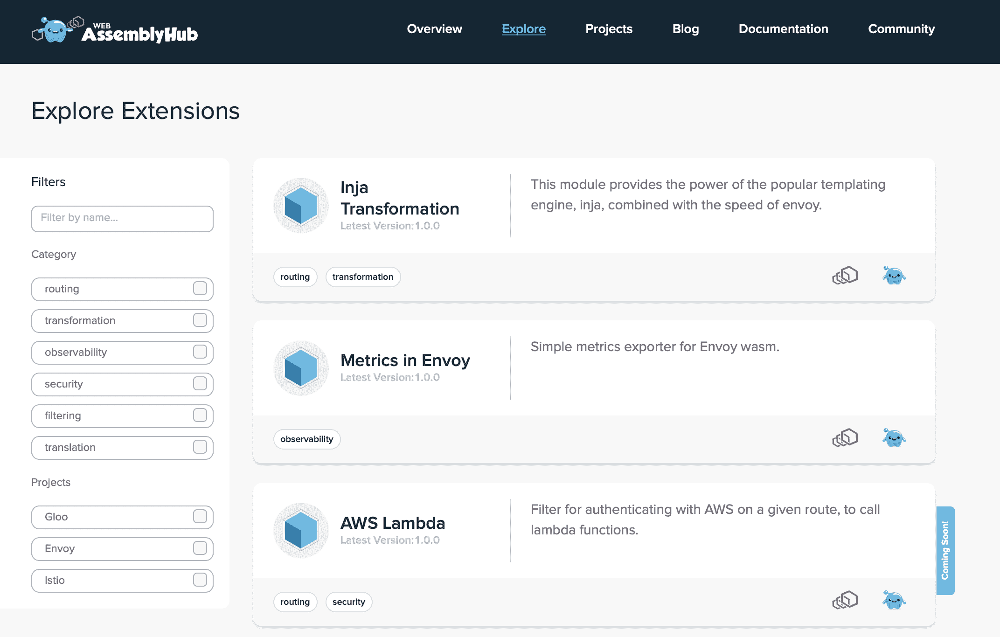

# Solo.io 为特使代理服务器的扩展创建注册表

> 原文：<https://devops.com/solo-io-creates-registry-for-extensions-to-envoy-proxy-server/>

Solo.io 创建了一个 [WebAssembly Hub](https://www.globenewswire.com/news-release/2019/12/10/1958800/0/en/Solo-io-Launches-the-WebAssembly-Hub-to-Empower-Users-to-Add-New-Functionalities-to-Their-Service-Mesh-to-Best-Fit-Their-Business-Needs-and-Enhance-Security.html) 注册表，旨在使发现和共享开源特使代理服务器的扩展变得更加容易。

由 Lyft 创建的 Envoy 现在正在云原生计算基金会(CNCF)的支持下开发，作为一种代理服务器，它正在接受微服务的 IT 环境中获得牵引力。

Solo.io 首席执行官 Idit Levine 表示，DevOps 团队面临的挑战是找到一种方法来扩展使用 C++编程语言开发的 Envoy 平台。WebAssembly Hub 通过采用可移植 WebAssembly (Wasm)二进制指令格式(称为 Wasm 堆栈机器)提供了一种扩展 Envoy 的替代方法，可以作为执行环境嵌入到其他平台中。

Levine 说，Wasm 本身是在万维网联盟(W3C)的支持下开发的，它为编译 C、C++和 Rust 等高级语言提供了一个可移植的目标，以某种方式构建应用程序，使 DevOps 团队能够通过将代码移动到正在运行的 Envoy 进程中来动态添加或修改扩展，而不必停止进程或重新编译代码。

Levine 补充说，这种方法提供了将扩展与 Envoy 隔离的额外好处，这意味着如果扩展崩溃，它不会随之关闭 Envoy。

Levine 表示，Solo.io 已经采用 Wasm 来促进对 Solo Gloo T1 的扩展的开发，这是一个针对 Kubernetes 环境优化的开源 API 网关，构建在 Envoy 之上。Solo Gloo 已经支持 WebAssembly Hub 注册表。

然而，事实证明，Envoy 也是 Istio 服务网的基础。Levine 说，现在任何使用 Envoy 的平台都可以利用 WebAssembly Hub 来构建和分发扩展。在其他用例中，Solo.io 设想 DevOps 团队使用 WebAssembly Hub 来发现一个 web 应用程序防火墙，该防火墙可以通过点击几下鼠标添加到 Istio 服务网格中，这可能会大大推动最佳 DevSecOps 流程的采用。

尚不清楚 It 组织是否会用 Envoy 等竞争对手的产品取代传统的代理服务器，这些产品声称对微服务架构进行了更优化。在许多情况下，开发人员基于个人偏好做出决策，这导致组织很快发现他们在一系列应用程序类别中支持多个代理服务器。然而，无论选择哪种方式，这些组织也可能很快发现，为基于特使的平台构建的大量扩展可能会侵占一系列安全、网络和应用服务，这些服务如今都是彼此孤立地调用的。然而，有一点是清楚的，那就是这些服务中的大部分将以编程方式调用，而不是依赖于已经掌握了单一功能平台的特定图形用户界面的所有细微差别的管理员。

新一代代理服务器可能需要一段时间才能达到临界质量。然而，在这一点上，这与其说是关于他们是否愿意，不如说是关于他们愿意到什么程度。

— [迈克·维扎德](https://devops.com/author/mike-vizard/)