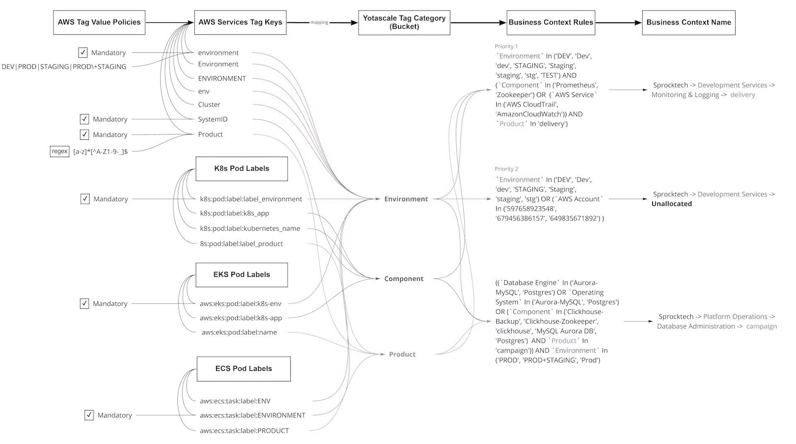

# 在奔向云的过程中解决云固有的挑战

> 原文：<https://devops.com/solving-cloud-native-challenges-in-the-rush-to-the-cloud/>

从传统数据中心基础架构向云原生环境的迁移势头不减，但安全性和复杂性挑战仍是开发运维团队的一大难题。

这是 IT 咨询公司[Flexera](https://www.flexera.com/)发布的 调查和分析师报告中的两个主要观点。

该调查基于 750 名 IT 专业人员的反馈，结果显示，92%的受访组织拥有多云战略，80%的组织拥有混合云战略，只有少数组织(45%)在云环境之间集成了数据。

根据调查结果，最大的挑战是:

*   安全性(81%)
*   管理云支出(79%)
*   治理、缺乏资源/专业知识和合规性(75%)
*   理解软件许可的成本影响(55%)。

除了实施正确的 DevOps 文化和实践之外，这些挑战的解决方案主要涉及采用正确的工具和平台，尤其是在安全性方面。然而，第一代云成本管理工具对于现代架构来说“根本不够用”，提供云资源优化平台的[Yotascale](https://www.yotascale.com/)首席执行官 阿西姆·拉扎克 说。

“今天的现代架构是动态的，所有权是短暂的，并不总是定义明确的。Razzaq 说:“容器和 Kubernetes 的最大优势是能够按需扩展，并在多个应用程序之间共享云资源。在现代体系结构中跟踪云成本需要强大的能力来自动确定这些动态资源的成本归属(或标记管理)，并了解应用程序级别的使用情况，即使是共享资源实例的容器也是如此

Razzaq 表示，这样一来，第一代云管理工具无法提供 DevOps 团队所需的信息，以了解如何为现代架构自动分配成本。

Razzaq 说:“(DevOps 团队)无法将成本分解成任何有意义的细节，以便工程和财务团队消化和采取行动。”。“相反，专注于 Kubernetes 成本管理的新方法缺乏了解和分解非云原生工作负载成本的能力。”

Razzaq 说，事实上，工具经常让工程团队感到沮丧，因为它们的静态定制报告、广泛和一般化的建议以及财务和工程之间有效协作的有效工作流。

“最大的挫折来源是无法以与这些团队开展业务的方式相匹配的方式钻取和管理成本。Razzaq 说:“可能有 10 个团队，每个团队都有 5 个生产应用程序在云中运行，负责一个特定的客户。“工程师需要在应用程序级别了解他们的资源利用率、成本和成本异常情况，以便为他们的应用程序做出最佳性价比决策。没有它，他们就盲目飞行；不得不在没有任何支持数据的情况下为他们的云使用辩护。”

Razzaq 解释说，例如，配置不当的 Kubernetes 集群会“导致成本大幅飙升”。“如果没有团队和应用程序级别的详细成本和利用率报告，工程师可能会花费数周时间在电子表格和日志中挖掘，试图追踪异常的来源。他们有几周的时间没有用来开发新功能。”

Razzaq 表示，DevOps 团队可以采用许多解决方案来解决这些问题，包括自动化成本归属和标签管理、可行的建议和全面的可观察性能力。

Razzaq 表示，自动化成本归属和标签管理“是精确和详细的云成本管理的基础”。“工程师需要工具来帮助他们设置标签管理策略，识别未标记的实例，并在其云环境中快速轻松地更新标签，”他说。“有了这一点，云原生工作负载可以在动态创建时自动标记，从而确保云成本始终明确地归属于正确的团队和应用。”

Razzaq 说，在云实例层面上提供具有闭环反馈的可行建议也是一个重要的过程，“这样工程师就可以确切地了解为什么要提出建议，以及采取该行动的成本影响是什么”。Razzaq 补充说:“能够对建议提供反馈，并拒绝不符合业务需求的建议，这确保了新的建议是相关的。”

最后，Razzaq 表示，为云原生[和已转移到云的传统工作负载提供统一视图的工具有助于确保“工程和财务部门对其云成本有一个真实的来源，使他们能够为其业务做出更明智的决策”。](https://devops.com/?s=cloud-native)