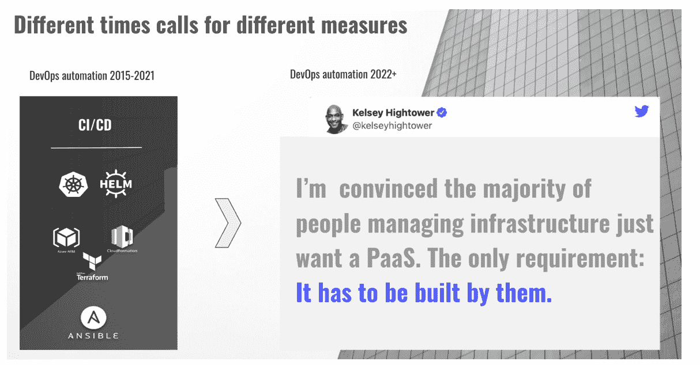

# 用开源 PaaS 解决速度悖论

> 原文：<https://devops.com/solving-the-speed-paradox-with-open-source-paas/>

DevOps 工具的数量不断增长，云资源和管理这些资源的选项的数量也在增长。仅在 EC2 上，AWS 就提供了近 400 种跨存储、网络和操作系统的实例类型。更复杂的是，用户可以从位于 24 个地区和 77 个可用区域的机器中进行选择。

这种扩散正在推动一种“速度悖论”，即你发展得越快，你的生态系统就变得越分散和复杂，这反过来又会减慢一切。大多数 DevOps 团队努力跟上开发人员对更多环境的需求。

## 速度悖论

### 内部开发者平台(IDP)的兴起

速度悖论的一个有趣解决方案是[内部开发平台](https://devops.com/internal-developer-portal-what-it-is-and-why-you-need-one/) (IDP)。顾名思义，IDP 提供了一个单一的地方，开发者可以在这里找到运行他们的环境所需的所有资源。IDP 允许开发人员通过提供以下方面的改进来加快开发过程:

*   **效率**–通过自助服务体验简化开发和测试基础设施的访问；
*   **一致性**–提供跨团队使用基础设施资源的一致方式；和
*   **可见性**–提供一个单一位置来查看与每个环境相关的所有管道、工作流和状态。

[Gartner](https://www.gartner.com/en/documents/4010078) 总结得很好:“产品团队在加速数字化转型的过程中，经常会因为不同的工具和脱节的工作流程而陷入困境。领导平台团队的软件工程领导者必须建立内部自助式开发人员门户，以实现一致性并扩展云、敏捷和开发运维计划。”

### “PaaS-t”的经验教训

开发者平台的想法并不新鲜。上一代 PaaS——例如 Google App Engine、Heroku Cloud Foundry——提供了一个简单的接口，通过抽象云资源来编写应用程序。但是早期的 PaaS 失败了，可能主要是因为开发者需求的长尾效应。 [回到 2013 年](https://cloudify.co/blog/devops-paas-and-everything-in-between/) ，我观察到:

“每个 Access 项目最终都会失败，因为虽然用户想要的 80%都可以快速轻松地创建，接下来的 10%可能会有困难，但最后的 10%最终是不可能的，因为您无法深入了解内置抽象，并且用户总是想要他们想要的 100%。”

您可以将早期 PaaS 的失败总结为三点:

*   太固执己见:很难(不可能？)来控制平台运行其基础设施资源的方式。定制依赖于平台供应商。
*   仅限于简单的 web 应用程序和语言选择:现代 SaaS 应用程序很复杂，并且包含不适合该架构的后端服务。
*   成熟:早期的 PaaS 试图抽象云，当时它还是一个年轻的、移动的目标。

## 什么变了？

在早期的 PaaS 中，我们用简单性换取了灵活性。在两者之间找到恰当的平衡是挑战的核心。Kubernetes 和 Docker，以及 Terraform、Cloud Formation 和 Azure ARM 等 IaC 工具是一个很好的基础:它们提供了一个一致的框架来管理云之间各种基础设施资源的应用程序。这些工具的成熟和采用减少了构建开发者平台的障碍。这提供了为每个组织创建定制平台的机会，允许团队控制他们的平台如何适应他们组织的环境。它还提供了简单性和灵活性之间的平衡，因为每个组织都可以选择界限在哪里，甚至可以在不依赖外部供应商的情况下重新划定界限。

*下一代平台*

## 进入后台

[后台](https://backstage.io/) 是由 Spotify 主导的开源 IDP 项目。它的三个主要部分是:

*   **服务定义**—基于 Kubernetes 模板格式，它提供了一个适合一系列服务的服务描述符:监控、CI/CD 和 Git 存储库
*   **Backstage 服务目录**—基本上是一个带有数据库后端的 web 应用程序，提供管理资源的单点访问
*   **通过插件集成工具**——集成资源的市场

以下是基于 Backstage 的 IDP 的外观:

*基于后台的内部开发平台示例*

我们可以使用 Backstage 来组织所有开发服务和资源，例如我们的 squad KPI、开发管道、API 和 Git 存储库，所有这些都在一个地方。

## 将后台变成一个成熟的 PaaS

后台缺失的部分之一是基础架构供应。添加它会使后台变得更接近成熟的 PaaS。Cloudify 提供了一个远程执行引擎，它集成了各种基础设施资源，并允许用户将它们组织到一个自助式开发或生产环境中。将 Cloudify 集成到 Backstage 中包括将开发环境同步到 Backstage 服务目录中，并允许通过 Backstage 门户或 GitOps 自行提供这些服务。

*将 Cloudify 作为远程执行引擎集成到后台*

你可以 [观看一个演示](https://drive.google.com/file/d/1Uyo9UV3Y1ew5FlUo_6PjOkwxFELPuU6l/view?resourcekey) 或者从 [Cloudify 后台 Git repo](https://github.com/Cloudify-PS) 获取更多关于集成的信息。

## “不惜一切代价的增长”的终结

去年， [王予柔和马蒂·卡萨多分析了](https://a16z.com/2021/05/27/cost-of-cloud-paradox-market-cap-cloud-lifecycle-scale-growth-repatriation-optimization/) 云支出对高速增长公司的影响。随着科技公司为了追求速度而牺牲效率，他们面临着不可持续的增长模式，云成本超过总收入的 50%。王和卡萨多的分析说明了这种情况如何直接影响公司的盈利能力和估值。

在今天的市场动荡中，更容易看出“不惜任何代价的增长”政策是不可持续的。如今，DevOps 团队必须找到在控制成本的同时支持增长的方法。这迫使组织更好地控制开发团队如何使用云基础设施。

国内流离失所者可以成为这一努力的主要工具。不出所料，它们将成为下一个热门的 DevOps 趋势。Backstage 提供了一个很好的框架和生态系统，可以缩短团队构建自己的内部平台所需的时间，Cloudify 提供了开放的远程执行引擎，通过单一位置将基础架构资源组织到自助服务环境中。集成将后台变成了一个成熟的 PaaS。

目前的 Cloudify-Backstage 集成只是一个 MVP 版本。接下来，我们将深化集成，在后台门户中提供更多监控。在这里，您可以找到更多关于我们对 Backstage 的开源贡献的信息，并提供反馈。

## 速度悖论  的开源解决方案

“速度悖论”——你发展得越快，你的生态系统就变得越分散和复杂，这反过来又会减慢一切——不需要把我们的 DevOps 敏捷性目标磨到地上。通过使用集成到后台项目中的开源 Cloudify，DevOps 团队可以避免成为软件开发敏捷性目标的新瓶颈。