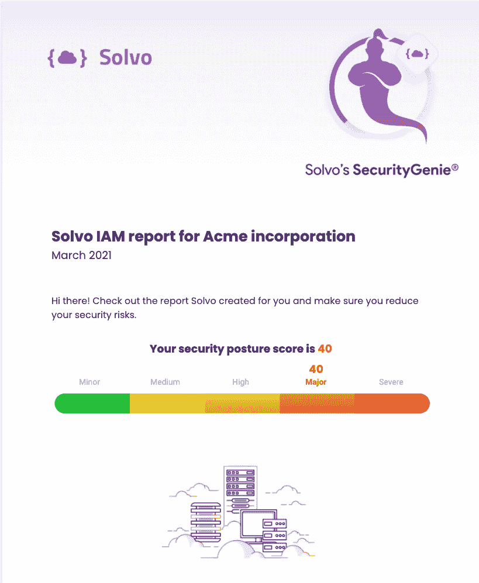

# Solvo 自动制定云安全策略

> 原文：<https://devops.com/solvo-automatically-crafts-cloud-security-policies/>

Solvo 今天宣布推出一款同名工具，该工具可自动创建一个[最低权限](https://devops.com/?s=least-privilege)策略，并将其应用于部署在云中的应用程序工作负载。

以前仅作为私有测试版提供， [Solvo](https://www.businesswire.com/news/home/20210329005240/en/Solvo-Announces-General-Availability-of-Its-Developer-Centric-Cloud-Security-Solution#:~:text=Solvo%20Announces%20General%20Availability%20of%20Its%20Developer%2DCentric%20Cloud%20Security%20Solution,-Dynamic%20solution%20empowers&text=The%20solution%20integrates%20with%20existing,policy%20for%20cloud%20native%20applications.) 还将在部署工作负载后持续分析工作负载，以便 it 团队在对应用程序进行额外更新时调整安全策略。

此外，Solvo 正在免费提供 Solvo Security Genie，IT 团队可以使用它来识别错误配置、过度权限、特权级别以及可能访问亚马逊网络服务(AWS)公共云帐户的第三方。

Solvo 首席执行官 Shira Shamban 表示，今天有这么多云安全问题的主要原因是因为缺乏网络安全专业知识的开发人员被要求制定政策。Solvo 通过在应用部署到云中之前分析工作负载并创建网络安全策略来消除这一负担。然后，开发人员可以自动应用该网络安全策略。

Shamban 说，这种方法将减少许多组织目前正在经历的 DevSecOps 紧张局势，因为他们试图将网络安全的责任进一步转移给开发人员。虽然没有哪个开发人员会故意部署一个不安全的应用程序，但是将网络安全的责任转移给一个并不真正了解需要什么的开发人员会造成很多额外的压力。

Solvo 平台可作为个人开发者和团队的付费订阅或免费增值模式，解决了当基础设施由开发者作为代码供应时不可避免地出现的许多云安全问题。Shamban 说，它通过在 DevOps 工作流的上下文中自动创建和应用网络安全策略来消除这种压力。

然而，Shamban 补充说，网络安全团队也可以在应用程序部署后手动编辑这些网络安全策略。

随着 DevSecOps 最佳实践的不断发展，显然开发人员和网络安全团队之间的关系也需要发展。长期以来，许多网络安全团队将开发人员视为他们遇到的问题的主要来源。习惯于这些开发人员现在将自己解决这些问题的想法需要一定程度的信任，这需要时间来建立。

就开发人员而言，他们普遍接受这样的观点，即他们应该对安全承担更多责任，只要提供给他们的工具不是由不欣赏应用程序开发工作流的网络安全专业人员选择的。

随着时间的推移，毫无疑问，开发者和网络安全团队之间存在的文化鸿沟将会缩小。然而，如果允许开发人员选择他们自己的安全工具，而不是接受来自高层的命令，指定一种特定的方法，那么将会更快地取得更多的进展，这是有争议的。事实上，对于许多 IT 团队来说，最好的做法就是对那些选择为其他同事树立榜样的开发人员说些鼓励的话。