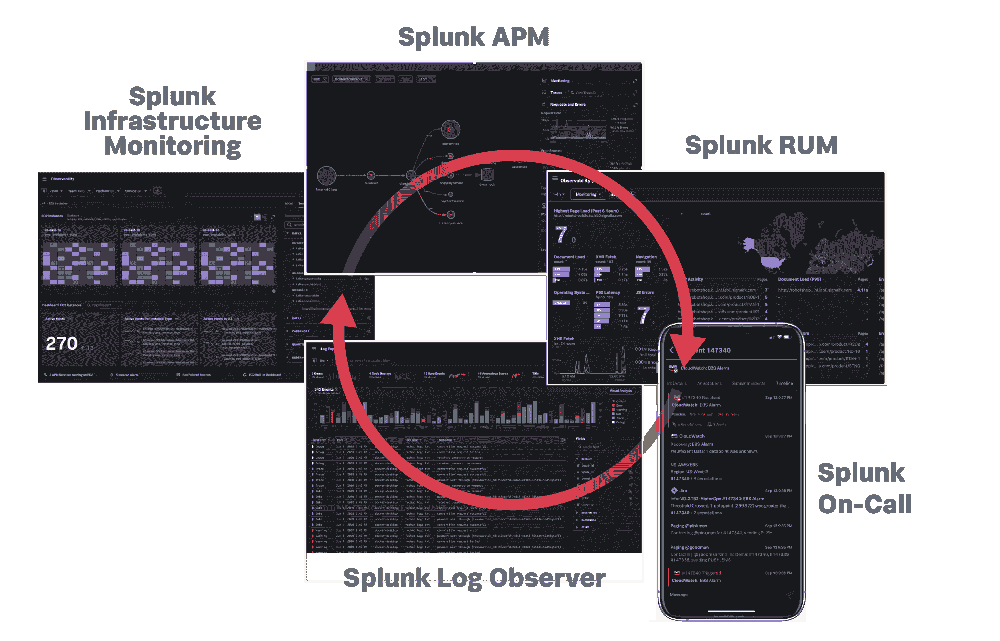

# Splunk 为可观察性产品组合添加了 Plumbr 和严谨性

> 原文：<https://devops.com/splunk-adds-plumbr-and-rigor-to-observability-portfolio/>

Splunk 本周在其 online.conf20 会议上透露，它已经[收购了一家](https://www.splunk.com/en_us/newsroom/press-releases/2020/splunk-to-acquire-plumbr-and-rigor-expanding-the-worlds-most-comprehensive-observability-portfolio.html)[应用性能管理](https://devops.com/?s=application%20performance%20management) (APM)平台提供商 Plumbr ，并签署了一份收购综合监控和应用优化工具提供商 gracience 的最终协议。

这两个平台都注定要与 Splunk Observability Suite 集成，Splunk Observability Suite 是该公司本周推出的一套 IT 管理工具。

Splunk CTO Tim Tully 表示，目标是提供一个全保真平台，利用机器学习算法来实时观察 IT 环境。

作为其平台的一部分，Plumbr 包括真实用户监控功能，它将扩展 Splunk 自己开发的真实用户监控(RUM)功能，目前处于测试阶段。

Tully 表示，Splunk 还致力于通过利用云原生技术，如 Kubernetes、Docker containers、Envoy、Istio 和 Terraform，使其平台在混合云计算环境中可用。

Splunk 采用了最佳 DevOps 实践的核心原则“可观察性”,这是在许多组织加快投资数字业务转型计划之际提供一系列数字体验管理功能的努力的一部分。Splunk 去年[以超过 10 亿美元的价格收购了 SignalFX](https://devops.com/splunk-to-acquire-signalfx-to-gain-apm-platform/) 以获得另一个 APM 平台，这将扩大其核心 IT 运营分析平台之外的影响力。

目前尚不清楚 Splunk Observability 套件最终将由多少平台和服务组成。该公司显然正在转向一种基于价值而不是收集的数据量来消费其服务的模式。确定这一价值自然会因客户而异，但随着新冠肺炎疫情带来的经济衰退，降低 IT 成本的压力越来越大。在许多情况下，获得一个可观察性平台的成本可以很容易地通过消除组织为使用来自不同供应商的十几个或更多工具而支付的许可费用来证明，这些工具通常是不集成的。

可观察性工具提供商之间的竞争也加剧了。除了 APM 平台的每一个提供商都将自己重新塑造成可观察性工具的提供商之外，还有一系列初创公司致力于解决可观察性的所有或某些方面。可观察性工具和平台提供商之间的整合浪潮几乎是不可避免的。

对可观察性的关注主要是由基于微服务的应用的兴起推动的，这些应用具有一定程度的依赖性，需要一定程度的上下文来成功管理依靠孤立监控应用和基础架构的传统工具无法实现的事情。缺乏集成也是 IT 团队在“作战室”浪费大量时间试图推断问题根源的主要原因之一，一旦发现问题，只需几分钟即可修复。

当然，Splunk 在可观察性战争中享有相当大的优势。其核心 IT 运营平台被内部 IT 运营和安全团队广泛采用。然而，大部分向可观测性的转变是由 DevOps 团队推动的，他们在应用程序的检测方面处于领先地位。这些团队中的许多人不再致力于任何特定的平台，不管它有多成熟。