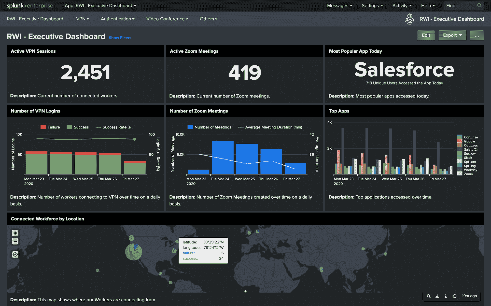

# Splunk 添加远程员工指标仪表板

> 原文：<https://devops.com/splunk-adds-remote-workforce-metrics-dashboard/>

Splunk 提供了一个[远程工作洞察](https://www.splunk.com/en_us/blog/leadership/introducing-splunk-remote-work-insights-our-solution-for-the-new-work-from-home-reality.html)仪表板，旨在帮助 IT 管理员跟踪和确定在家工作的员工最相关的 IT 指标，以帮助阻止[新冠肺炎疫情](https://www.who.int/emergencies/diseases/novel-coronavirus-2019/events-as-they-happen)的传播。

该公司首席技术官蒂姆·塔利(Tim Tully)表示，仪表板最初被配置为跟踪虚拟专用网络(VPN)流量以及通过 Okta 身份管理平台的实例对云应用程序的访问。

此外，该仪表板跟踪缩放视频会议服务的使用水平，以帮助确定员工在疫情期间继续协作的程度。

在大多数企业环境中实现的生产力水平与通过 VPN 提供的网络带宽量直接相关，VPN 在各种客户端设备上的部署可能不一致。与此同时，云应用程序体验可能会因最终用户所处的地理区域而有很大差异。

仪表板有助于 IT 团队确定他们可以解决哪些问题，以及哪些问题可能需要第三方服务提供商来解决。

Tully 表示，该仪表板构建在 Splunk 移动应用程序的基础上，为 IT 管理员提供了一种使用平板电脑或智能手机持续监控关键远程连接指标的方式，并指出该功能意味着 IT 管理员不必整天依赖 PC 来监控他们的环境。

他补充说，随着时间的推移，Splunk 计划增加对[额外指标](https://devops.com/devops-chats-what-is-your-data-really-worth-with-splunk/)的支持，以使 it 团队更容易监控远程工作人员。

除了简单地监控指标，Remote Insights 仪表盘还可以根据 it 团队定义的阈值发送丰富的通知。Tully 说，这种方法允许 Splunk Mobile 减少被监控的各种 IT 平台生成的警报数量。然后，这些通知会提供 IT 管理员需要与其他 IT 专业人员共享的相关可操作情报，以修复问题。

尚不清楚在新冠肺炎疫情事件平息后，It 团队将在多大程度上在家工作。许多组织可能会认为让 it 团队远程工作成本更低，而此时他们中的许多人都希望减少所需的办公空间以降低成本。许多组织将会发现，IT 人员就像客户支持人员一样，不一定需要呆在办公室里才能有效率。

无论身在何处，许多 IT 专业人员都将发现他们远程工作的效率有多高。这可能会在家庭和办公室之间产生一些边界问题。然而，它还应该大大有助于消除偶尔需要在晚上奇怪的时间去办公室，只是为了确定问题的根源只能由第三方服务提供商来解决 it 专业人员本来可以在家里联系的。

— [迈克·维扎德](https://devops.com/author/mike-vizard/)