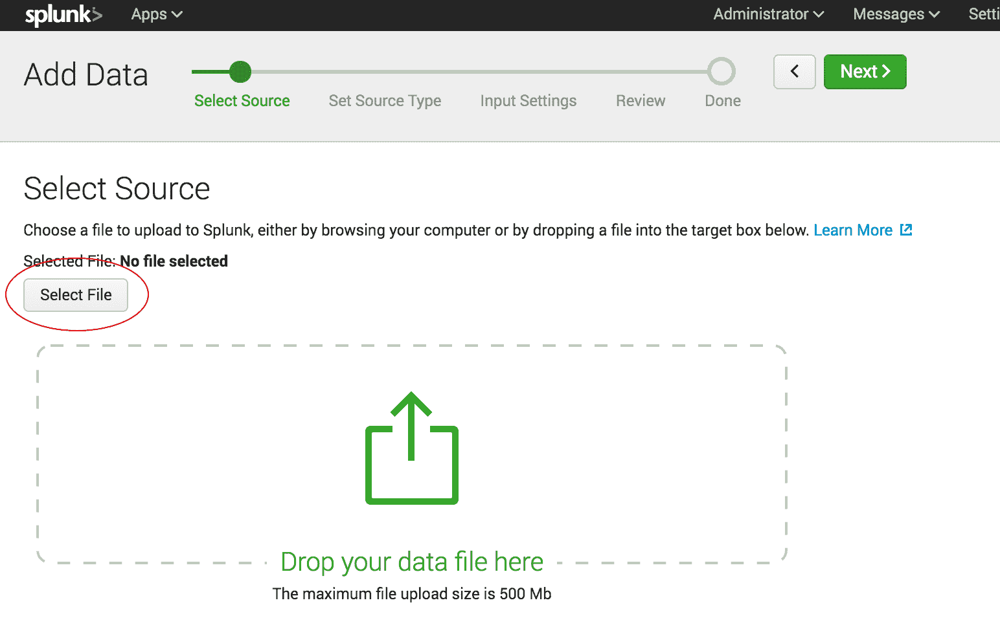
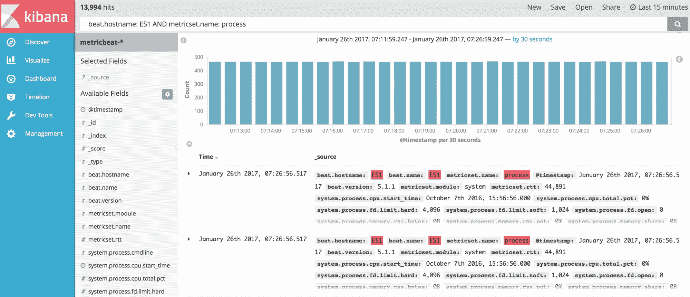

# Splunk 和 ELK 堆栈:并排比较

> 原文：<https://devops.com/splunk-elk-stack-side-side-comparison/>

本文的目的是比较日志分析领域的“两大巨头”——Splunk 和 ELK Stack。但是在我们详细讨论之前，需要对竞争对手做一个简短的介绍。

Splunk 是“Google for log files”的大型企业工具，是第一款日志分析软件，从那以后一直是市场领导者。Elasticsearch、Logstash 和 Kibana 的开源 [ELK Stack](http://logz.io/learn/complete-guide-elk-stack/) 是一个正在崛起的竞争对手，它是一个整合的数据分析平台。两者在功能、可用性和成本方面展开竞争。

## 概观

Splunk 和 ELK Stack 使用两种不同的方法来解决同一个问题。人们通常会根据他们的组织结构以及他们希望在日志分析上投入多少时间来选择其中之一。Splunk 获取大量数据，并允许人们通过搜索信息来提取他们需要的内容。ELK 在开始时需要更多的工作和计划，但是在结束时价值提取更容易。

Splunk 的三个关键组件是其转发器，它将数据推送到远程索引器；索引器，其作用是存储和索引数据以及响应搜索请求；和搜索头，它是 web 界面的前端，这三个组件可以在这里组合或分布在服务器上。Splunk 还支持通过 SDK 将其功能集成到应用程序中。常见的使用案例包括运营监控、安全性和用户行为分析。Splunk 是一种付费服务，通过对数量进行索引来生成账单。

ELK Stack 是一套三个开源产品——Elastic search、Logstash 和 Kibana——都是由 [Elastic](https://www.elastic.co/) 开发和维护的。Elasticsearch 是使用 Lucene 搜索引擎的 NoSQL 数据库。Logstash 是一个数据处理和传输管道，用于用数据填充 Elasticsearch(尽管它也支持其他目的地，包括 Graphite、Kafka、Nagios 和 RabbitMQ)。Kibana 是一个在 Elasticsearch 之上工作的仪表板，使用可视化和仪表板来促进数据分析。

Splunk 和 ELK 堆栈均可用于监控和分析 IT 运营中的基础设施，以及应用监控、安全和商业智能。

## ELK vs. Splunk

### **加载数据**

将数据发送到 Splunk 相当容易。安装后，转发器针对广泛的数据源(如文件和目录、网络事件、windows 源和应用程序日志)进行了预配置，并用于将数据导入 Splunk，如下所示:



在 ELK 堆栈中， [Logstash](http://logz.io/blog/logstash-tutorial/) 用于将数据从源传送到目的地。然而，Logstash 需要进行配置，以便在数据被发送到 [Elasticsearch](http://logz.io/blog/elasticsearch-tutorial/) 之前，每个字段都被识别。对于那些不使用脚本语言(比如 Bash、Python 或 Ruby)的人来说，这种配置可能很棘手，但是网上有很好的支持，可以很容易地找到。

### **可视化**

Splunk web UI 包括灵活的控件，允许您编辑和添加新组件到您的仪表板。可以为多个用户配置不同的管理和用户控制，每个用户都有一个自定义的控制面板。Splunk 还支持移动设备上的可视化，其应用程序和可视化组件易于使用 XML 进行定制。


Kibana 是 ELK Stack 中的可视化工具，与 Splunk 一样，该平台支持创建可视化工具，如折线图、区域艺术和表格，并在仪表板中呈现它们。搜索过滤器总是显示在不同视图的上方:如果使用查询，它会自动应用于仪表板的元素。Splunk 也有类似的选项，但它涉及 XML 格式的配置。尽管如此，Kibana 并不支持用户管理，但是[托管的 ELK solutions](http://logz.io/product/) 提供了开箱即用的功能。



### **搜索能力**

搜索功能是任何日志管理平台的关键功能。Splunk 和 ELK Stack 的 web 用户界面都支持使用专用搜索字段进行搜索。Kibana 上的查询语法基于 [Lucene 查询语法](https://lucene.apache.org/core/3_5_0/queryparsersyntax.html)，而 Splunk 使用自己的 [Splunk 搜索处理语言](https://www.splunk.com/en_us/resources/search-processing-language.html) (SPL)。熟悉脚本语言的人可能已经熟悉了 Lucene，而 SPL 是专有的，必须学习。

另一个不同之处是，Splunk 提供动态数据浏览，当以允许搜索未配置字段的方式格式化时，可以帮助用户将所有内容作为可搜索字段进行查找和提取。另一方面，Elasticsearch 字段需要预先定义，以便在日志属性上使用聚合。

下面是每个平台的一个查询示例。

Kibana:

```
(beat.hostname: ES1 AND metricset.name: process) AND (system.process.username: root OR system.process.username: admin)
```

Splunk:

```
(index=* OR index=_*) (index=_audit)   | search ( action=search NOT dmauditsearch )  "06:54"
```

SPL 语法和 Lucene 查询之间的区别在于，SPL 支持搜索管道(如上例所示)，其中连续的命令使用管道字符链接在一起，该管道字符允许一个命令的输出用作下一个命令的输入。Lucene 查询语法更加简单，可以从查询中生成输出，而不需要额外的转换。

### **牵引和社区支持**

Splunk 和 ELK Stack 都拥有庞大的用户和支持者群体。ELK 还为每个单独的工具提供了自己的清晰而广泛的文档，使其易于入门。此外，Elastic 本身在全球范围内提供[教育课程](https://www.elastic.co/training)。

除了拥有良好的[文档](https://www.elastic.co/guide/en/elasticsearch/reference/current/getting-started.html)和[论坛](https://discuss.elastic.co/)，Splunk 也拥有提供各种专业服务的客户和支持平台。Splunk 的教育计划和讲师可通过虚拟方式或现场提供。

### **学习曲线**

麋鹿栈的学习曲线是平坦的。Elastic 提供付费课程，但由于开源平台的流行，网上有许多免费材料。

对于 Splunk 来说，学习曲线的长度适中，尤其是在执行更专业的分析时。该公司提供了一段试用期，期间会有大量的文档资料，但是高级的 Splunk 教育课程相当昂贵。

### **用户管理**

ELK 堆栈作为一个独立的付费工具提供基于角色的安全性。Splunk 和 managed-ELK 服务提供现成的用户管理，包括用户审计。

### **定价水平**

如前所述，Splunk 是贴有价格标签的专有软件。在一个平台集成了几个数据源之后，随着数据的不断产生，成本会大大增加。

开源的 ELK 栈是免费的，但是真实的画面并不是那么黑白分明。平台的硬件和维护成本也在增加。为了降低使用 ELK 的成本，必须开发特性、插件和工具。

### **供应商锁定**

Splunk 的高价带来的好处是提供了一种全面的产品。用户可能会被某个供应商锁定，但几乎做任何事情都需要这个供应商。开源的 ELK 堆栈看起来是免费的，但它不提供许多功能，如开箱即用的警告，而且开发和维护它们需要资金。

勇气是 Splunk。麋鹿有很多种:

*   [开源的 ELK Stack 平台](https://www.elastic.co/webinars/introduction-elk-stack)(弹性)
*   [托管弹性搜索](https://aws.amazon.com/elasticsearch-service/) (AWS)
*   [企业级平台上的人工智能 ELK](https://logz.io/product/)(logz . io)

看待 Splunk 与 ELK 之争的一种方式是把它框定为旧的微软与 Linux 之争。如果你喜欢微软，你可能会更喜欢 Splunk。如果你喜欢 Linux，你可能会想使用 ELK 栈。

## 最后的想法

当人们在这些解决方案之间做出选择时，最终的选择不仅应该反映在平台上，还应该反映在客户的特定需求上。

Splunk 和 ELK Stack 目前都很受欢迎。但是未来会怎样呢？


Splunk (Blue) vs. Elasticsearch (Red) on Google Trends

根据 Google Trends，ELK Stack 在 Google 搜索中的比例已经超过了 Splunk。但是麋鹿的吸引力不止于此。如前所述，Splunk 自报共有 12，000 名用户。据报道，elastic search[每个月](http://www.infoworld.com/article/2998136/is-open-source-overtaking-splunk.html)*被下载 50 万次。因此，在 IT 部门，更有可能遇到熟悉 ELK 而不是 Splunk 的人，这意味着 ELK 堆栈的采用率可能会“滚雪球”式增长，未来每当 ELK 用户加入新公司或团队时，采用率甚至会增加更多。人们倾向于使用他们已经知道或者已经在使用的软件。*

*很明显，许多功能正在被添加到开源的 ELK 堆栈中。这反过来缩小了它与 Splunk 之间的差距。目前仅在 Splunk 中发现的软管功能可能会在某个时间点添加到 ELK 中。*

*因此，如果您需要更成熟的产品，请选择 Splunk。但如果你喜欢更灵活的产品，麋鹿是最好的选择。不管怎样，看看这两个公司如何继续竞争将会很有趣。*

*——[阿萨夫·伊加尔](https://devops.com/author/ayigal/)*