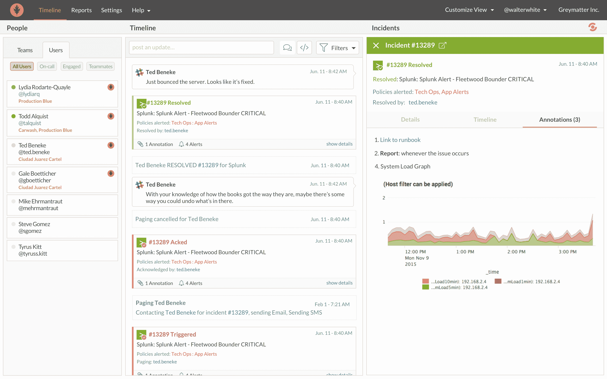

# Splunk 进军 DevOps 领域

> 原文：<https://devops.com/splunk-pushes-into-the-realm-of-devops/>

在最近以 1.2 亿美元收购事件管理软件提供商 VictorOps 之后，Splunk 正准备大幅扩大其在 DevOps 的立足点。

Splunk 的 IT 市场高级副总裁 Rick Fitz 表示，在企业中广泛使用的运营分析软件提供商看到了一个在一系列 DevOps 流程中扩展其业务的重要机会。

Fitz 说，事件管理是运营分析的自然延伸，并指出 Splunk 选择收购 VictorOps 是因为该公司在应用机器学习算法监控 IT 事件方面进行了投资。这种方法显著减少了生成的不相关警报的数量，并为可能对 IT 运营产生负面影响的潜在事件提供了可操作的情报。

Fitz 指出，大多数 IT 运营团队都有警报疲劳症，并且大多数警报都因为缺乏上下文而被忽略。他说，Splunk 和 VictorOps 的结合将导致更精确地识别任何 IT 问题的根本原因的警报，以及符合 DevOps 原则的 IT 运营团队的更好的整体“参与系统”。

Splunk 一直在稳步扩大对 DevOps 的关注。今年早些时候，该公司宣布了针对基础设施的 Splunk Insights，IT 组织可以将其托管在亚马逊网络服务(AWS)公共云上，以监控部署在任何地方的 IT 基础设施。[最新版本的 Splunk 云和 Splunk Enterprise](https://www.splunk.com/en_us/newsroom/press-releases/2018/splunk-customers-accelerate-business-value-through-artificial-intelligence.html) 还在改进的指标引擎基础上利用机器学习算法，使 IT 管理员能够监控从 CPU 速度和可用硬盘空间到物联网(IoT)设备和传感器中的温度读数等一切。Splunk 最近还为 Docker 和 Kubernetes 添加了连接器，以及用于实时传输数据的 Apache Kafka 消息平台。

IT 运营和网络安全团队已经广泛依赖 Splunk 运营分析软件来识别异常情况。通过投资机器学习算法和收购事件管理软件，Splunk 正在将其分析的所有数据转化为可操作的情报，然后可以与开发人员实时共享，以确保应用程序可用性并优化应用程序性能。

虽然 DevOps 流程在传统企业 IT 组织中的采用仍然参差不齐，但专注于 IT 运营的 IT 供应商(如 Splunk)已经清楚地看到了不祥之兆。Fitz 指出，例如，在机器学习算法方面的投资将使 IT 运营团队能够在 IT 环境变得极其复杂的时候，以更大的灵活性更好地响应不断变化的应用程序需求。Fitz 说，这种灵活性对于任何参与数字业务转型的组织都至关重要，因为这些努力总是会导致部署更多的应用程序。

目前还不清楚现有的 It 运营软件提供商在 DevOps 时代还能在多大程度上保持相关性。但他们中的大多数人肯定有财力至少获得一个 DevOps 工具组合，这将使他们能够发挥比他们中的许多人迄今为止更大的影响力。

— [迈克·维扎德](https://devops.com/author/mike-vizard/)