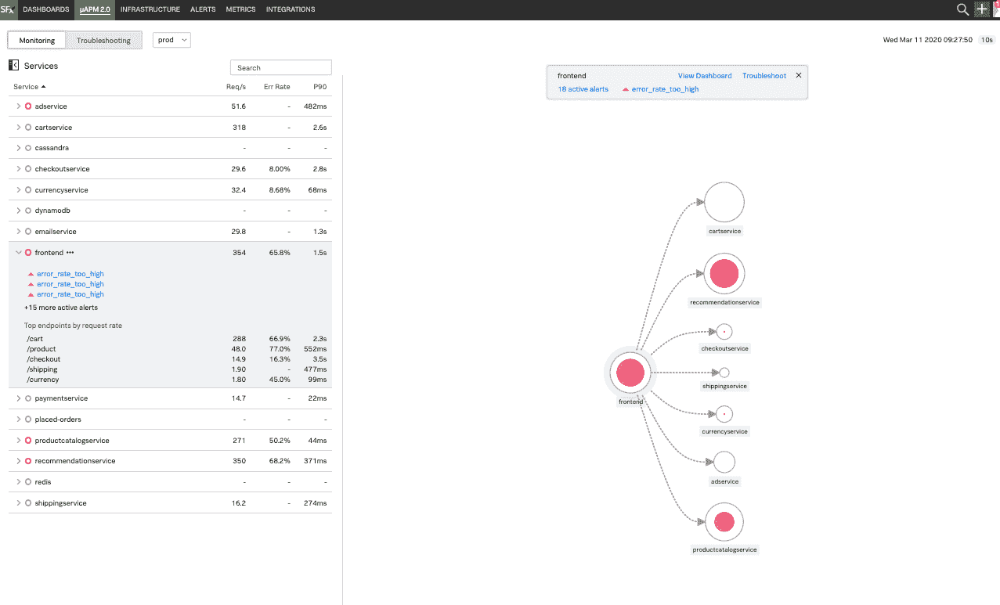

# Splunk 更新 SignalFx APM 平台

> 原文：<https://devops.com/splunk-updates-signalfx-apm-platform/>

Splunk 今天[展示了自去年 10 月](https://www.businesswire.com/news/home/20200331005122/en/Splunk-Observability-SignalFx-Microservices-APM)[收购 SignalFx 应用性能管理(APM)平台](https://devops.com/splunk-to-acquire-signalfx-to-gain-apm-platform/)以来的首次重大更新。

Splunk 应用性能管理(APM)总经理 Karthik Rau 表示，signafx 微服务 APM 首次将 signafx 平台与 Omnition 相结合，Omnition 是一个软件即服务(SaaS)平台，用于实施分布式跟踪，作为应用采样的替代方案， [Splunk 也于去年收购了 Omnition](https://devops.com/splunk-adds-omnition-to-devops-portfolio/)。

此外，SignalFx 的最新版本在 SignalFx 基础设施监控模块中添加了 Kubernetes 导航工具，使管理 Kubernetes 集群以及在该平台上运行的基于微服务的应用变得更加容易。该模块基于嵌入在平台中的机器学习算法，提出加快分类和故障排除的建议。Rau 指出，Splunk 还实现了 Kubernetes Navigator、Splunk Enterprise 和 Splunk Cloud 之间的工作流集成，为 IT 团队提供了额外的见解和背景。

Rau 表示，通过收购 SignalFx，Splunk 旨在推进两大 DevOps 趋势。第一个是开源代理软件的兴起，它使得为整个 it 环境提供工具变得越来越可行。Omnition 在被 Splunk 收购之前，是 OpenTelemetry 项目的创始成员和贡献者，该项目现在由云本地计算基金会(CNCF)管理。

第二，需要消除对采样的依赖，支持使用分布式跟踪来分析 IT 环境中发生的每个事件。

Rau 说，在 IT 环境变得越来越复杂的时候，能够解决 IT 问题至关重要。他指出，基于微服务的现代应用程序可能会特别成问题，因为涉及到所有的依赖性。Rau 说，与为监控整体应用环境而构建的传统 APM 平台相比，SignalFx 是为了解决基于微服务的应用环境而从头开始构建的，并指出这一努力的核心是摄取大量分布式跟踪数据的能力。

从历史上看，APM 平台很少用于帮助管理企业中最关键的应用程序，主要是因为对成本的担忧。然而，考虑到现代应用程序的复杂性，显然可观察性现在是任何实现最佳 DevOps 实践方法的核心原则。许多 DevOps 团队需要解决的问题是，确定他们现有的用于观察 IT 环境的工具在多大程度上足以满足新的应用程序类别的要求。在许多情况下，该决策可能取决于这些组织采用基于微服务的应用的速度。

当然，Splunk 并不是唯一一家针对微服务优化 APM 平台的供应商。已经增加了对容器和 Kubernetes 集群的支持的 APM 平台的新兴和传统提供商之间的竞争已经非常激烈。然而，未来真正的问题是确定哪个平台将使 DevOps 团队能够最快地发现最相关的问题。毕竟，当人手不足的 DevOps 团队遇到问题时，补救问题所花费的每一秒都很重要。

— [迈克·维扎德](https://devops.com/author/mike-vizard/)