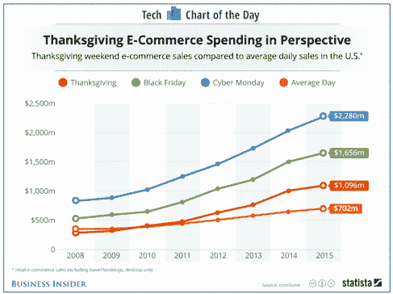
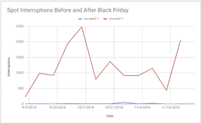
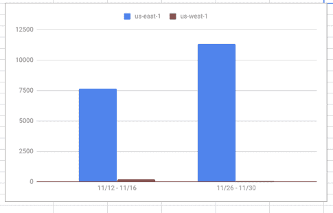
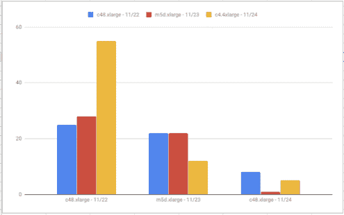
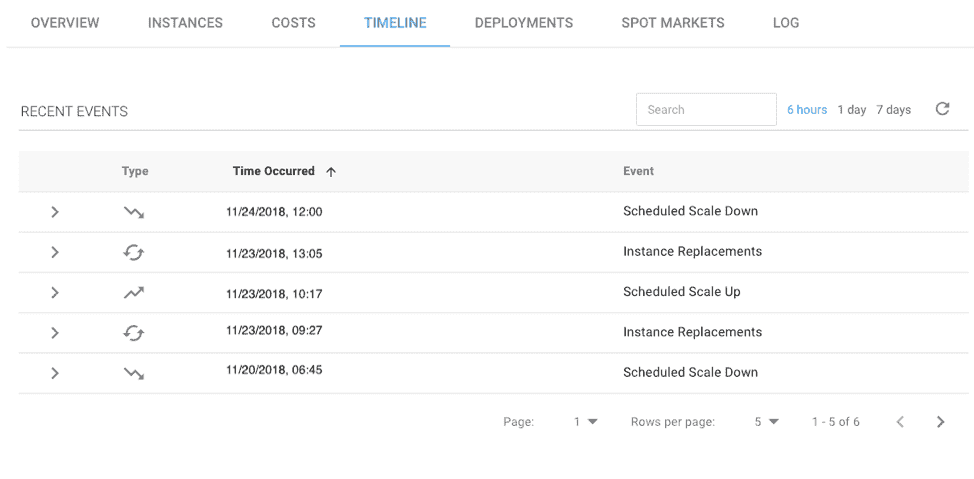

# 黑色星期五的现货实例:案例研究

> 原文：<https://devops.com/spot-instances-on-black-friday-a-case-study/>

***商家利用黑色星期五*** 的现货实例做出了正确的选择

黑色星期五是假日购物季的非正式开始，零售商宣布令人兴奋的交易，以吸引尽可能多的顾客进入他们的商店。随着近年来网上购物的激增，电子商务和广告技术企业也在参与黑色星期五，以增加他们的在线业务和收入。今天，数百万顾客可以选择网上购物或在实体店购物。虽然这些商店面临着管理大量购物者的挑战，但电子商务和广告技术企业在处理购物者流量时也面临着自己的一系列挑战。

Source: Business Insider

在购物高峰期，如黑色星期五，企业使用更多的能力来处理在线购物者的请求，同时不断努力为他们提供最佳性能。理论上，随着越来越多的公司利用云提供商的资源，他们在尝试扩展时可能会遇到容量短缺。当繁忙的网上购物日最终到来时，这一理论可能会成为现实，因为在线零售商会扩大规模以满足其购物者的需求，而云提供商则在努力适应容量。然而，许多云用户可能不知道的是，大约 50%的主要云供应商的基础设施大多处于闲置状态。

需要明确的是，这并不是因为 AWS、微软或谷歌在努力出售它们的产能；这是因为他们必须为使用率的快速增长做好准备——就像企业在黑色星期五经历的那样。

对容量不足的担忧也使用户担心使用云提供商的过剩容量(如 spot 实例)来运行他们的工作负载，因为许多客户正在使用更多的云资源，并正在吃掉所有的云库存。企业只是不想冒险去争夺过剩的产能，而是选择一些更可预测的东西，比如按需实例。云提供商有能力处理最激进的计算需求，这一事实创造了一种局面，即选择在黑色星期五期间明智地利用过剩容量的企业看到了巨大的投资回报。

对于任何面向消费者的企业来说，黑色星期五、全国大选和超级碗等事件都是非常极端的压力测试。我们认为浏览这些数据，看看 AWS 现货市场在黑色星期五期间的表现，看看我们能从中学到什么，会很有意思。在这篇博文中，我将回顾现货市场的统计数据和 2018 年黑色星期五的教训。

## 现货市场和统计

现货市场被定义为可用性区域中特定现货价格的特定实例类型的供应和需求。Spotinst Elastigroup 根据当前和历史数据对现货市场的可用性和成本进行排名，这一过程称为现货市场评分。现货市场评分使我们能够在市场中断发生前大约 15 分钟(有时甚至超过一个小时)预测它。这种对即将到来的中断的提前通知触发了现场实例替换，并确保了计算工作负载的持续可用性。让我们看看黑色星期五前后现货市场的表现。

现在你对现货市场有了更好的了解，下面我们来深入研究一下黑色星期五的统计数据。在下图中，我们可以看到美国西部-1 和美国东部-1 地区黑色星期五之前三个月的每个星期五的插播广告数量。在此期间，us-east-1 区域的 spot 中断明显更多。

下图显示了在所有实例类型中，美国东部-1 和美国西部-1 的黑色星期五前后一周发生的插播中断次数。我们可以看到 us-west-1 比 us-east-1 更适合 spot 实例。此外，us-east-1 在黑色星期五后的一周继续经历更多的停机。

然后，我们查看了黑色星期五之前、当天和之后使用的流行实例类型和大小，以了解有多少中断。在下图中，我们可以看到 c4.4xlarge 的中断次数最多，之后不断改进。

以下部分显示了 Back Friday 的指标，对比了美国东部-1 和美国西部-2 的不同可用性区域:

1.  **美国黑色星期五总点击率:** 462
2.  **按可用性区域划分中断，一些区域比其他区域有更多的现场中断**

| **可用区** | **美国东部-1** | **美国西部 2 号** |
| AZ 1 | Twenty-nine | one |
| AZ 2 | three | seven |
| AZ 3 | Twenty-four | three |

3.  **平均现场正常运行时间:** 2675 分钟(1.8 天)

## 斑点中断和自动缩放事件看起来像什么

让我们看看现货市场中断是什么样子，以及 Elastigroup 如何处理这种情况。在下面的数据中，您可以看到来自我们一个客户的真实事件日志。我们可以看到，在黑色星期五的早期，这一天开始于 Elastigroup 自动替换已终止或即将终止的实例。过了一会儿，当购物者开始在互联网上搜寻交易时，我们看到这些实例被自动放大以满足需求。第二天，Elastigroup 缩减了实例，因为需求没有黑色星期五那么高。有了 Elastigroup 中这种类型的自动伸缩自动化，管理员可以花更多的时间来担心应用程序开发和其他任务。

## 外卖食品

1.  **DevOps 自动化是关键**–elastic group 使用预测算法来识别和排出即将终止的实例。在终止之前，Elastigroup 将推出一个新的实例，并无缝替换它。Elastigroup 还将确保将您的实例分布在不同的类型中，以优化成本和寿命。
2.  **Spot 实例可用性**–拥有稳定的正常运行时间对于黑色星期五这样的高峰日至关重要。随着数百万购物者访问电子商务网站，宕机可能导致收入损失。在黑色星期五，少量经历中断的 spot 实例的平均正常运行时间为 1.8 天。有了这样的正常运行时间，组织可以依靠 Elastigroup 管理的 spot 实例来降低成本，同时不牺牲高峰时段的服务可用性。
3.  现货市场–现货让企业在不牺牲成本和可用性的情况下做出更好的决策。Elastigroup 可靠地利用现货市场来优化您的底层基础设施的成本，而不影响可用性。根据上面的统计数据，我们可以看到一些可用性区域比其他区域有更多的点端接。美国东部 1 区的 AZ 1 有最高数量的现场中断。

— [阿米拉姆·沙查尔](https://devops.com/author/amiram-shachar/)