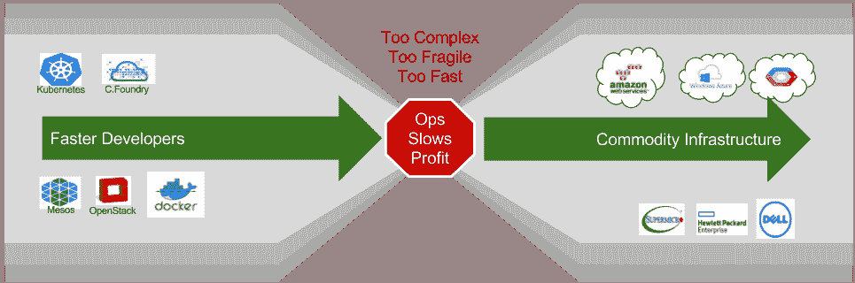

# SRE vs. DevOps vs .云原生:服务器笼比赛

> 原文：<https://devops.com/sre-devops-cloud-native-server-cage-match/>

*本帖支持我 5 月 4 日*的[*DevOpsDays Austin Presentation*](http://sched.co/AOQX)

*我不相信 DevOps 羞辱。我们的社区似乎不得不纠正 DevOps 作为工具、团队和茶壶的形容词的用法。沮丧是合理的:DevOps 清楚地挖掘了开发者和操作员的顶部空间，他们共同看到了更光明的自动化未来。例如，看看辛迪·斯里德哈兰的这篇精彩的 DevOps 演讲。*

 ***作为一个行业，我们渴望人为的冲突，所以很自然地试图将站点可靠性工程(SRE)、DevOps 和云原生软件分成敌对的派别，而它们并不是。他们都关注精益流程。**

非常简单:SRE 是一项工作职能，DevOps 是一种流程方法，而原生云是一种架构。

这三个概念有极大的一致性，因为它们都有相同的基本目标:通过改进流程来增加产品交付。真的就这么简单。我们希望利用精益制造的系统思维概念来提高生产率。

sre 通过消除手动操作、减少错误和提高基础设施质量来提高生产效率。他们从生产基础架构开始，并反向工作。高度自动化的交付、集成日志、全系统监控和无可指责的根本原因分析是关键工具。在我们陷入工具之前，SRE 团队的突出因素是他们拥有生产基础设施的所有权。

分配交付的所有权具有巨大的力量。这就是为什么我认为定义 SRE 工作职能对行业有益。DevOps 策略是一种系统方法，它变成了一种让个人或团队负责拥有“DevOps”的反模式

在 DevOps 中，我们寻求简化整个产品创造流程的方法。这通常会推动 SREs 所需的工具和技术；然而，我们的目标并不针对具体的部门。我们希望与所有利益相关者合作，包括开发人员、产品经理、测试人员、sre、高管和客户。开发人员的这个系统焦点变成了 CI/CD 管道、平台、工作跟踪工具和其他工作流元素。这些工具不是专门的 DevOps 工具，但是混淆是很自然的，因为由于 DevOps 的思想，它们经常被引入组织。

该 SREs 应期望与 DevOps 流程下的其他职能部门深入合作。

云原生架构也属于 DevOps 的任务范围，因为它致力于将大型应用程序堆栈分解为高度自动化的服务集合。云原生设计没有神奇的“DevOps 平台”；然而，使用架构方法的团队获得了模块化、强大的 API、面向服务、简化的配置和构建完全符合 DevOps 思想的自动化实践。

例如，使用容器并不意味着开发或 SRE 团队遵循开发运维流程或使用云原生架构；然而，这表明他们倾向于更小的可交付成果和改进的开发-生产保真度。

**然而，SRE、云土著和 DevOps 确实有一个共同的敌人:[复杂性](https://robhirschfeld.com/2016/11/17/devops-vs-cloud-native-damn-where-did-all-this-platform-complexity-come-from/)** **。**

我们在创建最佳实践和抽象方面做得很好，这些实践和抽象加速了开发人员的工作，并在云和物理方面创建了创新的基础架构选项。这意味着我们看到了开发人员生产力和基础设施复杂性的双重爆发。不幸的是，这些财富并没有进入运营自动化领域，而运营自动化充其量只能带来增量改进。更糟糕的是，增加的工作量和复杂性增加了 SRE 职能部门的压力。

最终，所有这三个概念都是精益商业实践的方面；然而，来自 DevOps 和云原生的加速超过了 SREs 的进步。这种不平衡会给所有相关人员带来风险，因为精益关乎系统性能。延迟和故障不能孤立于单个筒仓。

将开发和运营视为孤岛的错误意味着在 SRE、开发运维以及云原生之间制造虚假的竞争。

如果你在你的组织中听到这种说法，那么把它作为一个警告，关于你的团队是如何把精益系统思想整合到你的过程中的。

——[罗布·希施菲尔德](https://devops.com/author/rob_hirschfeld/)*