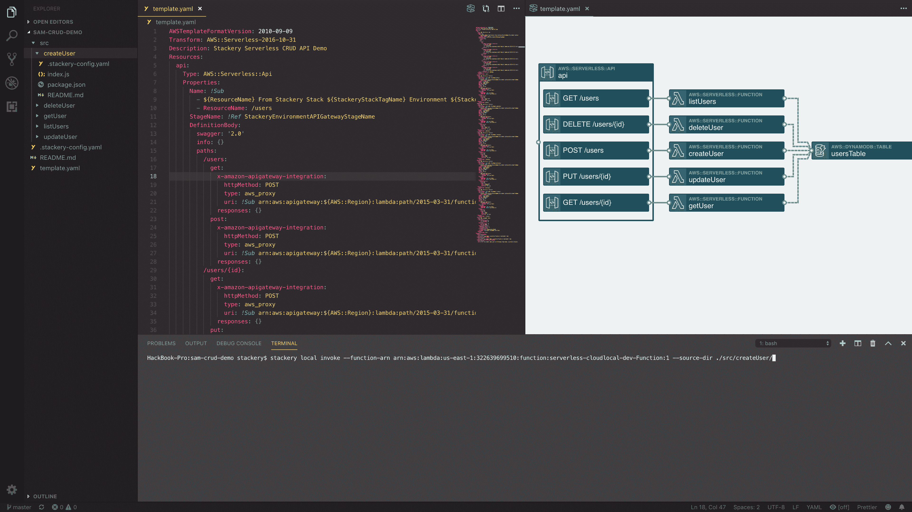

# stackers 简化了面向 devops 的 aws 无服务器集成

> 原文：<https://devops.com/stackery-smooths-aws-serverless-integration-for-devops/>

Stackery 今天宣布了一项[插件](https://www.stackery.io/blog/local-debugging-any-aws-lambda-function/)功能，该功能将允许开发人员从运行在本地机器上的集成开发环境(IDE)中构建和调试旨在运行在亚马逊网络服务(AWS)提供的 Lambda 无服务器计算服务上的代码。

公司首席技术官 Chase Douglas 说，最新的 Stackery 工具可以放入任何 IDE 中，可以通过 Stackery VS Code 无服务器工具插件自动安装，也可以通过手动安装过程安装，而不管使用的是什么编程语言。他说，目标是让 DevOps 团队更容易构建包含 AWS 无服务器计算框架的工作流，该框架现在正在迅速扩展。总之，Stackery 工具可以调用 86 个 AWS CloudFormation 兼容资源中的任何一个。

Stackery 提供了一组可视化工具，使得为 AWS Lambda 服务编写函数变得更加容易，而不必知道如何创建 YAML 文件来将基础设施作为代码进行操作。这一最新产品将该功能扩展到了本地环境，这将允许 DevOps 团队在他们的笔记本电脑上离线工作并进行更改，而不必通过互联网连接在 AWS 云上进行每一项更改。这项功能不需要客户设置 Stackery 帐户即可使用。

目前，Stackery 正专注于为 AWS 环境提供这些工具，但 Thomas 表示，最终这些工具将扩展到其他无服务器计算环境。

Douglas 说，目标是为 DevOps 团队提供工具，使开发人员和 IT 运营团队更容易访问所有无服务器计算框架。

无服务器计算框架越来越受欢迎，因为它们使开发人员更容易调用额外的 it 基础设施资源来启动，例如，每当他们的应用程序中发生某个事件时，就启动分析模块。这种能力减少了开发人员需要在其核心应用程序中包含的代码量。无服务器计算框架通常用于在很短的时间内运行无状态进程，而容器和虚拟机则继续依赖于运行更长时间的应用程序。但是对于 DevOps 来说，这创建了另一个抽象层来包含在更大的持续集成/持续部署工作流的上下文中。

大多数组织已经在努力掌握他们用来管理使用容器和虚拟机的应用程序的构建和部署的工作流，因此，如果该服务的提供商希望在 DevOps 从业者中实现主流采用，任何新的计算资源抽象层都需要轻松地集成到工作流中。当然，从长远来看，人们的期望是所有这些过程都将完全自动化，这意味着开发人员只需要担心编写业务逻辑。

与此同时，DevOps 商店调用运行在不同云上的多个无服务器计算框架可能还需要一段时间，更不用说端到端地自动化它们了。然而，这一天可能不会像今天的人们想象的那样遥远。

— [迈克·维扎德](https://devops.com/author/mike-vizard/)