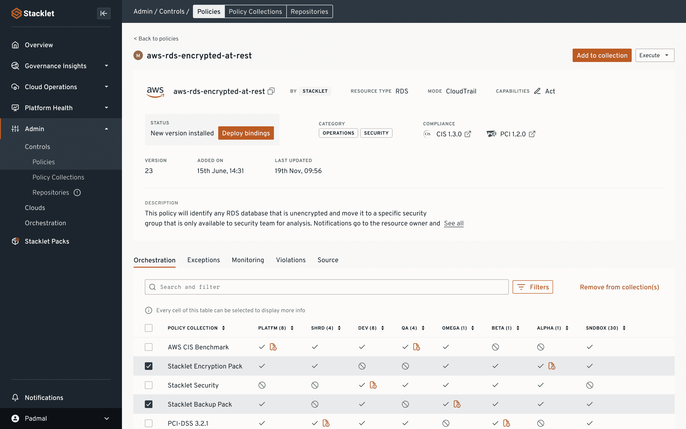

# Stacklet 在法规遵从性平台中嵌入协作

> 原文：<https://devops.com/stacklet-embeds-collaboration-in-compliance-as-code-platform/>

Stacklet 在其安全性和合规性平台中添加了协作功能[，该平台可自动对相关通知进行分组，将其发送给合适的利益相关方，并与现有工作流和协作工具相集成。](https://www.businesswire.com/news/home/20211201006286/en/Stacklet%E2%80%99s-New-Intelligent-Communications-Capabilities-Help-Organizations-Accelerate-Cloud-Adoption-Through-Governance-as-Code)

Stacklet 平台基于 Cloud Custodian，这是一个开源项目，提供对特定领域语言的访问，使 IT 团队能够采用 YAML 文件来管理代码合规性。

Stacklet 首席执行官 Travis Stanfield 表示，这种方法通过将实现合规性的责任进一步转移给开发运维团队，使采用了 [DevSecOps](https://devops.com/?s=DevSecOps) 最佳实践的组织更容易遵守广泛的要求。

Stacklet 平台的最新版本增加了通信功能，利用云资源配置和策略元数据来自动发送通知和上报。可定制的通知模板通过电子邮件或与 Slack、Microsoft Teams 和 Symphony instant messaging 的集成，为团队增加了协作环境。Stacklet 平台还可以触发吉拉和 ServiceNow 等工具中的外部工作流，以跟踪问题解决情况并生成报告。

Stanfield 说，最终，我们的目标是通过让每个相关人员不断了解最新情况，使 it 团队更容易确定其合规性补救工作的优先级。

组织在云计算环境中遇到的法规遵从性和安全性问题尤其成问题。开发人员通常采用基础设施即代码(IaC)工具来配置云基础设施。不幸的是，他们通常缺乏安全和法规遵从性专业知识，这导致了大量的错误配置。

Stacklet 平台旨在为开发运维团队提供一种方法，使用跨多个云平台的法规遵从性框架来防止法规遵从性和安全性问题，而不是要求开发运维团队为部署应用的每个云平台采用一套不同的法规遵从性工具。

尚不清楚合规责任会转移到什么程度。理论上，如果在生产环境中部署应用程序之前解决了合规性问题，组织可以避免处罚。然而，如今大型企业中管理法规遵从性的团队比他们的网络安全同行离 DevOps 团队更远。这些团队之间的文化差异可能需要几年时间才能弥合。与此同时，许多 DevOps 团队将合规性作为代码来管理，以防止在部署前的最后一刻出现意外问题。

总的来说，目标是使开发运维团队能够在不降低应用构建和部署速度的情况下实施合规性策略。希望采用法规遵从性和 DevSecOps 最佳实践能够解决这个问题。事实上，随着部署应用程序以支持数字业务转型计划的步伐不断加快，潜在合规性问题的数量也在稳步增加。更令人不安的是，合规性问题越多，网络罪犯就越有可能找到漏洞加以利用。