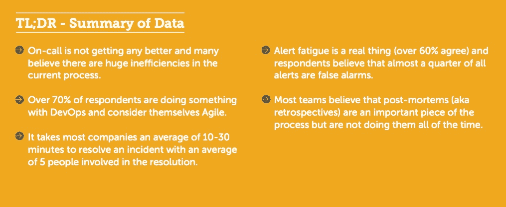
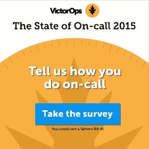

# 2015 年电话呼叫调查状态-需要帮助！

> 原文：<https://devops.com/state-call-survey-2015-help-needed/>

去年，我们发布了[首个待命状态报告](https://devops.com/2014/10/08/share-thoughts-on-call/)。我们询问了工具、建立随叫随到轮值、涉及哪些团队成员以及事件解决后会发生什么……等等。我们收到了 500 份回复，在这个过程中，我们了解到了很多关于人们如何应对随叫随到管理挑战的信息。

A few key takeaways from 2014’s results…

 
为了了解随叫随到对任何人来说是否有所改善，我们今年再次进行了调查。因为如果你不能开始挑选模式，检查逐年变化并寻找趋势，数据有什么意思呢？

我们对今年业绩的预测…

*   越来越少的人使用自主研发的监控和随叫随到系统，因为现在有了更多现成的选项
*   越来越多的组织将报告其基础设施(或大部分基础设施)已经迁移到云
*   越来越多地采用开发运维实践，尤其是在分担随叫随到的负载方面
*   ChatOps 将在组织如何进行事件管理方面发挥更大的作用
*   操作手册和协作将继续成为更快解决问题的两个最大因素
*   说随叫随到的人越来越少(希望如此！)

如果你愿意帮助这项事业，我们希望你能花几分钟时间回答关于随叫随到的问题。点击上图或这里的[开始调查](https://www.research.net/r/devopsdotcom)。我们将从所有受访者中选出一名幸运儿，赢得 Sphero 的 BB-8。

我们将于 12 月发布 2015 年待命状态报告，届时敬请关注。我们将和 DevOps.com 一起主持一个网络研讨会，展示结果。敬请关注，并提前感谢您的帮助！