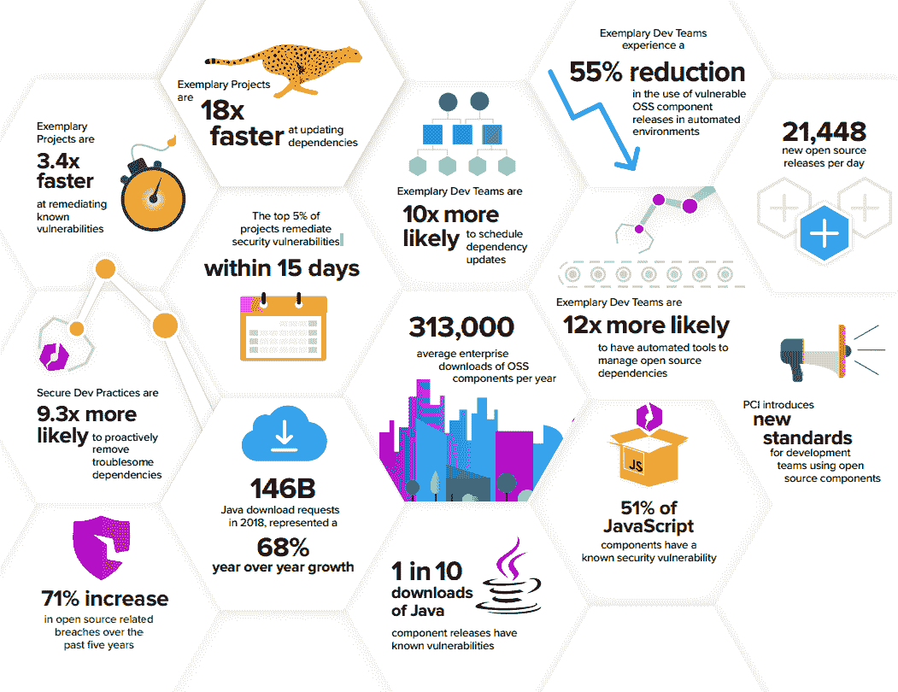

# 软件供应链的状态:安全编码成为焦点

> 原文：<https://devops.com/state-of-the-software-supply-chain-secure-coding-takes-spotlight/>

经过近一年的研究，包括研究 36，000 个开源软件项目，12，000 个企业开发团队和 370 万个开源版本，我们 Sonatype 很高兴分享“ [2019 年软件供应链状态](https://www.sonatype.com/2019ssc)”报告。

今年，我们与研究伙伴[Gene Kim(IT Revolution 的创始人](https://itrevolution.com/faculty/gene-kim/))和 Stephen Magill 博士(伽罗瓦的首席科学家兼 Muse 的首席执行官)合作，第一次客观地检查和实证记录了典型开发实践的属性，尤其是与安全编码实践相关的属性。但是，和过去几年一样，我们也分析了开源组件的快速增长的供应和持续指数增长的需求。

## **并非所有开源项目都是平等的**

在过去的四年里，我们研究了软件供应链的来龙去脉——它由什么组成；漏洞进入的方式和频率；日益增多的法规；最近出现了一种新趋势，即对手故意用恶意组件攻击供应链。

在我们的报告发表五周年之际，我们想做更深入的研究。我们想确切地了解企业开发团队——可能更重要的是，OSS 项目——是如何思考和解决软件供应链安全问题的。我们希望了解并确定最佳实践，以便与他人分享。

作为我们研究的结果，我们在 36，000 个开源开发团队中发现了五种常见的行为模式。这包括识别大型样本和小型样本的属性，它们位于 OSS 项目开发行为的前 3%,即 1229 个样本中。

为了得出这个列表，我们研究了大量变量，包括:

*   OSS 项目在更新其依赖关系和修复漏洞的效率上是否存在差异？
*   有比其他团队做得更好的模范团队吗？
*   来自示范性团队的组件是否比“非示范性”的组件被更广泛地使用？
*   哪些因素与示例性组件相关？
*   有什么建议可以提供给 OSS 组件的生产者和使用它们的开发者？

答案相当惊人——由此得出的数据更具启发性。虽然报告确定了小样本和大样本，我们也确定了另外三组 OSS 项目:落后者、功能优先和谨慎。

## 典型的商业开发实践创造了优秀的软件

具有模范 DevSecOps 实践的团队有明显的竞争优势。

多年来，我们都知道创新是关键，速度是王道，开源是核心。这项研究进一步强调了软件供应链中这些加速的趋势。这也表明驯服供应链是可能的。通过做出更好的供应商选择、组件选择和使用自动化，开发团队看到了令人印象深刻的回报。事实上，对于那些积极管理软件供应链的开发团队来说，已知易受攻击的组件版本的使用减少了 55%。

该报告详细介绍了领先企业开发团队的 11 个其他行为和属性，包括他们的软件发布频率、他们对存储库管理器的使用以及他们对软件材料清单的依赖。

Gene 和 Stephen 帮助阐明了示范性开发和 DevOps 实践的新观点，我相信这将帮助世界各地的开发人员更好地理解安全编码意味着什么以及如何着手解决它。

— [德里克·威克斯](https://devops.com/author/derek-e-weeks/)