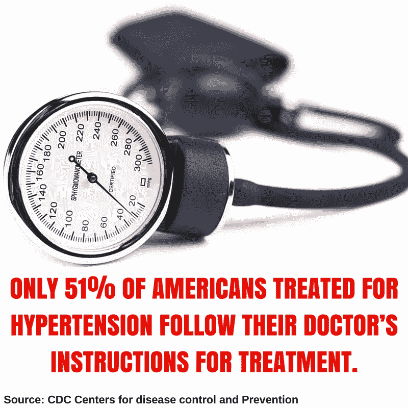
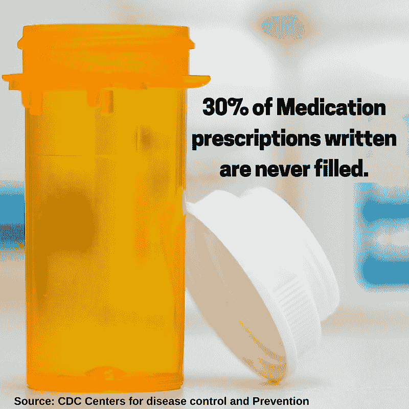
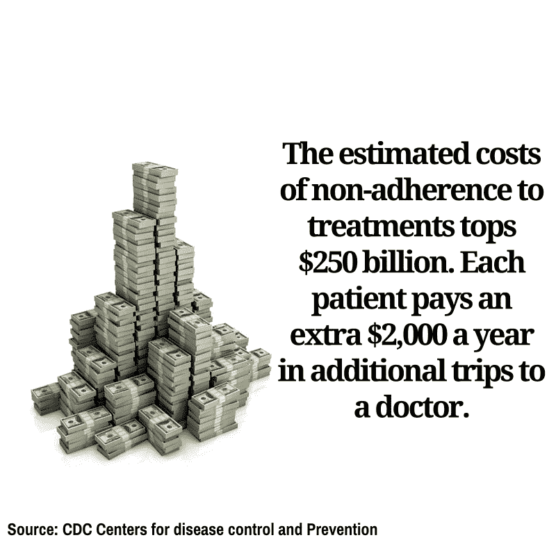

# 移动测试在生存中的作用

> 原文：<https://devops.com/staying-alive-theres-app/>

你曾经忘记吃药吗？你不是唯一一个。根据疾病控制和预防中心的数据，一半开药的人最终不再遵从医嘱。

这是一场危险的俄罗斯轮盘赌游戏。我们大多数人只是忘记了。对于老年人来说，他们用不同的说明服用更多的药物，很容易混淆。在他们的认知能力因疾病而减弱的情况下，他们可以定期遗忘。后果可能很严重。

几乎一半失败的疾病治疗都是由于未能坚持处方治疗。据估计，每年有 125，000 名美国人仅仅因为没有按时服用推荐剂量而死亡。

移动技术正在改变这一点。

最新的联网“东西”是药盒。智能药丸盒可以跟踪您是否服药、何时服药以及需要服用的药丸，甚至在药盒空了、需要重新配药时提醒您。

如果你没有服药，盒子本身会向护理人员、医生或家庭成员发出警报，他们会打电话给你。对于任何容易遗忘的人来说，这是一个救命稻草。

这种技术的优势是显而易见的。风险也是如此。把维持生命的杂务交给计算机，要求我们保证这项技术在任何时候都能完美运行。如果移动应用对我们不起作用，后果将是灾难性的。

进入移动测试。

“移动应用测试确保移动应用的每项功能在任何时间、任何地点都能正常工作。Experitest 的首席执行官 Tal Barmeir 说:“它提供了移动性的所有好处。

## 让移动测试发挥作用

一个成功的移动应用测试策略可以让你的治疗效果翻倍。为此，必须涵盖以下领域:

**功能测试:**从设置时间，到提醒用户，再到通知医生或护理人员没有服药，应用程序的每个操作都必须正常工作。它不仅要能工作，还要能在各种不同类型的移动操作系统上工作，能在各种设备上工作，并能在两者的所有版本上工作。

自动化测试:随着技术的进步，新的特性将会变得非常常见。对于添加到移动应用程序中的每个新功能，整个应用程序都必须重新测试，以确保没有任何东西受到影响——甚至是升级从未涉及的应用程序区域。这需要时间。在合理的时间内执行如此大量的移动测试的唯一方法是自动化过程。

**网络虚拟化:**当一名医生被提醒患者忘记吃药时，他或她可能正在另一个大陆度假。或者，家庭成员可以住在一个国家的另一边，使用另一家运营商的移动服务。无论情况如何，移动应用程序在一个本地网络中的工作效率要和在世界上其他 400 个网络中的工作效率一样，以确保信息及时传递，这一点至关重要。

移动技术有望延长使用顶级智能工具与移动健康应用程序通信的每个人的预期寿命。我们都将享受更健康、更长寿的生活，同时在这个过程中付出更少的代价。移动测试的作用是确保这是一个安全的过程，给你的应用一份健康的清单。