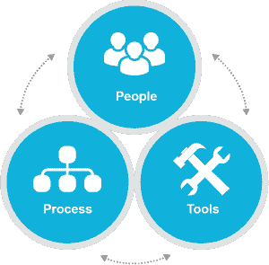
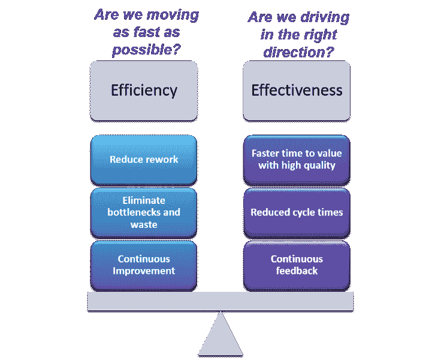

# 安全驾驶——推动跨多学科团队的协作

> 原文：<https://devops.com/steer-safely-driving-collaboration-across-multi-disciplinary-teams/>

这是 DevOps 系列的第二篇博客。在第一篇博客中， [**为企业扩展精益和敏捷:双手放在键盘上！！！**](https://devops.com/2015/08/05/scaling-lean-and-agile-for-the-enterprise-all-hands-on-keyboard/) ，我们讨论了成功的*企业敏捷转型的特征，并描述了为什么组织中所有学科的参与和承诺不仅是可选的，而且是必需的，以确保您交付差异化的价值。业务和 IT 必须同步，因为正如我们从经验中了解到的，成功的敏捷团队开发本身并不能保证组织的成功。*

*“同步”是什么意思？我们怎么做呢？当然，你要安全驾驶。我知道，这是一个可爱的文字游戏，但是想想吧。考虑一个典型的“你生命中的一天”。从你醒来的时候起，你就在一天中导航，一路上与他人交叉，并不断调整以作出回应。你丈夫比你先到浴室，所以你去拿另一杯咖啡。一个家伙穿过三条高速公路车道(在你前面！)在一个出口下车，他差点错过了，所以你开慢了一点。你在最后一刻接到一个要求，要在一天结束前完成某件事，所以你和一个同事一起完成这件事。其中一些更多的是反应而不是合作，但尽管如此，它仍然是安全驾驶的一个简单类比*:*驾驶，这意味着一系列持续的调整以使你保持航向，并在驾驶时安全地应用指导和最佳实践。这个概念反映了 IBM DevOps 框架包含的一些基本概念:*

 **   意识到你周围的环境(理解依赖性)
*   识别并避免风险和障碍(根据反馈进行监控和调整)
*   与他人合作(协作)

清澈如泥？简而言之，安全驾驶意味着，作为一个企业，您正在应用精益和敏捷原则来加速价值交付。要取得成功，需要跨业务和 IT 的多学科协作，从规划到开发到部署到交付，然后根据反馈返回规划。

让我们来探索一下你是如何做到这一点的。

第一步:改变你的行为和决策方式:

1.  专注于取悦顾客，而不是赚钱。赚钱是结果，不应该是目标。这一概念在安全的投资组合层中得到了特别的强化，它要求组织从经济的角度出发，基于对事物价值和成本的理解来帮助指导业务优先级。
2.  重新考虑老板的角色。管理层的角色是通过快速识别和消除障碍，端到端地让那些从事实际工作的人尽可能高效。敏捷曾经意味着“没有管理”，但企业敏捷不一样。你需要经理，但他们的角色不同。安全分层方法清楚地描述了各级经理的职责和活动，这样就不会产生混淆。
3.  **避免自上而下或自下而上的转向**。这两种方法都不会成功。取而代之的是，在整个组织中横向推动协作，并尽早让所有学科参与进来，并经常参与决策过程。外管局通过一系列定义明确的事件和活动明确阐述了这一概念，这些事件和活动旨在让整个多学科团队参与进来。

****

**S** **第二步:**确保转型完全解决环境的各个方面:

1.  **人员:**建立一种全组织范围的文化，拥有正确的技能组合来*拥抱*精益和敏捷的价值观——无处不在，跨越所有团队，每天都是如此
2.  **流程:** *在价值的规划、开发、部署和交付中应用*精益和敏捷原则，然后监控反馈以持续改进
3.  **工具:**提供了一个框架，使*能够*轻松地实施精益和敏捷实践

诀窍在于平衡效率和效果，这样你就能以积极的方式回答这些问题: 

*   我们是否在尽可能快地前进？通过精益实践实现执行效率，最大限度地减少浪费，最大限度地增加增值工作的时间。
*   我们行驶的方向正确吗？执行的有效性是通过持续的反馈和更好的交付分析量化价值和成本权衡的更明智指导的结果。

**第三步:**(至少)采用这三个安全概念:

看板系统:看板包含精益原则，以确保您在生命周期的适当阶段，在您的能力范围内进行足够的投资。SAFe 描述了一种受在制品(WIP)限制的分阶段分析方法，该方法以经济思维为基础，不仅根据价值，还根据成本对工作进行快速排序。

**WSJF:** 加权最短工作优先是分配给每个关键安全工件的值:投资组合史诗、程序史诗和特征。这个值本质上定义了一个估计的投资回报，并使您的团队能够在整个投资组合中一致地*并相对排名*工作，以将优先级向下驱动到团队。使用 WSJF 可以加强计划中的经济观点，因为它可以确保在确定工作优先级时考虑价值和成本。

**PI 目标:** SAFe 描述了项目和团队级别的项目增量(PI)目标工件，作为一种以相对方式记录预期和实现价值的方法。这里，和 WSJF 一样，一致性和相对性是最重要的，而不是精确。PI 目标也是获取验收标准概念的一种方式，它可以指导解决方案级的验证。

要了解我们对 SAFe 和 DevOps 的更多想法，请试试这个:[SAFe with the Power of IBM devo PS](https://www.ibm.com/developerworks/community/blogs/c914709e-8097-4537-92ef-8982fc416138/entry/safe_with_the_power_of_ibm_devops?lang=en)。

请参加 2015 年 10 月 26 日在华盛顿特区举行的 IBM agile DC。在 2015 年 8 月 15 日之前提交提案。网址:[**http://agiledc.org/2015-call-for-proposals/**](http://agiledc.org/2015-call-for-proposals/)

**关于作者/艾米·西尔伯鲍尔**

 Amy 是一名解决方案架构师，负责为 IBM 系统应用平台业务线定义和交付企业级敏捷和 IBM DevOps 计划解决方案和战略。她是规模敏捷和软件开发生命周期解决方案领域公认的主题专家，包括企业现代化、SOA 和协作开发。她在 IBM 工作了 28 年，作为一名工程师、架构师和经理，她拥有 20 年的软件开发经验。她是一名经过认证的 SAFe 项目顾问，在领导和咨询多个内部和外部 SAFe(扩展敏捷框架)转型方面经验丰富。

在  上连接艾米*