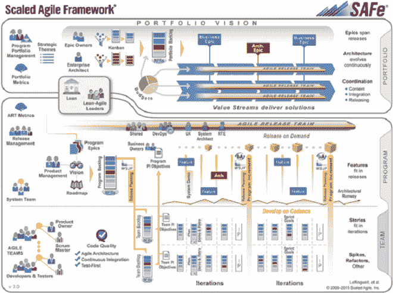
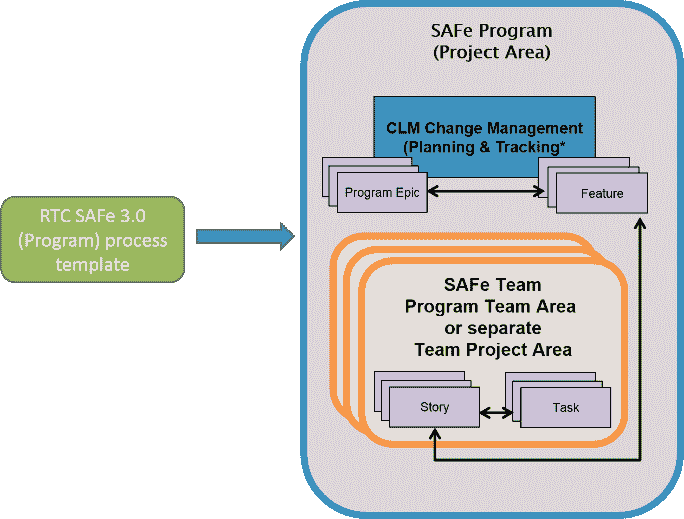
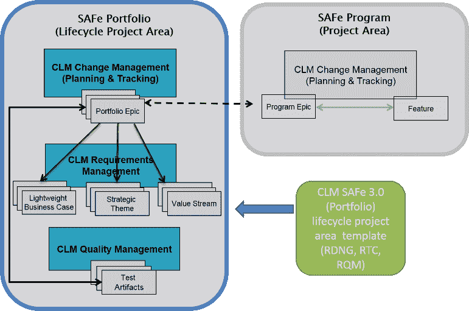
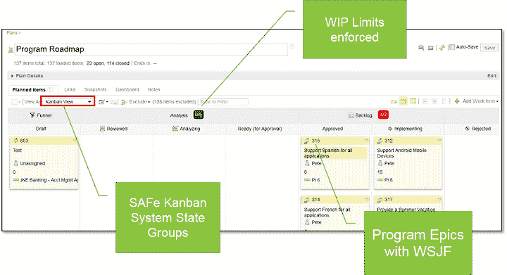
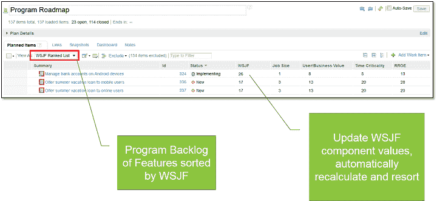

# 安全驾驶——那么你是如何做到的呢？

> 原文：<https://devops.com/steer-safely-so-how-do-you-do-it/>

这是 DevOps 系列的第三篇博客。在之前的博客中，我们讨论了一个[成功的企业敏捷转型](https://devops.com/2015/08/05/scaling-lean-and-agile-for-the-enterprise-all-hands-on-keyboard/)的特征，并提供了在企业层面应用精益和敏捷实践的具体[指导。我们讨论了“为什么”和一点“如何”的高层次，提出了需要解决扩展敏捷转换的所有方面——人员、过程和工具——以获得成功的理由。](https://devops.com/2015/08/11/steer-safely-driving-collaboration-across-multi-disciplinary-teams/)

现在你应该问“牛肉在哪里？!"你明白了…现在你想做了。太好了！因为我们有工具可以帮忙。是的，工具只是向持续交付模式转变的一个方面，但是，伙计，拥有支持企业级敏捷方法的开箱即用的工具不是很好吗，这样你就不必考虑这一部分并着手处理困难的事情——比如这一转变的文化方面？

> 扩展的敏捷框架(SAFe)提供了在整个企业中扩展精益和敏捷的“规则”;这些工具支持这些规则，可以让您快速启动并运行。

让我们从分解组织结构开始:SAFe v3.0 版描述了一种跨三个组织层扩展敏捷和精益的方法:

*   **投资组合:**进行投资决策的地方。这是经济计划的核心，计划与企业战略相一致。在一个企业中，甚至在一个业务线中，可能有多个投资组合。决策取决于战略和资金；一个投资组合有自己的策略和自己的资金。【T2
*   **计划:**资金和战略满足计划和执行的地方。该计划拥有为实现该战略而分配的资源。项目是长期的，需要持久的结构和任务，所以它们不完全等同于业务驱动的“项目”，后者通常有开始和结束日期。也就是说，程序通过它们对投资组合史诗的贡献来交付支持“项目”的能力。我们稍后会详细讨论这一点。
*   团队:真正的工作在这里完成！团队独自负责定义、构建和测试他们自己的用户故事，这些故事有助于项目的价值交付。他们是独立的和自治的，但是他们确实与其他团队合作，交付与项目远景和组合策略一致的软件。

跟我到目前为止？支持 SAFe 的工具封装了这种组织结构，让您可以在投资组合级别捕捉诸如预算、战略和路线图之类的东西，以及“变化”工件——确定项目将交付什么以及团队将如何交付*的工作项目。通过提供一个保存数据的系统，我们还可以提供对执行程序的状态和健康状况的可见性，以及报告趋势的方法，以证明测量的改进–或不改进！–随着您转型的进展。*

让我们自下而上地探索工具，因为这通常是大多数组织开始使用 SAFe 的方式。

**安全项目/团队**

IBM Rational Team Concert 支持安全的程序和团队。提供了一个过程模板，您可以使用它来创建一个项目区域，其中团队作为项目中的团队区域。也可以支持其他的拓扑，比如团队在他们自己的项目领域，甚至使用第三方工具。******

过程模板提供了:

*   ***项目区初始化***
*   ***工作项目&属性***
*   ***【路线图、看板、WSJF 排名榜】***
*   ***报道***
*   ***流程指导***

快速启动一个新项目和启动项目增量计划所需的一切都已准备就绪，可供您的团队开始工作。

**安全投资组合**

在 Rational Collaborative life cycle Management(CLM)解决方案的下一个版本中，IBM 将提供对 SAFe 组合的支持，完善我们的 SAFe V3.0 支持。与计划过程模板一样，CLM 生命周期项目区域模板将提供一个组合工具基础结构，它将变更管理与需求和质量管理结合起来，以完全支持组合的执行。通过一套模板，我们为您提供:

*   ***组合神器&属性***
*   ***计划*** ***s(路线图、看板)***
*   ***报道***
*   ***流程指导***

作为起点，投资组合包括一组作为团队区域的计划，允许您容易地识别每个计划中涉及的资源。

**安全关键概念**

在[的上一篇博客](https://devops.com/2015/08/11/steer-safely-driving-collaboration-across-multi-disciplinary-teams/)中，我们讨论了我们认为取得成功所必需的三个关键安全概念:看板、相对排名的 WSJF 以及捕获和评估价值交付的 PI 目标。工具支持这些概念中的每一个。

**看板系统**

在项目组合和项目级别，该工具提供了看板计划视图，使您的团队能够基于看板系统推动相对排序和优先级讨论。

**WSJF**

为了帮助您的程序推动待办事项计划，WSJF 分级列表视图提供了主动引导计划会议的功能，以便在线进行更改，从而创建分级的功能列表。

**PI 目标**

PI 目标是由计划过程模板提供的工作项工件，允许您捕获与 SAFe 指导方针一致的计划的和实际的价值交付。在下一个版本中，我们还将提供一个新的计算属性，用于捕获价值百分比(实际/计划),以便我们能够提供趋势报告，展示计划在一段时间内交付价值的能力。

请继续关注这个系列的下几篇博客。在此之前，如果你之前错过了最后两篇博客，请务必阅读—[*为企业扩展精益和敏捷:所有人都在键盘上！！！*](https://devops.com/2015/08/05/scaling-lean-and-agile-for-the-enterprise-all-hands-on-keyboard/)[*安全转向——跨专业团队驾驶协作*](https://devops.com/2015/08/11/steer-safely-driving-collaboration-across-multi-disciplinary-teams/) *。*

此外，在这里向专家学习:

*   [Telstra 公司利用敏捷开发和 IBM Rational 工具扩展服务](https://www.youtube.com/watch?v=jEdnqUDyBz0)
*   [Google Hangout:安全和 DevOps 应用](https://www.ibm.com/developerworks/community/blogs/c914709e-8097-4537-92ef-8982fc416138/entry/Google_Hangout_on_SAFe_and_DevOps_Adoption_July_1_2015?lang=en)

要了解我们持续的安全支持，请访问安全登录页面:[http://ibm.biz/safesupport](https://ibm.biz/safesupport)。我们期待您的反馈！请参加 2015 年 10 月 26 日在华盛顿特区举行的 IBM agile DC。在 2015 年 8 月 15 日之前提交提案。网址:【http://agiledc.org/2015-call-for-proposals/ 

**关于作者/艾米·西尔伯鲍尔**

 Amy 是一名解决方案架构师，负责为 IBM 系统应用平台业务线定义和交付企业级敏捷和 IBM DevOps 计划解决方案和战略。她是规模敏捷和软件开发生命周期解决方案领域公认的主题专家，包括企业现代化、SOA 和协作开发。她在 IBM 工作了 28 年，作为一名工程师、架构师和经理，她拥有 20 年的软件开发经验。她是一名经过认证的 SAFe 项目顾问，在领导和咨询多个内部和外部 SAFe(扩展敏捷框架)转型方面经验丰富。

在 [LinkedIn](https://www.linkedin.com/pub/amy-silberbauer/43/20/3a1) 上与艾米联系