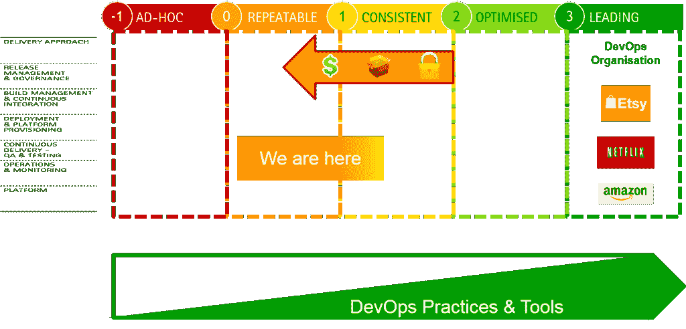

# 为什么我们仍然在 DevOps 与 15 年前的问题作斗争

> 原文：<https://devops.com/still-fighting-problems-devops-15-years-ago/>

有一件事一直让我着迷，那就是这么多年后，我仍然可以走进 IT 组织，看到基本的实践没有被遵循(例如，软件配置管理或持续集成等等)。我们不都应该更清楚吗？！？我最近看到了一些 90 年代末和 21 世纪初的幻灯片，读起来很像今天 DevOps 会议上的内容。所以我想知道是什么阻碍了我们今天变得更好，我想我找到了一个可行的答案。

出于说明的目的，我使用了埃森哲 DevOps 成熟度模型，但也可以随意使用任何其他模型，因为趋势是相似的。我相信，作为一个行业，我们过去比现在更好(当然所有的概括都是危险的，包括这个)。虽然很难找到确凿的证据，但让我来证明我的观点。

10 多年前，我们有更多的定制开发来解决大问题，大多数工作是在同处一地的团队中完成的。提高生产率和降低成本的唯一方法是拥有更好的工程实践和利用更多的自动化，因此公司在这方面进行了投资。我们过去在很多地方都是一致的。然后，就工程实践而言，两种趋势导致我们倒退:

*   离岸——随着离岸交付的引入和掌握，该行业有了自动化和良好工程实践的替代方案，因为劳动力套利提供了降低成本的快速解决方案。在海上手工操作可能比在岸上维护或引入自动化更便宜。当然，随着离岸劳动力成本稳步上升，这种情况不会持续下去。一些组织停留在工程实践和自动化的过程中，另一些组织在这个过程中失去了成熟度。这种趋势类似于制造业的趋势，在制造业中，体力劳动变得如此廉价，自动化不再是降低成本的关键因素。那些走向海外的公司没有充分关注自动化和良好的实践，因为在海外跨地区进行这种工作比较困难，而降低成本很容易实现。
*   打包和专有软件–随着我们利用越来越多的打包和专有软件，我们依赖这些供应商为我们的生产力挑战提供解决方案。随着时间的推移，这导致了孤岛解决方案，这些解决方案支持特定的包，但不够开放，无法集成到 IT 生态系统中。当配置管理隐藏在软件包中，或者更糟的是，配置只能通过图形用户界面进行，而不能访问底层源代码/文本文件时，您如何为企业范围的软件包建立基准？预打包的软件是获得功能的快速解决方案，但是良好的工程实践又一次被遗忘了。许多组织进行了如此多的定制，以至于他们真的应该像对待任何其他应用程序一样严格地对待原始的“COTS”。打包软件引入的另一个问题是，定制它们的人通常被认为或认为自己不是程序员(这意味着他们不必担心定制应用程序开发人员使用的那些实践)，在我看来，这是一个危险的错误。

**“速度是 IT 和企业的新货币”**

当以一天劳动成本表示的成本成为组织优化的主要驱动力时，这一切都很好。这种模式已经改变，如今市场速度正在推动激励和行为。全球各地的组织都在努力寻找在不影响质量的情况下加快交付流程的方法。但是，您现在如何扭转许多组织追随的趋势——您的 IT 组织主要是外包和/或离岸的，您的应用程序架构是打包软件、专有解决方案和定制元素的混合，而您缺乏修复它的工程经验和技能。

在这一点上，我们需要认识到，DevOps 是一个因组织而异的旅程。当然，也有工程驱动的组织，如 Etsy、亚马逊和脸书，他们的高管层中有工程师/IT 人员，他们直观地了解应用程序架构和良好工程的重要性。我相信他们不会问你什么是速度和灵活性的终极优化的商业案例——他们知道这有多重要——至少我相信是这样。他们还将考虑将哪些应用程序引入到他们的生态系统中，并确保这些是可以采用良好工程实践的开放产品。在其他组织中，DevOps 实践的采用需要由通常难以创建的业务案例来支持(尤其是在中等成熟度级别，在这种情况下，困难不在任务关键级别，最高成熟度的全部好处尚未触手可及)。与我们大多数业内人士一起走在这条路上的组织需要认识到改进有时是无形的。上市速度和其他周期时间指标应该是您旅程的指南。

**“无论你是否知道，每个人都在 DevOps 的旅途中”**

“你做不做 DevOps”这个问题在我看来是不成立的。我们都在 DevOps 之旅，这是改进 it 解决方案交付的旅程。DevOps 是一个广阔的领域，为我们提供了不断增长的实践和工具工具包。我们所有的 IT 高管都在寻求改善我们的组织和交付能力。只要我们不断前进，不断尝试，我们用什么标签并不重要。这趟旅程有目标吗？不，我不认为有具体的目标，一种当我们宣布我们完成了的状态。我认为我们中最好的人会继续前进，不管我们做得有多好，从我在旅行中看到的情况来看，在我面前还有很多路可以走，我不需要担心在任何情况下很快就能到达那里。加入我的旅程，愿我们的道路交叉，分享我们在旅途中的冒险故事。