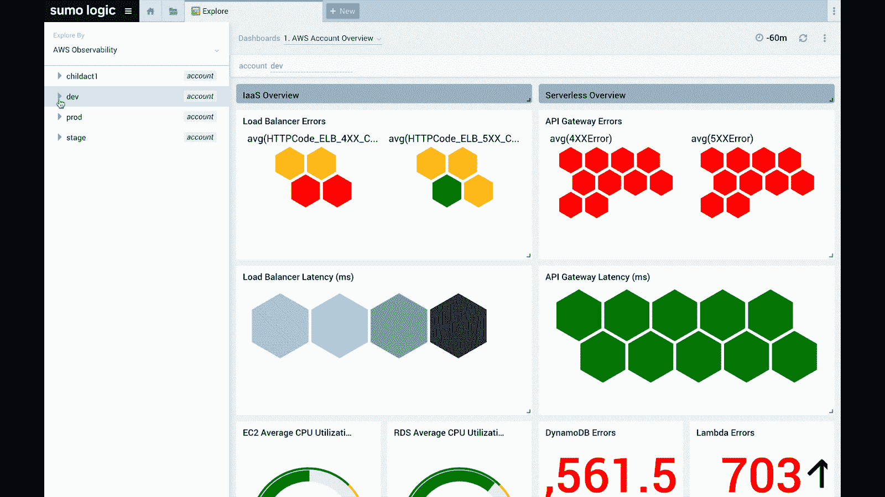

# 相扑逻辑扩大了可观察性平台的范围，达到

> 原文：<https://devops.com/sumo-logic-expands-observability-platform-scope-reach/>

Sumo Logic 今天宣布，它已经[扩展了其监控平台](https://www.sumologic.com/press-release/observability-suite-powered-by-continuous-intelligence/)的范围，以提供跨越应用和基础架构日志、指标、跟踪和元数据的实时[更深入的见解](https://devops.com/uncover-the-secrets-in-your-apps-through-observability/)。

该公司的软件即服务(SaaS)产品套件的最新成员包括 Sumo Logic AWS Observability 解决方案，该解决方案专门关注 AWS 服务，以及 Sumo Logic 软件开发可观察性解决方案的新成员，该解决方案除了现有的对吉拉、Bitbucket 和 OpsGenie 的支持外，还为 GitHub、Jenkins 和 PagerDuty 提供支持。Sumo Logic 软件开发可观察性解决方案基于一种关键绩效指标(KPI)方法，该方法由谷歌的一个分支 DevOps 研究和评估(DORA)组织开发。

此外，Sumo Logic 还推出了基于 [OpenTelemetry](https://opentelemetry.io/) 标准的分布式事务跟踪服务的封闭测试版，该标准将整合日志、指标和元数据。最后，该公司在其现有的微服务可观察性解决方案中增加了更多的跟踪功能。

Sumo Logic 最初是通过提供云服务来分析日志，作为 Splunk 的替代方案。从那时起，该公司扩展了其服务范围，以满足 DevOps 团队更广泛的可观测性要求。

Sumo Logic 的现场宣传主管 Ben Newton 表示，该公司正试图通过提供从日志分析到包括 Kubernetes 在内的各种平台的可观察性工具的一系列产品，来吸引任何成熟度级别的 IT 组织。他说，这些产品现在跨越了从编码到死亡的应用生命周期。

Sumo Logic 还区分了基于数据层的定价模式，使 IT 团队能够跨各种使用情形分析日志、指标和跟踪，而没有月度限制、峰值配置或因数据量过剩或超过自定义指标限制而按需收费。

随着新冠肺炎疫情带来的经济衰退，DevOps 工具向云转移的速度加快了。随着越来越多的 DevOps 团队在家工作，基于云的服务变得更加灵活。与此同时，在整体经济前景仍不明朗的情况下，更多的组织倾向于将 IT 成本视为运营支出。牛顿指出，整个 IT 组织需要能够以更敏捷的方式响应快速变化的业务条件。

不太清楚的是，经济衰退是否也会推动当今一系列可观察性工具的整合，这些工具包括日志分析和主要用于对应用流量进行采样的应用性能管理(APM)平台。更不清楚的是，分布式跟踪功能的兴起是否会减少对应用程序采样的依赖。

显而易见的是，IT 团队从未如此深入地了解日益复杂的 IT 环境。现在的挑战和机遇是确定如何最好地应用广泛的可观察性工具，将所有的洞察力转化为可操作的情报。