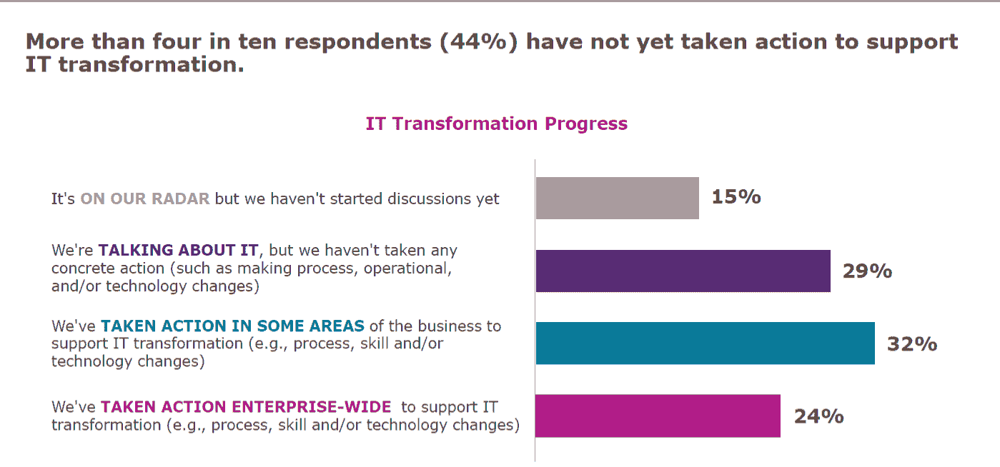
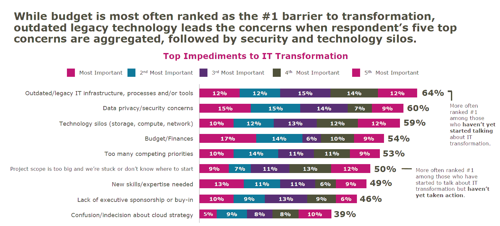
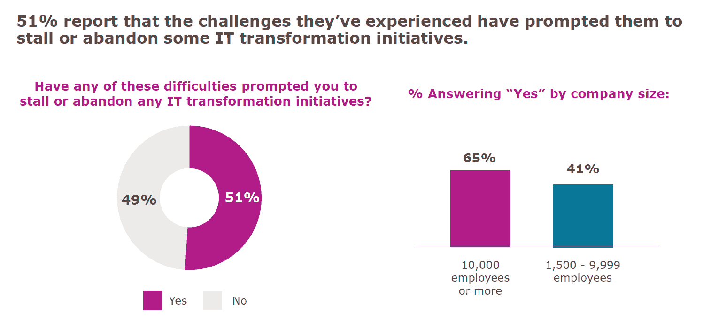

# 调查显示:数字化转型困难重重

> 原文：<https://devops.com/survey-says-digital-transformation-is-hard/>

[IDG](https://www.idg.com/) 和 [Insight Datalink](https://www.datalink.com/) 最近在[开展了一项调查](https://www.datalink.com/Transform?ext=.)，调查各公司在数字化转型之旅中的表现。就像如今的许多技术一样，如果你在数字化转型的道路上进展不顺利，很容易感觉自己会被落在后面。

你不是。

## 你们到底是什么人？

该调查的行业分布不错，主要集中在大型企业的主管及以上级别，超过三分之一的受访者来自金融服务或高科技行业。简而言之，三分之一的受访者正是最有动力实施数字化转型项目的组织。

## 将近一半的受访者甚至还没有开始

让我们先来解决一个简单的问题:调查显示，相当一部分公司除了谈论数字化转型之外什么也没做。

将“它在我们的雷达上”和“我们正在谈论它”加起来，我们得到 44%的受访者甚至还没有开始。事实上，由于数字化转型的本质，我认为只有不到四分之一的人在真正地做这件事。还有 24%的人正在进行企业范围的转型:您可以转换项目，但这并没有改变您做生意的方式。这是一个开始，所以我承认这确实是一个有争议的说法，但真正的转变是跨应用程序、跨团队、敏捷和地区移动的。

## 为什么这么小？

由于我们经常听到数字化转型及其重要性，“为什么数字这么低？”是一个合理的问题。事实是，复杂基础设施的转型非常困难。这是无法回避的事实。当有一个包含大量数据的大型机和一个通常复制大型机功能的中间层时，那么在(此处插入语言，但在上面的环境中通常是 Java)中进行基于 web 的事务的独立应用程序，有许多部分是复杂的，像移动和/或合理化数据存储这样简单的事情可能非常复杂。

但我不会在这里没完没了地讲下去，我会简单地向你们展示 IDG 的发现。

特别看看大型机工具集，在过去的几年中，已经有了巨大的进步，使它们与现代开发和部署实践更加兼容。但是要利用这些变化，通常需要更新系统，否则系统会崩溃。而且这种更新*将*破坏某些东西的风险总是存在的。一个组织对现代化工具做的研究越多，他们就越相信有一条有效的路径——但是当它被添加工作时，这并不容易。

数据隐私的排名也很高，这是因为它多年来一直在处理数据中心的数据锁定问题。此外，公共云数据存储中的一些惊人的配置错误让我们都感到害怕。许多公司都有针对公共云中数据安全的解决方案，但这并不能改变我们都曾因“由于存储桶配置错误”而畏缩不前的事实。

技术孤岛是一个事实。这些筒仓可能会被打破，但它们不太可能完全消失。在寻求减少孤岛的过程中，EMC 专家或 Cisco 专家不太可能被淘汰。(我刚刚挑选了两个角色，他们的知识有时会让我吃惊——既因为这些人可以拥有的深度，也因为他们需要这种深度的要求。)让您的网络和存储团队参与数字化转型，同时不破坏让他们变得有价值的东西(他们特定于孤岛的知识和洞察力)，这是一个可以实现的挑战，但不是通过“打破孤岛”来实现的；更像是，“增加筒仓之间的通信，同时减少筒仓行为。”

## 如果你那样潜水，你会失速的！

在本次调查中，我想说明的最后一点是“停滞的数字化转型计划”幻灯片。(这项调查中有大量的好数据，但这三个数据非常吻合，所以我把它们拿出来了。)事实是，如果你试图改造一个复杂的系统，你会有赢有输。有些事情会比你计划的更好，而有些事情根本不会如你所愿。我认为，由于问题的措辞，这就是我们在这里看到的情况:

是的，51%在任何其他情况下都是令人震惊的，但问题是，“这些困难是否促使您停止或放弃了任何 IT 转型计划？”

任何都是一个大词。事实上，任何是那个问题中最大的词。如果用“你的”而不是“任何”来表达，我想肯定的答案会是一个接近零的极限。

如果你宣布对一系列新流程进行大规模重组和实施，诸如“这不适合我们的基础设施”之类的说法将会不攻自破。这并不意味着数字化转型的厄运和黑暗；这只是另一个需要克服的障碍。暂时放弃它，同时关注计划中更可行的部分是常识，除非不可行的部分是转型的核心。那么它仍然会导致你在解决问题时停滞不前。

## 二等奖；荣誉奖；H 奖

平均而言，受访者表示，他们预计超过三分之一的数字化转型活动将由第三方进行。那是一大块。“外包”规模不大，但仍有很大一部分工作他们希望外包出去完成。

## 所以。很多。打字。

好吧，我现在要闭嘴了。外卖很简单。与宣传相反，您的数字化转型并没有落后。这是一项艰难的工作，在开始之前知道你希望从中获得什么将有助于你在事情变得艰难时继续下去。他们会变得粗暴。“转变”这个词应该告诉你。但是继续前进:如果你能坚持下去，会有更好的/更快的/更智能的/更移动的，因为它们是复杂的系统，需要复杂的修改，缓慢而稳定确实会赢得比赛。

请记住，你要对那些极其复杂、难以改造的系统的行为负责。每天都是。让它们变得更好、更容易管理是显而易见的，但花点时间沉浸在让事物在复杂的环境中运行的想法中也是如此。

唐·麦克维蒂