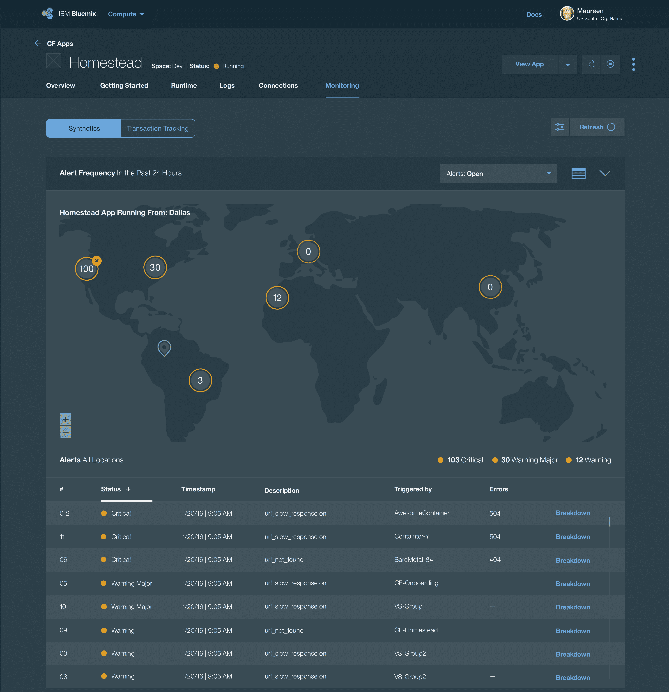

# 综合监控:监控之旅的开始

> 原文：<https://devops.com/synthetic-monitoring-the-start-of-the-monitoring-journey/>

在创新和为应用程序提供快速更新的压力下，开发人员通常把监控放在事后考虑的位置。在当今世界，速度放缓可能会导致客户流失，停机可能会导致[数百万美元的损失](https://money.cnn.com/2016/09/07/technology/delta-computer-outage-cost/)和负面新闻，确保令人满意的响应时间已经成为开发早期阶段最关键的需求之一，也是确保开发运维成功的共同目标。

**监控的左移**:为了研究开发运维团队如何以及何时开始监控的新兴模式，我们采访了几个开发运维团队。几乎一致的回答是:

1.  他们最关心的是知道，**应用程序启动并快速加载了吗**？应用程序的所有关键用户交互是否都符合可接受的标准？
2.  他们希望在整个开发生命周期中主动获取这些信息**,这样他们就可以确定任何代码签入是否影响了性能/**
3.  他们希望使用**最低设置**和配置进行监控，但没有时间学习复杂的工具/

为了满足这些需求，综合监控成为监控的起点。

借助综合监控，DevOps 团队可以模拟用户行为，并在性能问题影响用户之前，主动检测来自世界各地的全天候性能问题。他们可以通过 fine 应用程序 URL 和 API 并运行模拟来检查用户最常经过的路径是否响应良好，从而最大限度地延长正常运行时间并确保良好的响应。

合成监控的一些关键功能对开发团队非常重要:

*   全天候报告全球所有网页、URL 和关键用户交互的可用性、响应时间和用户满意度得分(如 Apdex)
    *   每分钟运行一次或更短时间的合成测试，以测试:
        *   网页加载
        *   REST API 调用
    *   每隔几分钟通过脚本运行一次模拟用户交互
*   需要最少的设置和维护，最好是带有全球托管探头的 SaaS 解决方案。监控内部应用程序需要专用探测器。
*   作为交付管道的一部分集成到 DevOps 生命周期中，以便可以在开发/测试、试运行和生产中运行合成测试。
*   提供对运行什么测试、多长时间运行一次、从哪里运行以及在 HTTP 响应代码中验证什么的粒度控制。
*   易于使用的脚本工具，没有学习曲线，最好是开源的。通常，开发中使用的自动化回归测试脚本可以被重用来运行生产中的合成模拟。
*   不仅通过用户首选的通知渠道(如电子邮件或 SMS)，还通过他们的主要协作渠道向用户发出问题警报。
*   提供相关警报，并通过适当的警报过滤和失败重试来避免警报噪音。
*   通过呈现警报、指标和部署活动的自动关联视图，确定问题是否由应用程序部署或更改引起。
*   快速隔离问题是在应用程序代码中还是在它的依赖关系中，例如网络延迟问题或第三方服务变慢。
*   通过提供所有页面资产的瀑布分析，查明缓慢的请求、断开的链接、大图像、缓慢的外部 API 调用等，诊断失败的确切步骤。
*   通过故障的自动化浏览器屏幕截图加速诊断。
*   比较应用程序的两个版本以启用 A/B 测试。
*   提供每日、每周和每月的分数和报告，以确保满足正常运行时间和用户满意度的目标 SLA。

敬请关注本[五篇博客系列](https://devops.com/2016/09/07/continuous-monitoring-role-devops-and-apm/)中关于 DevOps 和日志分析的下一篇博客，不要忘记[注册](https://bit.ly/2bwak1v)观看即将到来的互动网络广播“了解为什么我们必须在 DevOps 生命周期中向左转移 APM”

## 关于作者/ Payal Chakravarty

Payal Chakravarty 是 IBM 应用性能管理产品组合的领导者。她在企业技术领域拥有九年的丰富经验，担任过各种职务，包括产品管理、战略、开发运营、工程管理和软件开发。她定义并交付了软件即服务(SaaS)和内部软件，用于应用性能管理、混合云监控、数据中心管理和运营分析。Payal 拥有杜克大学的 MBA 学位和北卡罗来纳州立大学的计算机科学硕士学位。你可以在 Twitter 上找到她，她在那里发布关于 DevOps 和云的所有事情。在 [LinkedIn](https://www.linkedin.com/in/payalchakravarty) / [Twitter](https://twitter.com/its_pi) 上与 Payal 联系