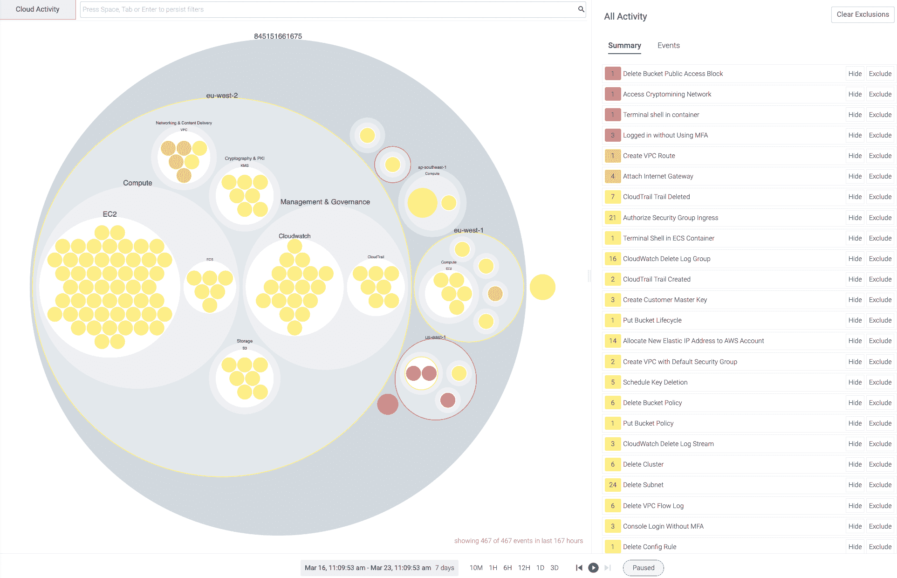

# Sysdig 将 CSPM 模块添加到 DevSecOps 平台

> 原文：<https://devops.com/sysdig-adds-cspm-module-to-devsecops-platform/>

Sysdig 今天宣布[在其 Sysdig Secure DevOps 平台中添加了云安全状态管理(CSPM)模块](https://sysdig.com/press-releases/sysdig-adds-unified-threat-detection-across-containers-and-cloud-to-combat-new-lateral-movement/)，用于监控应用性能和安全性，使 it 团队能够持续检测威胁。

Sysdig 的产品营销总监 Pawan Shankar 表示，这种 CSPM 功能基于开源云托管工具，使 IT 团队能够定义访问云基础设施的规则。此外，该工具使 IT 团队能够收集利用率指标，这些指标可用于在云资源未被使用时将其关闭。IT 团队现在还可以通过软件即服务(SaaS)平台自动发现正在使用的所有云服务，包括确定哪些服务配置错误或者可能存在需要解决的合规性和监管问题。

Shankar 补充说，总的目标是帮助减少当今组织在采用 DevSecOps 最佳实践时遇到的摩擦。

Sysdig 正在为一个帐户免费提供其 [CSPM](https://devops.com/?s=CSPM) 产品，以鼓励 DevOps 团队利用 CSPM 功能以及 Sysdig 的开源 Falco 威胁检测功能。Sysdig 今天还宣布，它扩展了 Falco 的实现，以使用在谷歌云平台(GCP)上创建的审计日志。Sysdig 在 2018 年向云原生计算基金会捐赠了 Falco。最近，Sysdig[还贡献了一个 Sysdig 内核模块](https://securityboulevard.com/2021/02/sysdig-donates-ebpf-to-cncf-to-improve-linux-security/)，以及用于 Kubernetes 的 Falco 安全平台的库，它运行在扩展的 Berkeley 包过滤(eBPF)微内核中，以进一步提高 Linux 的安全性。

免费层包括每天对照 CIS 基准进行检查，以及支持每月对运行在 Amazon Web Services (AWS)提供的 Fargate 或 Elastic Container Registry (ECR)服务上的多达 250 个集装箱图像进行在线扫描。

几年来，Sysdig 一直致力于传统 IT 监控功能和安全性的融合。在最近一些涉及软件供应链的高调违规事件之后，该公司打赌，在恶意软件越来越容易在整个 it 环境中横向移动的时候，更多的 DevOps 团队将很快重新审视他们的软件供应链是如何管理的。事实上，Sysdig 引用的研究估计，70%的网络攻击涉及恶意软件在组织中的横向移动。

当然，随着基于微服务的应用程序的兴起，一般的 IT 环境将变得更加集成，这自然会使恶意软件更容易横向移动。Shankar 指出，IT 组织现在需要更好地了解整个潜在攻击链，以应对这些威胁。

随着 DevSecOps 的不断发展，开发人员和网络安全团队之间的关系也在不断发展。现在，开发人员对网络安全负有更大的责任，他们中的许多人都倾向于那些可以在更大的 DevOps 工具链中轻松集成的工具。

安全工具将如何集成到这些工具链中还有待观察，但对于已经依赖 Sysdig 来监控其 It 环境的 DevOps 团队来说，只需点击几下鼠标，就可以访问大量附加的安全服务。