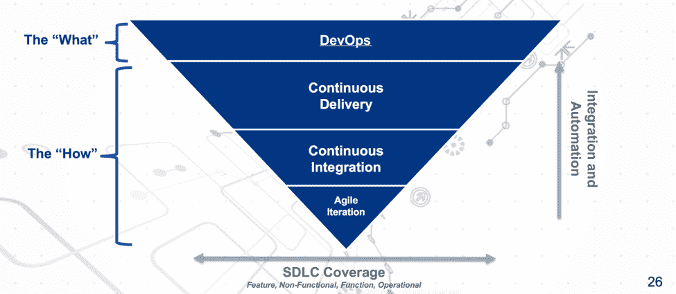

# DevOps 发现的故事第 2 部分:定义很重要

> 原文：<https://devops.com/tales-devops-discovery-part-2-definitions-matter/>

## **定义很重要:DevOps 转换的第二步**

*[关于 DevOps 探索系列的第一篇文章](https://devops.com/2016/04/01/tales-devops-discovery-qa-field/)讨论了询问利益相关者的基本问题的重要性，以促进优先事项的一致性，并在开始 DevOps 转型时建立使命陈述。下面的第 2 部分回顾了与 DevOps 相关的常见术语的定义，并举例说明了未能就这些术语达成一致会如何阻碍您的转型。*

这个行业充斥着诸如持续集成、敏捷、持续交付、DevOps 等术语。这些术语所描述的实践经常被不同的行业“专家”不同地定义，导致软件交付过程中的涉众对这些实践的构成有不同的理解。有些人会说他们已经在遵循惯例了；其他人会说他们没有。一些人认为目标无法实现，而另一些人则看好前景；不同的解释阻碍了对组织的当前状态和目标状态达成一致。如果利益相关者不能就当前状态(或起点)和目标状态(或目的地)达成一致，就不可能为 DevOps 之旅“绘制路线”。

例如，让我们看看一些人是如何定义持续交付的:

**连续交付–定义 1:**

> 一种软件工程方法，团队在短周期内生产软件，确保软件可以在任何时候可靠地发布。它旨在更快、更频繁地构建、测试和发布软件。
> 
> 该方法允许对生产中的应用程序进行更多的增量更新，有助于降低交付变更的成本、时间和风险。直截了当且可重复的部署流程对于持续交付非常重要。
> 
> 资料来源: [【维基百科】](https://en.wikipedia.org/wiki/Continuous_delivery)

**连续交付–定义 2:**

> 连续交付是一种软件开发原则，在这种原则下，你可以用一种软件可以在任何时候发布的方式来构建软件。
> 
> [马丁·福勒连续发表博文](http://martinfowler.com/bliki/ContinuousDelivery.html)

您可能阅读了上面的内容，并且最初认为这两个定义没有什么不同，但是，请注意，第一个定义通过以下陈述来解决软件的部署问题:“ 一个简单且可重复的部署过程对于持续交付非常重要”，而第二个定义通过以下陈述来解决软件的部署问题:“以一种软件可以在任何时候发布到生产环境的方式来构建软件。”

这个区别可能看起来微不足道，但是它经常是连续交付实践和通常被称为连续部署的实践之间混淆的根源。与持续交付相反，持续交付声明每一个软件构建“都可以被发布”，持续部署被松散地定义为“向用户发布每一个好的构建的实践”

当建立 DevOps 转换的目标状态时，这种看似轻微的混乱可能会导致利益相关者的反对，他们担心连续部署无法实现或太具破坏性。这些观点包括:

*   业务:“我们无法以这样的速度收集、规范和跟踪我们的需求。”
*   运营:“我们无法支持日常生产交付、确保安全性、正常运行和执行日常工作。今天，我们花了整整一个周末的时间和多次尝试来部署。”
*   客户:“我们的合规团队需要三个月的时间来审核和批准我们会计系统的每个新版本。”

混乱和潜在的阻碍说明了在开发运维转型开始时建立基线定义和一致性的必要性，并在您组织的特定环境中这样做。it 部署范围等要点的重要性因组织而异—一些组织可以支持一周多次甚至一天多次的连续生产部署，例如网飞。其他组织，如关键财务系统的提供商，可能永远不会追求这种部署节奏。请务必根据您的组织实际应用这些行业实践， 不要教条地基于通用的行业定义。

让我们看看 DevOps 的几个定义:

**devo PS–定义 1:**

> DevOps (开发和运营)是一个企业软件开发短语，用来表示开发和 IT 运营之间的一种敏捷关系。 **DevOps** 的目标是通过倡导两个业务部门之间更好的沟通和协作来改变和改善关系。”
> 
> [Webopedia](http://www.webopedia.com/TERM/D/devops_development_operations.html)

**DevOps 定义 2:**

> "DevOps(一个[【开发】](https://en.wikipedia.org/wiki/Software_development)[【运营】](https://en.wikipedia.org/wiki/Information_technology_operations) )是一种强调 [软件开发者](https://en.wikipedia.org/wiki/Software_developer) 以及其他 [信息技术的协作与交流的文化、运动或实践 它旨在建立一种文化和环境，使构建、](https://en.wikipedia.org/wiki/Information_technology)测试和发布软件能够快速、频繁、更可靠地进行。”
> 
> [【维基】](https://en.wikipedia.org/wiki/DevOps)

像连续交付的例子一样，这两个定义也非常接近。然而，仔细观察后，很明显第一个定义将 DevOps 描述为关注关系(即文化和协作)。第二个定义对此进行了扩展，包括“软件交付和基础设施变更的自动化过程”，考虑了工具和技术实践，例如连续交付。

这重要吗？是的。通常，如果执行发起人和关键利益相关者不考虑建立工具和技术实践的需要，而只关注关系，那么很有可能对时间表、预算和结果有不切实际的期望。相反，如果不考虑文化和过程中的变更需求，并且 DevOps 转换只关注工具和技术实践，那么努力也不可能产生预期的结果。DevOps 转换必须考虑“人员、流程和工具”的三位一体。

当考虑 DevOps、it 目标及其组件实践的目标时，建立这些实践之间关系的清晰概念是有用的。将它们形象化如下通常是有用的:

The DevOps Transformation Triangle

DevOps 是“什么”，是由一组指导原则定义的目标状态。敏捷开发、持续集成和持续交付是“如何”，一系列过程、实践和工具共同构建了可持续开发运维实施的基础 。

在下一节中，我们将回顾在开始开发运维转型时提出的一些初始发现问题，提供来自真实组织中各利益相关方的真实答案示例，并分析这些答案以更好地理解开发运维之旅。