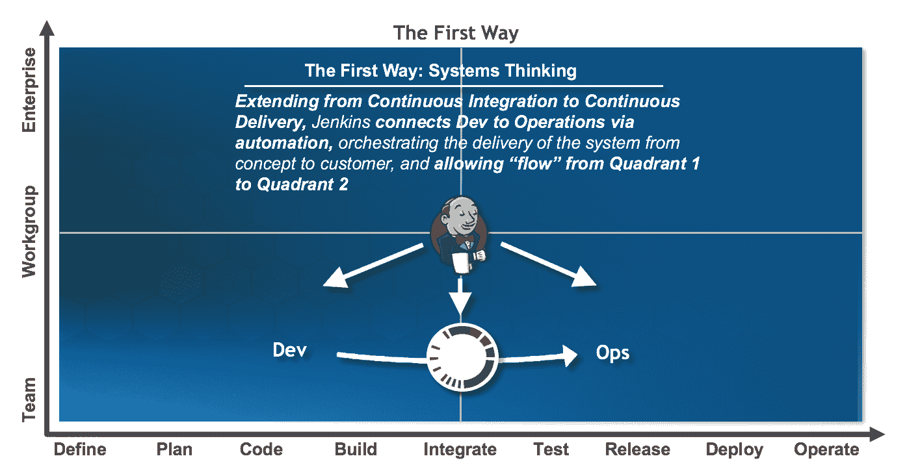

# DevOps 发现的故事，第 3 部分:问答和解释

> 原文：<https://devops.com/tales-of-devops-discovery-part-2/>

这是 DevOps 发现故事系列的第三部分。为了赶上进度，请阅读[第一部分](https://devops.com/2016/04/01/tales-devops-discovery-qa-field/)和[第二部分](https://devops.com/2016/05/27/tales-devops-discovery-part-2-definitions-matter/)。

在准备开发运维转型的过程中，关键的第一步是执行预先发现，通常会询问利益相关者最基本的、看似显而易见的问题。这种发现的主要部分应该在群体环境中完成。在小组环境中向利益相关者询问这些基本问题可以提供关于计划的 DevOps 实施的不同观点甚至不同目标的关键见解。在发现阶段分享这些不同的观点为相互理解奠定了基础，并使利益相关者能够识别和协调，这是协调共同目标的重要一步。在本文中，我们将概述常见问题，分享真实世界的答案，并提供解释和应用结果的指导。

### 发现问题:您希望通过这种转型/开发运维实现什么？

首先要考虑的事情之一是，“我们为什么要这样做？”因为这建立了目标和目的。因此，我通常会在发现过程中首先询问利益相关者，他们期望通过向 DevOps 的转变实现什么。对于这个问题，我得到的答案往往截然不同，这取决于回答的人的角色。可以理解的是，他们深受该角色独特视角的影响。

### 答案:

**CIO:** “随着我们转向以 SaaS(软件即服务)为主的模式，并看到业务的快速增长，我们希望提高“扩大”交付的能力。这意味着我们必须提高开发人员的工作效率，更快地响应客户的请求，同时减少严重程度为 1 的问题的数量。”

**运营:**
“我们希望减少技术债务，最大限度地减少消防工作，并提高我们采用现代最佳实践(如基础设施即代码)的能力。我们必须能够在将应用交付生产的同时保持正常运转。”

**开发:**
“我们希望最大限度地减少客户特定的一次性工作，这种工作会导致开发、QA(质量保证)和部署中令人痛苦的复杂性，并且是效率低下的整体根源。我们希望能够花更多的时间来改善用户体验、性能和增加有价值的功能。但是，相反，我们正在追踪 bug 并返工被误解的需求。”

### 指南:

不足为奇的是，高管通常会关注以业务为导向的目标，如提高生产率和客户响应，而运营则关注稳定性和尽量减少冲突，开发则希望创新。但是在这些差异中，我们看到了一些可以利用的共性，比如生产力。例如，一个共同点是生产力:

首席信息官:“我们必须提高开发人员的生产力。”

**运营:**“…最大限度地减少消防工作，提高我们采用现代最佳实践的能力…”

**开发:**“…花更多时间改善用户体验、性能和增加有价值的功能。”

首席信息官、开发和运营回答的另一个共同点是关注质量:

**首席信息官:**“…减少我们的严重问题数量。”

**运营:**“我们希望减少技术债务…保持正常运转…”

**开发:**“…反而是我们在追 bugs”

这些共同点可用于建立跨职能部门参与的共同目标，例如:

*   我们的努力将提高生产力，并最大限度地减少加班和交火(跨团队)
*   我们的努力将提高应用程序的质量和正常运行时间

然后，它们不仅可以用作指导决策(如流程或工具选择)的驱动原则，还可以用于建立关键绩效指标(KPI ),该指标将用于量化地衡量转型的成功。示例 KPI 可能是:

*   缩短从故事接受到用户接受(或发布)的周期时间
*   每次发布的严重性 1 或严重性 2 生产问题的数量
*   每次构建的缺陷
*   每次发布的缺陷
*   开发工作小时数？运营？

### 发现问题:你今天实践敏捷了吗？如果是，你如何定义一个故事或冲刺的完成？

连续交付(CD)和精益实践是成功的、可持续的开发运维转型的基础(尽管不要求满足开发运维的某些定义)。)如果我们将 CD 和精益实践视为一条管道，通过这条管道，我们需要管理由工作代表的连续变更流，那么考虑将什么工作发送到管道中、如何启动工作以及如何管理变更是很重要的。因此，在探索过程中，向客户询问有关所使用的开发方法以及定义、规划和编码的总体实践的高级问题是非常重要的。

不同层次的回答是不同的，“是的，我们是敏捷的”，“不，我们是瀑布”，以及“我们两者都实践。”最常见的情况是，组织的回答描述了对某种敏捷形式的坚持，以及改进的空间。

### 答案:

“我们实践敏捷和/或 scrum。我们在两周的迭代中工作，在前一个 sprint 结束时为 sprint 计划工作。一旦代码被成功提交并合并到一个团队分支，并且被成功构建，我们就认为故事已经完成了。当 sprint 的所有故事都被提交并成功构建时，我们就认为 sprint 完成了。

“大约每三个月，我们将来自团队分支的代码集成到主干中，并执行自动和手动回归和验收测试的混合。一旦构建通过 QA，我们将手动部署到生产前环境，验证并安排手动部署到生产环境。”

### 指南:

这是传统瀑布式组织采用敏捷的经典故事。组织在开发中采用敏捷，而不涉及其他关键职能团队，如 QA 或运营。通常，这是因为它更简单。在跨组织、技术和文化边界扩展敏捷实践的过程中，有许多障碍需要克服，所以通过将敏捷的采用限制在这些边界上，可以避免这些障碍。

这是一个将采用限制在“敏捷上游”而实践瀑布或遗留“下游”的例子研究表明，不到 33%的组织采用了“敏捷上游”并在计划、编码和团队构建中运用敏捷或迭代开发实践，然而只有 13%的组织采用了敏捷下游，并遵循诸如持续集成(CI)、CD、自动供应测试和部署等实践。

将敏捷采用限制在敏捷上游的负面影响是多方面的，但是可以总结为，“你永远不知道你什么时候完成了。”因此，您无法准确地度量进度、引入延迟风险或中断开发计划来解决流程下游部分发现的问题，例如验收测试期间出现的理解不充分的需求，或者在部署到类似生产的环境期间发现的运行时问题，或者在最坏的情况下，最终用户在生产中发现的问题。

关于 DevOps 的一本开创性的书是 Gene Kim 的《凤凰计划》，它提出了 DevOps 思考的三种方式。第一种方法，“系统思维”，通过跨越传统界限的系统观点和通过界限建立系统的“流程”，解决敏捷上游和下游、开发和运营、业务和客户之间的差距。

### 发现问题:你今天练 CI 吗？您执行什么类型的验证？

由于 CD 是 DevOps 的基础，CI 也是 CD 的基础。CI 可以被看作是敏捷上游到敏捷下游的连接点，是填充 CD 管道的泵。这是大多数组织声称他们遵循的实践，也是最经常被错误实施的实践。因此，当在发现过程中调查客户的当前状态时，了解 CI 当前是否是其中的一部分非常重要。

### 答案:

“是的，我们实行持续整合。每个团队都有一台 Jenkins CI 服务器。开发人员每周多次提交他们的变更。然后，詹金斯将这些变化作为每夜构建的一部分。

“我们做一些单元测试，但是我们不跟踪代码覆盖率。如果夜间构建失败，我们可以继续提交，但我们通常会在几天内修复问题。”

### 指南:

这是一个常见的答案，也是 CI 实施不当的一个例子。CI 不仅仅是拥有一个共享的 Jenkins CI 服务器和运行预定的构建。CI 可以定义为:

> “一个软件开发实践，团队成员经常集成他们的工作，通常每个人至少每天集成一次——导致每天多个集成。每个集成都由自动化构建(包括测试)来验证，以尽快检测集成错误。”—马丁·福勒

实践 CI 的好处包括识别接近问题根源的集成和质量问题，从而减少纠正的时间，并使更高质量的软件能够更快地开发出来。

正确实施的 CI 的基本要素是:

*   ****频繁集成变更**，理想情况下每天多次甚至每次变更。**
*   ****通过组件级测试、代码扫描等执行一致的质量验证**。**
*   ****总是维护一个工作构建**，当一个构建失败时暂停开发，并且直到问题被纠正或回复之前不恢复开发。**

**允许“几天”的不完整构建，将提交或构建推迟到“每周多次”，或者没有通过测试实践一致地验证的团队，不是实践 CI，也不会产生 CI 的好处。**