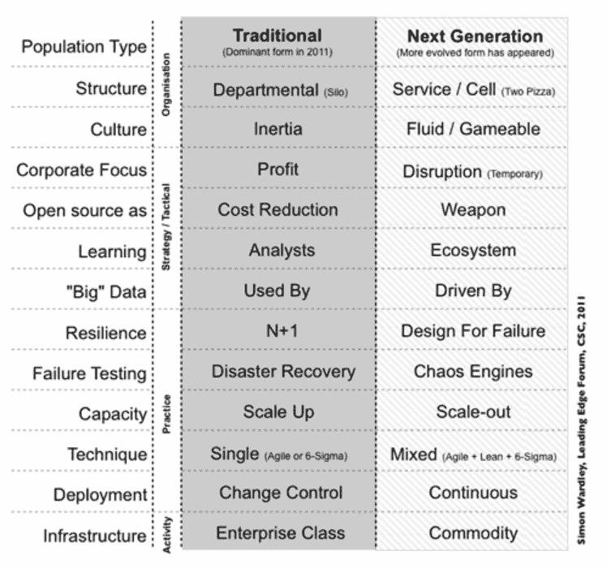
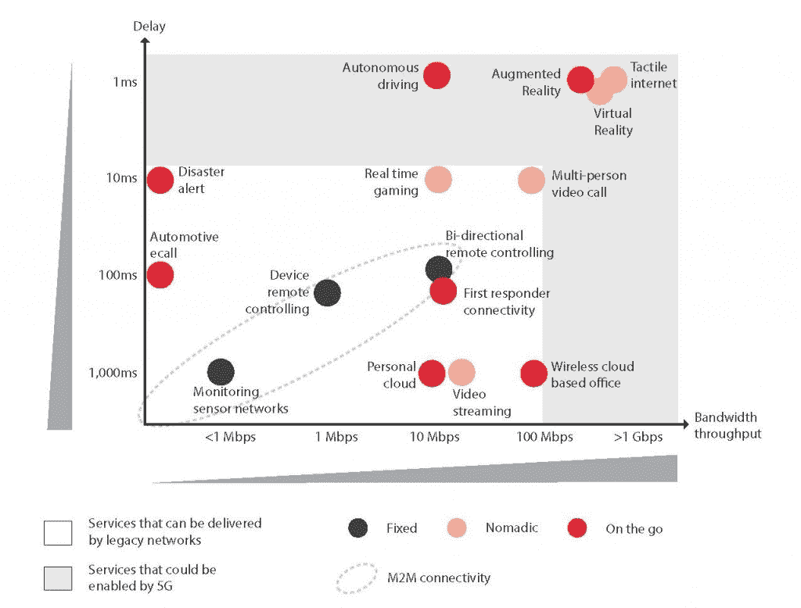

# 驯服 2 个云应用性能敌人

> 原文：<https://devops.com/taming-2-cloud-app-performance-enemies/>

每当你听到“今天网络很慢”或者更糟的“网络瘫痪”这样的话，你就知道有人算错了。可能是决定购买错误硬件的人，或者可能是与错误的电信提供商签约的人。

通常，速度变慢或停机是由于有人低估了服务器需求或高估了网络设置中的冗余量。找到合适的冗余水平，让用户不必等待数据，又不会在云容量上超支，这总是一件棘手的事情。

IT 经理在从内部基础设施转向云基础设施时犯的一个常见错误是，未能利用亚马逊网络服务、微软 Azure 和其他云提供商提供的灵活、经济、冗余的容量。这是崔琰在 2015 年 4 月 20 日他的博客“燃烧的和尚”中的结论。

崔指出，延迟是不可避免的，因为事情会出错，而且通常情况下，这些事情超出了你的控制范围。这就是为什么您在设计应用程序时必须考虑延迟的原因。开发人员经常在一个泡泡里工作，所有的硬件和网络参数都与手头的任务相适应。在现实世界中，硬件、网络和软件都会崩溃。如果你的应用程序没有被设计来适应这样的失败，你就让你的用户陷入困境。

## 现实一点:在测试环境中注入延迟

要在真实环境中对应用性能建模，在预期负载下测试服务器和数据库是不够的。你必须采取额外的步骤来模仿那些不可避免和不可预测的小故障。Cui 建议在每个请求上注入随机延迟。他甚至[提供了一个简单的 PostSharp 属性](https://gist.github.com/theburningmonk/384acf8bd55f3bdcbdfb#file-injectlatencyattribute-cs)来自动化这个过程。

Cui 进一步应用了错误规划的概念，在用于抑制请求的机制中引入错误，以防止坏人使用 Charles 和 Fiddler 等工具或垃圾邮件发送者自己的机器人向他们的服务器发送垃圾邮件。通过使错误在开发环境中可见，设计人员可以预测它们，并设计出“优雅地”处理节流错误的方法再次应用 PostSharp 属性来随机注入节流错误；Cui 指出，可以使用相同的方法来计划和自动响应会话过期、状态不同步和其他特定于服务的错误。

这些以及其他错误检测和纠正方法都属于“为失败而设计”的范畴，这是西蒙·沃德利(Simon Wardley)倡导的原则，是下一代科技公司的关键特征。

西蒙·沃德利的失败设计对比了传统商店和他称为“下一代”的商店的发展方式来源:[燃烧的和尚](http://theburningmonk.com/2015/04/design-for-latency-issues/)

*崔解释了如何使用[混沌猴子和混沌大猩猩【】,以及设计的](http://techblog.netflix.com/2011/07/netflix-simian-army.html)[机制](http://theburningmonk.com/2015/03/qcon-london-2015takeaways-from-scaling-ubers-realtime-market-platform/)，对开发过程中的延迟和其他错误进行建模，以允许其客户端应用程序在数据中心停机时无缝故障转移。*

## *从专家那里了解如何应对延迟:游戏玩家*

*没有什么地方的服务器性能比在线游戏世界更重要，在那里一微秒的小故障就能决定赢家和输家、冠军和傻瓜之间的差别。在 4 月 17 日 Venture Beat 上的一篇文章中，Cedexis 的 Pete Masden 解释说, [500 毫秒的网络延迟](http://www.cedexis.com/blog/guest-blog-toto-were-not-in-gamestop-anymore-digital-distribution-and-the-new-oz-for-video-games/)会使在线游戏玩家离开的可能性增加一倍，而 [2 秒的加载时间延迟](https://blog.radware.com/applicationdelivery/applicationaccelerationoptimization/2013/05/case-study-page-load-time-conversions/)会导致高达 87%的放弃率。*

*马斯登说，解决延迟问题首先要测量它。这就是为什么我们在构建云管理平台时，为 [Morpheus](http://morpheusdata.com) 添加了原生监控。能够一目了然地看到您组织的所有应用和业务服务的状态，这不仅是一种很好的便利，也是一种竞争优势。为了能够按系统依赖性和影响浏览您组织的所有应用程序和业务服务、组数据库、应用程序服务器、消息队列和 web 服务器的状态，查看总体状态以及每个应用程序的当前状态对于了解您组织中的情况至关重要。*

*解决云服务器延迟的一种方法是创建单独的实例，这在故障转移中很常见，但在处理区域性网络需求时不太常见。然而，Masden 建议在实施多个冗余实例时采用主动-主动方法，而不是传统的主动-被动模式，以确保所有服务器都是最新和优化的。在多个实例之上运行全局流量分析器，以确保没有一个实例变得过于拥挤。*

## *“零延迟计算”可能实现吗？为什么不呢？*

*如果你现在认为网络延迟是一个问题，那么等到 5G、物联网(IoT)、虚拟现实(VR)和机器人技术等技术成为主流时就知道了。设备和带宽升级以及更复杂的软件定义网络不足以满足未来的应用性能需求。这是 Nitin Serro 在 9 月 29 日发布在渠道合作伙伴博客上的结论。Serro 认为三项技术是满足未来性能需求的关键:网络功能虚拟化基础设施(NFVi)、雾计算和零延迟计算。*

**

*5G 和相关技术使应用成为可能，通过将更多智能直接转移到网络，而不仅仅是通过提供更快的速度，这些应用几乎消除了延迟。来源:GSMA Intelligence，via [The Unwired People](http://theunwiredpeople.com/2015/05/18/all-eyes-on-latency/)*

*虽然 NFVi 和雾计算主要关注网络和数据层(计算、存储和网络基础设施)，但零延迟计算针对的是应用层，在应用层，信息必须在不同组件之间实时交换，其中大多数组件都与用户直接相关。根据 Serro 的说法，只有从主干到边缘的整个网络基础设施的重新发明，才能防止今天的瓶颈成为明天的障碍。*

## *让网络智能更贴近数据*

*Silicon Republic 的约翰·肯尼迪(John Kennedy)表示，我们现在面临的网络容量挑战是前所未有的，他在 10 月 3 日的一篇文章中写道，即使是备受吹捧的 5G 网络也将因需要容纳许多前辈而步履蹒跚。5G 将为网络智能带来巨大的推动，而不是大多数分析师预期的网络速度的“阶跃变化”。这可能是这项技术最大的资产:一个更智能的网络意味着数据不用走那么远。*

*从应用程序设计的角度来看，延迟可以追溯到三个来源:链接到遗留基础设施的需要、通过 API 链接到第三方的需要以及互联网本身固有的不可预测性。Marqeta 的 Dave Matter 在 9 月 13 日的 App Developer 杂志上的一篇文章中从支付处理的角度研究了这些情况。*

*与网络基础设施本身一样，应用延迟的解决方案是将更多智能移入应用本身，然后依靠开放 API 在更接近用户的环境中实时链接数据源。同样，数据和相关分析工具的传输距离更短，需要处理的延迟也更少。最终，延迟的解决方案——在硬件和软件中——将是更少、更短的旅行。*

*— [布莱恩·惠勒](https://devops.com/author/bwheeler/)*