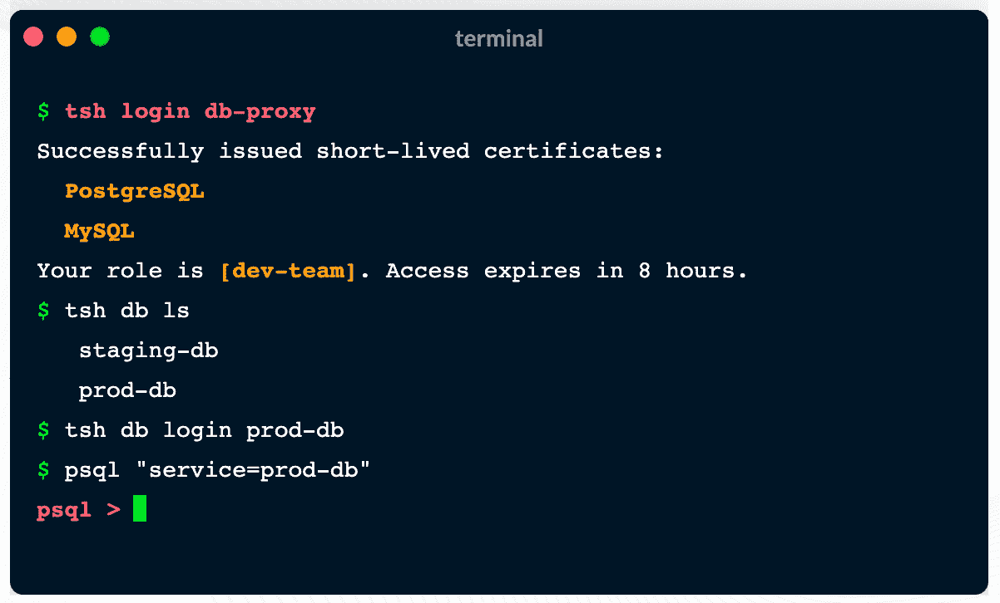

# Teleport 为安全网关增加了数据库支持

> 原文：<https://devops.com/teleport-adds-database-support-to-security-gateway/>

Teleport 今天宣布，它已经为安全网关添加了对数据库的支持，作为云服务提供，目前用于保护 Linux 服务器和 Kubernetes 集群。

首席执行官 Ev Kontsevoy 表示，Teleport 打算将安全网关的覆盖范围扩展到整个 IT 基础设施，开发人员通常使用这些基础设施来远程访问数据库。最初， [Teleport 6.0](https://www.globenewswire.com/news-release/2021/03/17/2194633/0/en/Version-6-0-of-Teleport-Introduces-Secure-Database-Access-for-Users-Who-Need-To-Access-Databases-in-Multi-Cloud-Environments.html) 增加了对开源 PostgreSQL 和 MySQL 数据库的支持。

Teleport 作为一种访问管理工具获得了广泛的关注，因为它提供了一个单一的二进制文件，开发人员可以轻松地部署该文件来加密 it 平台和实施会话控制。它会自动[发现 It 环境中的所有资源，以及访问这些资源所需的协议](https://digitalanarchist.com/videos/featured-guests/ev-kontsevoy-techstrong-tv)。Teleport 还提供了一个 JSON 格式的统一审计日志，使 it 团队能够跟踪哪些资源正在被访问，何时被谁访问。

其他功能包括通过内置的单点登录(SSO)和多因素功能来验证身份，发现和查看所有数据库实例，与命令行界面(CLI)和一组用于管理权限提升的工作流集成。

由于多种因素，访问控制正成为一个更大的问题。随着运行应用程序所需的基础架构不断增长，整个 IT 环境变得越来越复杂；大多数 IT 团队继续在家工作，以帮助对抗新冠肺炎疫情。Teleport 提供了一种细粒度的方法来简化跨服务器、集群和数据库的[访问管理](https://devops.com/?s=access%20management)，从而消除了对虚拟专用网络(VPN)的依赖。Kontsevoy 说，实际上，Teleport 使 IT 团队能够转向一种更加以身份为中心的方法来统一访问管理。

Kontsevoy 补充说，当 DevSecOps 的兴起将安全责任进一步推给开发人员时，这一点至关重要。Kontsevoy 说，虽然这种转变的速度会有很大差异，但很明显，作为更快推出安全应用程序的更广泛努力的一部分，开发者正在对访问控制进行更多的控制。

DevOps 团队可能需要一段时间才能将他们目前使用的所有访问控制协议聚合在一个代理下。然而，Kontsevoy 说，今天花费在管理访问控制上的大量时间和精力将促使 DevOps 团队寻找方法来自动化目前非常手动的过程。

不太清楚的是，网络安全团队在监督访问管理方面可能扮演什么角色。需要单独的覆盖层来管理访问的日子可能即将结束。

与此同时，很明显，在一个大部分 it 团队及其支持的员工都在家工作的时代，VPN 不是为解决访问管理而设计的。更多的员工可能很快会更频繁地回到办公室，但远程工作可能会继续流行。这意味着管理远程访问的传统方法从未被设计成可扩展的，将变得越来越过时。