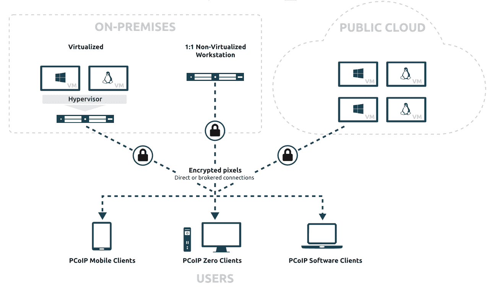

# Teradici 将虚拟桌面引入 Azure Stack

> 原文：<https://devops.com/teradici-brings-virtual-desktops-to-azure-stack/>

Teradici 今天宣布，它已经在微软 Azure Stack 上提供了云访问软件(CAS)，这是微软为内部服务器提供的云操作系统版本。

Teradici 产品管理副总裁 Ziad Lammam 表示，Azure Stack 上 CAS 的可用性使得采用 Teradici 开发的 [PC-over-IP](https://www.teradici.com/what-is-pcoip) (PCoIP)远程显示协议从 Azure Stack 平台访问运行在微软 Azure 云中的虚拟桌面成为可能。

虚拟桌面已经以这样或那样的形式存在了几十年，但其采用一直受到限制，主要是因为在本地服务器上配置虚拟桌面的复杂性。然而，随着公共云的兴起，利用作为云服务提供的虚拟桌面变得更加容易。

Teradici 创建的 PCoIP 协议在云和桌面之间传输像素，这使得通过云交付在图形处理器单元(GPU)上运行的高性能 3D 图形应用变得可行。虽然有其他协议可以用来访问远程桌面，Lammam 说，PCoIP 已经获得了牵引力，因为它能够支持这种高清应用程序。

然而，微软已经将大部分力量投入到其专有的远程桌面协议(RDP)上。

究竟有多少虚拟桌面可能会迁移到云上，还有待观察。许多组织出于各种技术顾虑和文化问题抵制虚拟桌面。虚拟桌面很难在本地服务器上设置，而与云的连接可能会时断时续。与此同时，许多负责管理本地桌面的内部 IT 团队一直不愿放弃对其领地的控制。事实上，直到 Azure 兴起之后，微软才开始积极鼓励这些 it 团队采用虚拟桌面。

然而，Lammam 说，现在到云的连接变得更加可靠，越来越多的组织正在将工作负载转移到云，技术问题和文化问题都不再是一个障碍。

不太清楚的是，IT 组织将在多大程度上接受 Azure Stack 作为一个平台，从这个平台访问运行在 Azure 云中的虚拟桌面。一般来说，Azure Stack 要求组织获取并部署一个现代服务器来运行它。许多组织倾向于访问运行在云中的虚拟桌面，而不必购买运行新型操作系统的新本地服务器。Teradici 已经提供了对运行在公共云上的虚拟桌面的访问，而不需要组织安装 Azure Stack。然而，有一部分微软客户将使用 Azure Stack 来构建和部署混合 IT 环境，并需要访问在公共云上运行的虚拟桌面。

无论选择哪种方式，很明显将会有更多的虚拟桌面通过云来访问。许多组织希望降低与管理通常部署在多个远程办公室的本地桌面实例相关的人力成本。现在的挑战是根据所访问的工作负载的特征，找出实现该目标的最佳途径。

— [迈克·维扎德](https://devops.com/author/mike-vizard/)