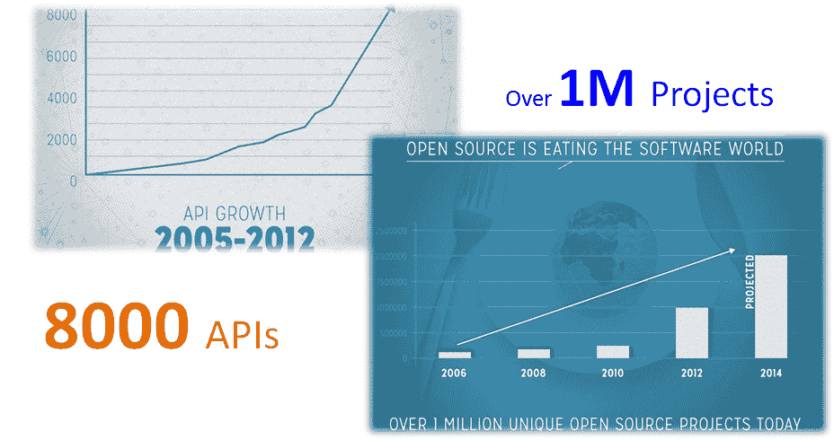

# 自动化连续体

> 原文：<https://devops.com/the-automation-continuum/>

如今，创新的速度经常受到采用令人兴奋的新工具的速度的影响，特别是开源工具。在过去的几年中，开源项目一直在以指数速度增长；然而，探索、测试、配置并最终将它们集成到生产环境中的过程通常仍然非常复杂和耗时。在许多情况下，这个过程仍然是手工完成的。与所有 DevOps 流程一样，通过自动化，我们能够更快地采用新工具，并且在流程中减少人为错误。

### 开源革命

## 

这一过程中的摩擦很大程度上是由于这样一个事实:从探索到 POC 和测试、集成，再到管理，每个阶段都需要在完全不同的设置和环境上使用非常不同的工具。这意味着，例如，每当你想从探索阶段进入测试阶段时，你必须基本上重建整个系统。这可能会变得非常令人沮丧，而且如上所述，非常耗时。

如果我们能够简化这一过程，并快速探索数十甚至数百个项目，从而使我们能够无缝地增加我们的创新，会怎么样？

这是如何工作的——流程:

1.  探索:无需安装任何软件就可以探索产品。这可能是通过点击 Github 上的一个按钮，并看到产品的行动。这将使您能够使用它，而不必下载、配置或设置任何机器。

2.  测试:当我们开始尝试时，我们希望使用与探索阶段相同的模型。我们也想在 SaaS 的基础上尝试一下，但是这次要有更多的控制。我的意思是在更高性能和类似生产的环境中，用真实的集群和机器进行测试。

3.  开发:在这个阶段，我们希望能够用我们的实际栈来测试它，并快速地将它插入到我们的项目中。然后，最终在稍后阶段下载它并在我们自己的环境中运行它。

### 需要什么

有了所有这些阶段的统一工具，过程中的大多数摩擦都可以减少。实现这一点的一种方法是将项目作为服务或在我们的环境中运行，使用一个编排引擎，它基本上可以带我们完成所有这些阶段。

通过将整个项目打包成一个超级启动器(在 Cloudify 中，我们称之为“小部件”)，任何开源项目都可以插入其中，就像应用商店或存储库一样，任何用户都可以立即开始使用，而不必知道它到底是如何运行或工作的。

好的一面是，我们最终可以从应用程序目录或商店中获得软件，因为它不是作为一个黑盒打包的，而是作为一个蓝图或脚本。然后，我们可以根据自己的需要对其进行定制。正因为如此，我们实际上可以在整个循环中使用相同的工具，彻底打破摩擦。

因此，归根结底，最基本的原则是将 SaaS 和[云流程编排](http://www.cloudifysource.org/cloudifyRecipeCatalog.html)的能力结合起来，以避免安装的复杂性，使用基于脚本的模型来使软件打包通用，但仍可定制，并使用云抽象来移动环境，而不必改变配方。这就是我们所说的自动化连续体，我们一直用它来演示如何将任何开源项目的力量带到任何云上。