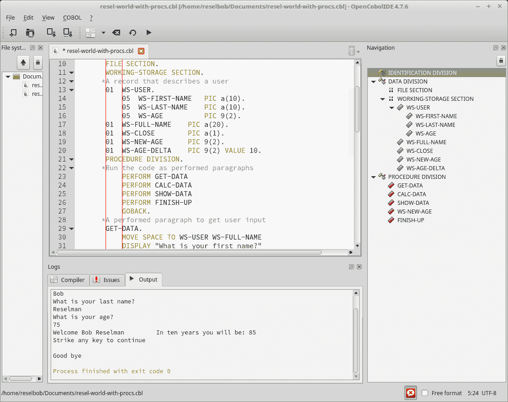
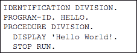
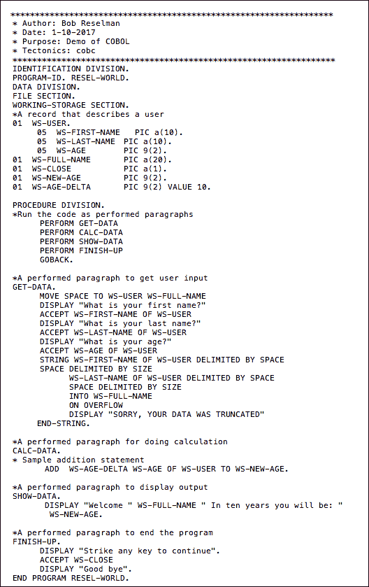
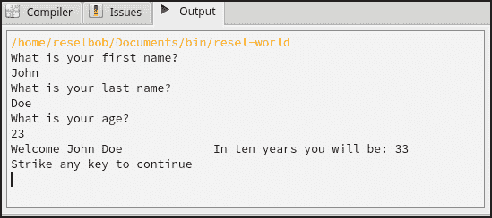
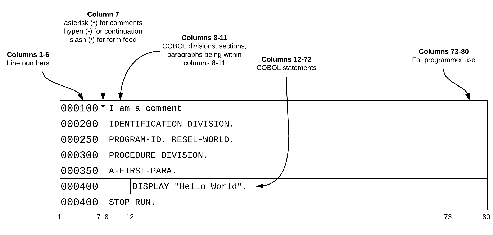
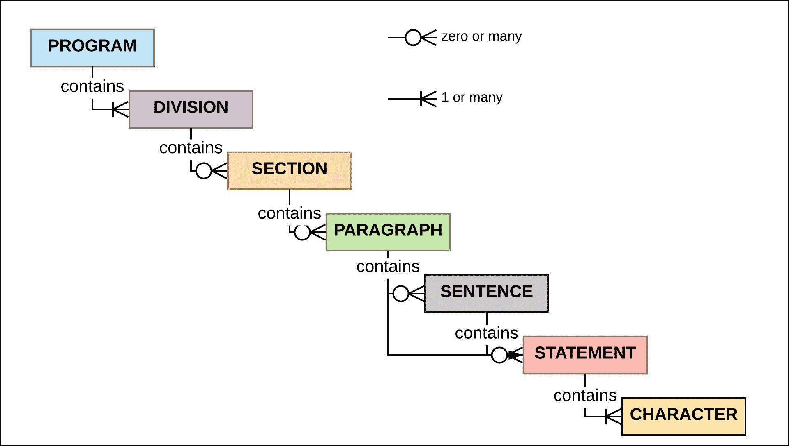
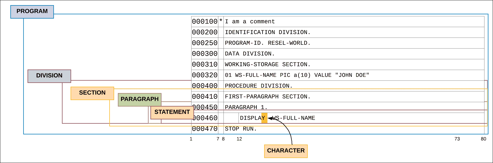
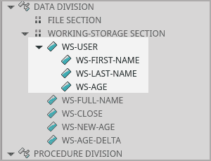
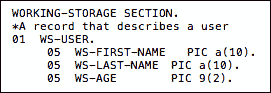
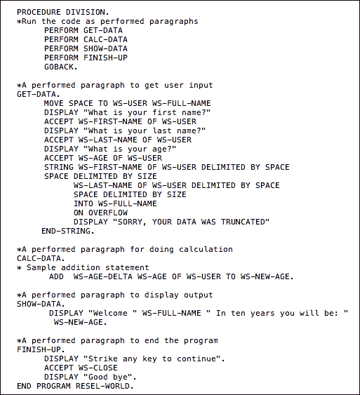

# 2018 年最佳:COBOL 编程语言之美

> 原文：<https://devops.com/the-beauty-of-the-cobol-programming-language-v2/>

在我们结束 2018 年之际，我们 DevOps.com 想要强调今年最受欢迎的五篇文章。以下是我们为期一周的 2018 年最佳系列的第一篇。

写得好的代码是一件艺术品。过去是，将来也是。一个程序员会凭空想出一个想法，然后把它转化成一个可以被其他人使用的工作想法。它的抽象表达变成了现实。计算机编程需要深度的创造力和逻辑纪律，这在别处是很难找到的。也许建筑和理论科学很接近，但是计算机编程却与众不同。计算机编程很特别，我喜欢它！

因此，我总是对学习一门新的编程语言感兴趣。每一种编程语言都提供了拓展我思维的新途径。时间总是用得其所。

最近，我决定学习 COBOL，没有别的原因，只是因为有许多大型机安装，并且它是其中许多大型机的主流语言。大型机对于许多银行、保险公司、运输系统和政府机构的运营至关重要。学习 COBOL 在我的愿望清单上已经有一段时间了。所以我冒险一试。

| COBOL 这个术语代表什么？面向商业的通用语言 |

## 在现代 IDE 中使用 COBOL

在学习 COBOL 的过程中，我首先需要的是一个 IDE。我非常支持在集成开发环境(IDE)中编码。我喜欢能够在一个地方编写、测试和运行代码。此外，我发现 IDE 提供的支持功能，如可视化代码结构分析、代码完成和内联语法检查，使我能够高效地编程和调试。

我找到的 IDE 是开源产品， [OpenCobolIDE](https://opencobolide.readthedocs.io/en/latest/index.html) ，如下图 1 所示。



**图 1: OpenCobolIDE 提供了许多工具来简化 COBOL 编程**

OpenCobolIDE 允许我在一个地方编写、编译和运行代码，而不用去命令行，这非常好，因为我是世界上最差的打字员！

| **Programming COBOL in the Real World**当要进行真实世界的基于大型机的 COBOL 编程时，您最好看看 IBM 提供的 ide。这些工具被设计成作为一组 [Eclipse 插件](https://developer.ibm.com/mainframe/products/downloads/eclipse-tools/)无缝地在 Z Systems 环境中运行。这些工具允许在大型机环境中工作的 COBOL 开发人员编码、调试、单元测试和确定问题。 |

设置好我的开发环境后，接下来要做的事情是设计我的第一个项目。

## 设计我的第一个 COBOL 程序

通常，当学习一门新语言时，我喜欢从小处着手，逐步完成更复杂的任务。我做了典型的 Hello World 节目。您编写代码以在标准输出中显示字符串 Hello World。每个开发者都做一个。这是一个简单的程序，如清单 1 所示


**清单 1:一个用 COBOL 编写的 Hello World 程序**

虽然 Hello World 要求我了解除法的概念，我将在下面详细讨论，但在事物的计划中，我需要更多。我想写一个程序，迫使我学习如何:

*   如何创建和使用变量？
*   如何将数据组织成层次结构。
*   如何将代码组织成封装的过程。
*   如何做一些基本的算术？
*   如何接受用户输入，然后围绕该输入进行一些操作。

因此，我创建了程序 RESEL-WORLD，如下面的清单 2 所示。



**清单 COBOL 程序 RESEL-WORLD 接受并操纵用户的输入**

用户输入和程序输出如图 2 所示。

****

**图 2:RESEL-WORLD COBOL 程序要求用户输入名字、姓氏和年龄，然后操作输入**

RESEL-WORLD 项目教会了我很多关于 COBOL 以及如何用这种语言编程的知识。本着奉献的精神，我将分享我从编写这个程序中学到的东西。然而，在我深入研究细节之前，请注意，我提供的信息只是一个高层次的概述。与任何编程语言一样，要成为入门级专业人员，需要大约一年的持续编码时间。我真诚地希望我提供的信息能给读者一个良好的语感和足够的动力去学习更多。正如我前面提到的，学习 COBOL 是值得的。

## COBOL 是结构化文档中的代码

学习 COBOL 时最需要理解的是，在代码布局方面非常严格。布局规则与列和字符的使用有关。此外，该格式使用分层大纲结构。以下部分描述了布局规范的细节。

### COBOL 列规范

在 COBOL 中，一行代码的长度不能超过 80 列。你也可以把一个列想象成一个字符。列被分成组，每组都有特定的用途。列组如下所示:

**列 1-6** 是程序员定义序号的组。序列号类似于行号。

**第 7 列**为特殊字符保留。星号(*)开始一行注释。连字符(-)表示行继续符，斜杠(/)是换页符。

**第 8-11 列**称为区域 A。区域 A 是您开始划分、段落和节的一组列。我们将在下一节*COBOL 结构层次*中详细讨论这些。

**第 12-72 列**，也称为 B 区，是你写代码语句的地方。

**列 73-80** 保留给开发者使用。如果你愿意，你可以在那里写诗。只要确保你不超过 80 栏。

下面的图 3 说明了上面描述的列分组。

**图 3:COBOL 文件中的每一列都被指定用于特定的目的**

COBOL 是一种编译语言。到了运行代码的时候，编译器会检查以确保代码布局符合列分组规范。如果有违反，编译器将出错。

| **Understanding Performance in Terms of Compilation and Compilers**COBOL 是一种编译语言，其他如 Java、C#和 C++也是如此。编译是将文本源代码转换成计算机可以理解的二进制格式的过程。当谈到编译器时，COBOL 世界中有许多变化，特别是当谈到成本和性能效率时。例如，编译器如何编排数字在内存中的加载和计算方式非常重要！一个好的编译器会让代码运行得非常快。IBM 从事 COBOL 业务已经有很长一段时间了，并且非常了解如何让编译器变得又快又划算。例如， [z14 系统](https://www.ibm.com/ms-en/marketplace/z14?S_PKG=-)编译器通过利用近 24 条新的低级指令来提高效率。结果，计算速度显著提高。随着您使用 COBOL 的时间越来越长，您会逐渐体会到像 [IBM Z Systems](https://www.ibm.com/it-infrastructure/z) 这样的业界领先的编译器给编码体验带来的强大力量。 |

## COBOL 结构层次

COBOL 程序的文件格式背后的概念是基于文档大纲的结构，有一个顶级标题，后面跟着下级。构成层次的组织单位是程序、部门、章节、段落、句子、陈述和字符。图 4 展示了层次结构。

**图 COBOL 程序实体的结构层次**

程序是 COBOL 代码层次结构的根级别。PROGRAM 代表大型机作业调度程序 [JCL](http://www.mainframes.com/JCL.html) 加载到内存中运行的代码单元。程序由标识部分中的程序 ID 语句来标识。识别部门是从程序往下的下一个层次的一部分。程序**必须**包含标识部分。

还可以包括其他部门。这些其他的划分是:环境划分、数据划分和程序划分，它们发生在识别之后。此外，这些后续部分必须按照定义的顺序出现:环境、数据，然后是过程。你可以在这里阅读各个赛区[的详细描述。分部名称以句点结尾，例如，](https://matrix.senecac.on.ca:8443/wiki/bac344/index.php/Four_Divisions)

```
DATA DIVISION.
```

从部门往下的下一级组织是部门。(请看图 5。)每个部门都将包含其特有的部分。例如，数据部分可以包含文件部分、工作存储部分和/或链接部分。你可以在这里阅读关于部门[的详细信息。](http://www.mainframestechhelp.com/tutorials/cobol/cobol-divisions.htm)

**** 
**图 5:一个 COBOL 程序以分层的方式构造**

部分名称以句点结尾，例如:

```
WORKING-STORAGE SECTION.
```

一个节包含零个或多个段落。(通常一节至少有一个段落。)段落名称以句号结尾，类似于分部和小节。

段落包含句子或陈述。一个句子是一组陈述。通常一个段落包含一个或多个陈述。语句是一个执行行。语句由字符组成。字符可以是字母数字符号或特殊字符。字符位于 COBOL 代码格式层次结构的底部。

## 变量和数据类型

COBOL 允许您以各种数据类型声明变量。COBOL 的特殊之处在于由级别号表示的变量级别的概念。级别号根据是父变量还是具有父变量来定义变量。(稍后，您将在 *COBOL 支持分层数据*一节中看到更多相关内容。)

下面的语句是变量 WS-QUANTITY 的声明，它将在数据分部的工作存储部分中声明。WS-QUANTITY 将保存一个数值。

```
01  WS-QUANTITY PIC 9(2) VALUE 12
```

上面的表达式将变量 WS-QUANTITY 声明为两位数的值，初始值为 12。此外，该变量被声明为级别 01，这是可能的最高级别。该变量没有父级。我们之所以知道 WS-QUANTITY 是一个两位数值的变量，是因为 PIC (Picture)子句。您可以将 PIC 子句视为类型声明。表 1 提供了各种 PIC 子句符号的高级描述。

| 标志 | 描述 | 示例声明 | 样本值 |
| nine | 一个数值，其中每出现一次 9 就代表一个数字 | 99 或 9(2) | Thirty-five |
| a | 字母的 | aaa 或 a(3) | “鲍勃” |
| x | 含字母和数字的 | xxx 或 x_4) | “R2D2？” |
| v | [隐式小数](http://3480-3590-data-conversion.com/article-implied-decimal.html) * | 五(3) | .175 |
| s | 符号 | 第九条第二款 | -76 |
| p | 假定十进制* | p9 | .6 |

**表 1:PIC 条款的符号**

*COBOL 有一种特殊的存储数字的方式，这样当字符被加载到内存中时，数字转换就发生了。例如，PIC 为 p9(2)的变量将作为 56 存储，并作为. 56 加载到内存中。关于用法和 PIC 条款的详细讨论，请点击[这里](http://www.mainframes360.com/2009/12/cobol-tutorial-usage-clause.html)。

## COBOL 支持分层数据

将数据存储在一组命名的变量中使编程更容易。例如，在 C 编程语言中，我们可以使用一个结构来命名一组变量，如清单 3 所示。

```
struct User { 
  char  first_name[10]; 
  char  last_name[10] 
  int   user_id; 
};
```

清单 3:C 语言中的一个简单结构

COBOL 真正的优点之一是它允许你根据一组命名的值来组织数据，类似于 C 结构。从历史的角度来看，有趣的是，在 Kernighan 和 Ritchie 创造 C 语言之前，COBOL 就已经具备了这种能力。

COBOL 完成命名数据分组的方式是使用一个称为记录的结构。下面的图 6 显示了名为 WS-USER 的记录的图形表示。



**图 6:记录，WS-USER 包含从属变量，WS-FIRST-NAME，WS-LAST-NAME，WS-AGE**

清单 4 中的代码片段来自本文开头的 RESEL-WORLD 程序，展示了声明记录 WS-USER 的 COBOL 代码。



**清单 4:记录，** **WS-USER 包含 3 个从属元素，** **WS-FIRST-NAME，** **WS-LAST-NAME，** **WS-AGE**

注意，在上面的清单 4 中，有两个级别的数据变量:01 WS-USER 和 05 WS-FIRST-NAME，05 WS-LAST-NAME，05 WS-AGE。WS-USER 变量是 05 级从属变量 WS-FIRST-NAME、WS-LAST-NAME 和 WS-AGE 的父变量。

给变量赋值是 COBOL 特有的。声明逻辑是记录变量(记录的根)的级别号是 01。级别 02 到 49 用于声明下属元素。(您可以将一个元素视为记录的成员。)

使用的保留字来访问记录的元素。下面的清单 5 显示了两条语句。第一个要求用户输入他们的名字。第二个语句获取输入的值，并将其分配给元素 WS-FIRST-NAME of record，WS-USER。

```
DISPLAY "What is your first name?".
ACCEPT WS-FIRST-NAME OF WS-USER.
```

**清单 5:在 COBOL 中访问记录的元素**

记录从一开始就是 COBOL 一部分，这是有道理的。COBOL 原本是一种用于商业应用的语言。自从创建客户表单之前，企业就已经根据命名的组来组织值。COBOL 旨在反映业务需求。有趣的是，随着时间的推移，业务在逻辑数据结构方面的基本需求惊人地一致。

## COBOL 有一个自然的语言语法

用 COBOL 表达一个语句，很像一个人自然说话的方式。下面的清单 6 显示了将两个变量 WS-AGE-DELTA 和 WS-AGE(来自记录 WS-USER)的值相加，并将结果存储在变量 WS-NEW-AGE 中的语句。

```
 ADD  WS-AGE-DELTA WS-AGE OF WS-USER TO WS-NEW-AGE.
```

**清单 6:将两个整数****WS-AGE-和** **DELTA WS-AGE 相加，然后将和存储在变量** **WS-NEW-AGE** 中

注意，清单 6 中的语句非常接近于说，“将 WS-AGE-DELTA 和 WS-AGE 从 WS-USER 添加到 WS-NEW-AGE。”

我发现非常令人震惊的是，许多现代编程范例试图捕捉 COBOL 多年来拥有的自然语言表达的简易性。马上想到的是 NodeJS [Chai](http://chaijs.com/) 包中自然语言表达式的使用。在 NodeJS 单元测试中使用 Chai 来表达 [BDD](https://en.wikipedia.org/wiki/Behavior-driven_development) 断言。这是一个 Chai 表达式，它检查一个变量，myVar，以断言它是一个字符串。

```
expect(myVar).to.be.a('string');

```

| **FAST FACT: Is COBOL a case-sensitive language?**不会。COBOL 会将名为 ws-first-name 的变量视为与名为 WS-FIRST-NAME 的变量相同。 |

## COBOL 支持干燥

对于真正有用的编程语言，它需要支持 DRY。DRY 是不要重复自己的缩写。大多数程序员不想一遍又一遍地写同样的代码，也不应该这样做。您想要做的是将代码封装到一个可以重复调用的执行区域中。对于大多数语言来说，能够通过 DRY 编程是很常见的——BASIC、Java、C#、Javascript、Python 等等……你猜对了:COBOL。

COBOL 以多种方式支持代码分段和重用。一种方式是通过[联动](https://www.wisdomjobs.com/e-university/cobol-tutorial-269/linkage-section-5280.html)，调用程序间的例程。另一种方法是在过程部分的一个段落下面内联分割代码，然后调用那个段落。(参见图 7。)

****

**图 7:您可以在 COBOL 段落中重用代码**

我写的小 RESEL-WORLD 程序使用了内嵌段落技术。在我详细介绍调用封装在一个段落中的代码之前，您必须知道在 COBOL 中，程序执行的入口点是声明 PROCEDURE DIVISION 之后的第一行代码，如清单 7 所示。


**清单 7: COBOL 通过使用段落分割执行来支持可重用代码**

请注意紧接在过程划分之后的执行语句。这四个语句是调用段。(对于熟悉 JavaScript 的人来说，你可以把每一段想象成一个函数定义。)本质上，代码说的是，“在名为 GET-DATA 的段落执行代码，然后在 CALC-DATA、SHOW-DATA 和 FINISH-UP 执行代码。”

将代码封装到一个段落中的语句中可以防止代码变得难以维护。此外，封装增强了干燥的敏感性。任何名副其实的语言都需要支持某种封装。COBOL 满足了这种需求，并留有余地。

## 一种表达现在和未来的语言

对 COBOL 了解的越多，就越喜欢。这种语言继续发展，以满足我们快速变化的时代的需求，最近的修订版本是 2014 年的。自从 COBOL 诞生以来，它已经有了十几项改进，包括一系列正式的标准。

今天的 COBOL 支持现代编程范例，如[面向对象](https://supportline.microfocus.com/documentation/books/sx51/oppubb.htm)。ide 的发展与现代用户的需求保持同步。而且，考虑到巨大的安装基数，使用 COBOL 编程可以赚很多钱。引用[维基百科](https://en.wikipedia.org/wiki/COBOL#Legacy):

> *2006 年和 2012 年，*[*【computer world】*](https://en.wikipedia.org/wiki/Computerworld)*调查发现，超过 60%的组织使用 COBOL(多于* [*C++*](https://en.wikipedia.org/wiki/C%2B%2B) *和* [*Visual Basic)。NET*](https://en.wikipedia.org/wiki/Visual_Basic_.NET) *)并且其中一半的内部软件使用 COBOL。*

更让我惊讶的是这种语言所宣扬的工程学的聪明之处。COBOL 开发人员解决了过去的问题，这些问题至今仍困扰着许多人。我们现代开发人员可能会认为，在我们出现之前，没有酷的东西。这就像一个年轻的，有抱负的吉他手认为他有自己的能力，可以爬到顶端。后来有一天，他的音乐老师给了他一盘 1936 年的录音，录音中的[坦哥·雷恩哈特弹吉他，](https://www.youtube.com/watch?v=o6jwvS0mHwo)只用左手的两根手指弹奏！在那个时候，年轻的艺术家意识到精湛的技艺超越了时代，创造力是没有界限的。这就是我学习 COBOL 时的感受。这是一种美丽的、富有表现力的语言，当时很酷，现在也非常酷。学习它让我意识到当时有多少惊人的想法在继续涌现。使用 COBOL 为大型机编写优秀代码的机会很多。这只是掌握、创造力和[发现](https://www.ibm.com/us-en/marketplace/application-discovery)的问题。

## 特别感谢

> 如果说我看得更远，那是因为我站在巨人的肩膀上。
> 
> —艾萨克·牛顿，给罗伯特·胡克的信，1675 年 2 月 5 日

学习任何编程语言都是艰苦的工作。几年前，当我想学习一门新语言时，我会找几本这方面的书，然后坐下来花必要的时间来吸收所需的知识。如果我有时间，我可能会选一门课。也许我有一个专家朋友，当我碰壁或需要现实世界的指导时，我可以打电话给他。

自那时以来，我们已经走过了漫长的道路。互联网改变了游戏规则。在线教程、视频和交互式电子书籍让事情比以前容易多了。我学习 COBOL 的经历证明了这些现代好处的价值。但是，正如我一直在学习的，我遇到了不止一面墙，需要专业的指导和审查。IBM 的 Allan Kielstra 和 Roland Koo(他们也写了[这篇伟大的文章](http://ibmsystemsmag.com/mainframe/trends/modernization/devops-z14-applications/))提供了专业知识，使我学习 COBOL 不仅不那么困难，而且很有趣。我欠他们的。他们对 COBOL 的热情是有感染力的。他们对技术卓越的承诺令人鼓舞。

鲍勃·雷瑟曼