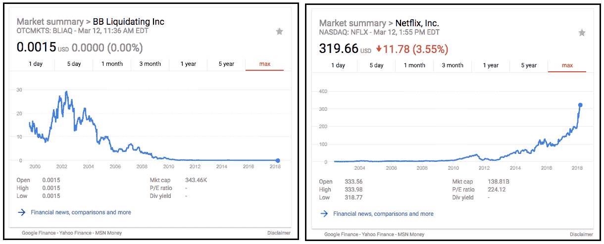

# 自动化时代的“轰动效应”

> 原文：<https://devops.com/the-blockbuster-effect-in-the-age-of-automation/>

说新的工作总会被创造出来以取代那些被自动化淘汰的工作，是一种避免潜伏在地平线上的真正问题的机制。

2004 年，在最受欢迎的时候， [Blockbuster Video](https://en.wikipedia.org/wiki/Blockbuster_LLC) 在全球拥有 9000 多家门店，员工超过 80000 人。总劳动力中约有 50，000 人受雇于美国。去百视达买部电影是很多人周五晚上的惯例，包括这位作家。

百视达和其他视频租赁店，以及负担得起的大屏幕电视的出现，是家庭影院增长的重要因素。人们现在有了一个 10 美元电影票的选择，并与周末的交通作斗争去电影院。一个完整的家庭可以在自己舒适的家中观看一部最近上映的电影，只需大约 5 美元。唯一需要的是爆米花，节俭的家庭会在好市多买一箱一箱的爆米花。那些不太节俭的人可以在音像店的收银台买一盒微波爆米花。周五晚上 25 美元的约会费用减少到大约 6 美元。

大片让人们坐在沙发上，远离电影院。电视已经打消了人们去看电影的念头。1930 年，65%的人口每周去看一次电影。到 1964 年，这个数字下降到 10%。尽管引进了 [3D](https://www.imax.com/theatres) 放映技术，电影院也提供了额外的功能，如[座位用餐](https://www.amctheatres.com/food-and-drink/dine-in)，电影上座率现在处于自 1992 年以来的最低点[。](https://www.theverge.com/2018/1/3/16844662/movie-theater-attendance-2017-low-netflix-streaming)

百视达是娱乐业的转型企业。如今，公司已经不在了。流媒体技术结合“吃到饱”的订阅模式杀死了它。(参见图 1。)

**图 1:随着百视达股票的下跌，网飞的股票上涨了。**

正如百视达不再需要去电影院看电影一样，网飞、亚马逊和其他视频流媒体服务也不再需要走出家门就能获得晚间娱乐。美国人呆在家里，每月支付固定费用，在网上欣赏电影。百视达倒闭了。

网飞雇佣了大约 5500 名员工，年销售总额为 116.9 亿美元。百视达 2004 年的总销售额为 60 亿美元[。令人震惊的是，网飞用不到百视达 10%的员工做了几乎是百视达鼎盛时期两倍的生意。这就是自动化的好处。](https://www.encyclopedia.com/social-sciences-and-law/economics-business-and-labor/businesses-and-occupations/blockbuster-inc)

Blockbuster 需要在每个社区的商店里配备员工才能开展业务，而网飞和其他流媒体服务则在一个虚拟的中心位置工作，没有多余员工的额外费用。百视达有 9000 台收银机。网飞有一个，是由某种人工智能运行的。

那么，那些失业的店员和商店经理都去哪里了呢？希望他们继续从事其他工作，也许是比日复一日处理录像带出租工作好得多的工作。毕竟，这是传统智慧:总会有新的工作来取代被自动化淘汰的工作。但是，让我们面对一个残酷的事实:在网飞做视频交付比在百视达核实顾客购买需要更多的知识和技能。网飞只需要更少的人就能把生意做起来。爱荷华州苏城的一名百视达员工是否具备继续在加州洛斯加托斯的网飞工作所需的技能和流动性？似乎很牵强。

现在，经济形势非常乐观。因此，传统智慧占了上风:随着自动化淘汰了一种工作，另一种新型工作会取而代之。

然而，还有另一种方式来看待它。有很好的论据可以证明:

*   随着自动化消除了现代世界的工作岗位，人类的新工作岗位将不会达到保持劳动力充分就业所需的水平。相反，人工智能将做得更多，要求更少。
*   导致大规模失业的过程不会很慢。这将在一两年内迅速发生。而且，这很可能在十年内发生，而不是在未来几十年。

百视达的消亡来得相当快。该公司在 2004 年处于鼎盛时期。六年后，它申请破产，负债 10 亿美元。音乐零售商 Virgin Megastore 在 2009 年关闭了最后一家[北美](https://www.nytimes.com/2009/06/15/arts/music/15virgin.html)商店，一年前音乐流媒体 [Spotify 在互联网上上市](https://allmakessense.wordpress.com/cool-websites/spotify-com/history-of-spotify/)。(Spotify[2016 年收入 38 亿美元](https://www.statisticbrain.com/spotify-company-statistics/)，员工人数[2162 人](https://www.statista.com/statistics/245130/number-of-spotify-employees/)。)

自动化带来的生产率持续提高。在 20 世纪 80 年代早期，生产一吨钢需要 10.4 个工时。到 2014 年，这一数字降至每吨 1.9 工时。生产率的提高是由于自动化水平的提高(想想:机器人)。如果在购买机器和雇佣工人之间做出选择，公司更有可能选择机器。因此，完全可以想象，少数人监督许多机器人炼钢的日子就要来临了。不久之后，一个人将管理整个机器人劳动力。然后，最后，随着人工智能继续改进并进一步主导生产领域，将不再需要人类。机器人会自我监督。

这个时间离未来有多远？不知道。但是我可以告诉你，机器人正在帮助人类做手术。一个外科医生用自动化做 10 个人的工作还需要多久？那么，AI 能在无人监督的情况下做手术还要多久，五年？十年？仅在 10 年前，无人驾驶汽车还在测试轨道上；今天，他们正在加州[山景城](https://www.atlasobscura.com/places/google-selfdriving-car-garage)的街道上漫步。拿着手术刀的自主机器人不再是科幻小说里的东西。一旦人工智能可以在没有帮助的情况下进行手术，所有被取代的外科医生将在哪里找到工作？也许有些人会从事研究。其他人呢？

纽约市曾经有 20 万匹马。他们为这个城市的大部分交通系统提供劳动力。今天有不到 1000 匹马。汽车、卡车、飞机和火车已经取而代之。当汽车能做得更好时，雇用一匹马是没有好处的。随着[将军 AI](https://en.wikipedia.org/wiki/Artificial_general_intelligence) 继续发展和提高只有人类才能做到的连接能力，还需要多长时间才能不再需要大多数人类的劳动？当雇佣大部分人类没有任何好处，因为机器可以做得更好时，会是什么样子？是的，后果是可怕的。但是，需要考虑这种可能性。可悲的事实是，很少有人考虑这种情况，更不用说想办法解决即将到来的影响了。说人类将永远有工作是一种回避机制，特别是考虑到现代机器正在超越纯粹的机械劳动，做更多的思考工作。

1990 年，人们认为电影租赁会一直存在，直到没有为止。2000 年，人们认为维珍超市会一直存在，直到它不存在。如今，[西尔斯](http://fortune.com/2018/01/09/lands-end-sears/)不断关店。它很快就会从地球上消失。是的，亚马逊正在开设实体店。这可能是个好消息。但是这些商店的自动化程度很高，员工很少，这一事实抵消了此刻的美好感觉。

如今，当一家公司走到尽头时，这不是一个漫长的过程。它发生得很快，超过一年的时间。许多留下来的人面临着低工资，“露面就做”的工作。受教育程度越高的人越有机会获得报酬更高的工作，同时学习曲线也极其陡峭。无论工作是低薪的零售工作还是高薪的技术工作，每个工人都在——或将会——与能够——或将会——更好地完成工作的人工智能自动化竞争。

这不是一幅美丽的图画。但是，如果我们决定考虑替代方案并将这些想法付诸行动，这是可以避免的。可悲的是，由于人工智能推动的工业自动化的扩散，更多的人在考虑如何到达火星，而不是解决大规模失业问题。问题是，我们似乎仍然停留在“总会有工作来取代被自动化淘汰的工作。”相反的说法被认为是预言。也许是这样。但是不考虑这个问题是愚蠢的。这种危险会让每个不得不工作谋生的人付出沉重的代价。

鲍勃·雷瑟曼