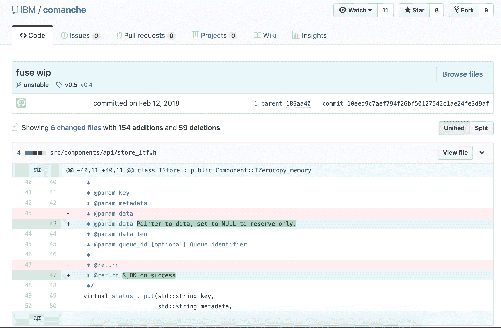

# 现代 SCMs 的竞争优势

> 原文：<https://devops.com/the-competitive-advantages-of-modern-scms/>

源代码管理并不是一个新概念。自 1980 年左右，第一个主要 SCMs 之一的修订控制系统(RCS)发布以来，它就一直存在。

但这并不意味着今天的供应链管理和几十年前一样。现代配置管理工具比他们的前辈做得更多。它们不仅处理应用程序代码，还处理用于构建和支持应用程序所依赖的基础设施的所有配置脚本和模板。

这里有一个现代 SCM 能为你做什么的解释，以及为什么从商业的角度来看拥有一个现代 SCM 是重要的。

## 配置管理工具是做什么的？

配置管理工具，也称为版本控制系统(VCS ),在最基本的层面上，提供了一个存储库中一个或多个文件和目录的所有变更的历史。这些工具对基于文本的文件(如源代码和配置文件)最有效，因为它们可以逐行显示差异。虽然有些工具可以处理特定的二进制文件类型(如 Microsoft Word 文档)，但通常情况下，二进制文件会原封不动地保存下来，每次更改都会保存一个全新的副本。

历史记录中跟踪哪些元数据的示例(基于 CLI 的示例):

| $ p4 changes2019/04/19 变更 2 由[【电子邮件保护】](/cdn-cgi/l/email-protection)‘删除 library . dll’在 2019/04/18 由[【电子邮件保护】](/cdn-cgi/l/email-protection)“初始提交”更改 1… |

您可以显示每个文件中实际更改的内容(基于 GUI 的示例):

****

## **分布式与集中式供应链管理**

实际上有三种模式的配置管理工具:本地的，集中的和分布式的。

目前还没有只运行本地的现代 SCM 工具。现代 SCMs 已经不仅仅是一个局部性的建筑。

集中式配置管理工具的工作原理是将每一个变更直接提交回源服务器，源服务器是任何工作的权威。代码托管在本地工作站上，但是任何和所有的更改都在服务器上被跟踪。这种模式在 20 世纪 80 年代后期占主导地位，在许多大型企业中仍然非常流行。将一切集中起来的好处是所有的变更都被跟踪，并且很容易与权威的存储库保持同步，导致很少的冲突合并。缺点是需要持续连接网络才能完成工作。

分布式配置管理工具在 2000 年早期从默默无闻中走出来，他们最大的支持者是:Linux 内核开发。Linux 内核开发已经发展成为一个全球分散的团队，并不是所有的成员都有继续使用他们集中的配置管理工具集所需的带宽或不间断的连接。分布式模型的最大好处是每个工作站都有整个存储库的完整副本，并且可以在本地分支、标记、恢复和提交更改。在某些时候(通常是每天，有时是每周)，每个开发人员将他们的本地存储库与远程存储库(可以笼统地称为权威版本)同步。最大的缺点是，如果在这个过程中没有更多的协调，那么将冲突的变更应用到存储库中的文件的可能性会高得多。它不像在集中式模型中那样强制使用锁。

## 为什么要使用配置管理工具？

再现性和可追溯性。句号。真的就这么简单。

有了嵌入在开发和支持生命周期中的配置管理工具，你可以在任何时候产生用于任何版本的代码，这将让你重现在生产中运行的二进制文件。此外，您可以追溯到底是谁修改了代码行，要么修复了缺陷，要么破坏了世界。

让我们来看几个场景，在这些场景中，这可以产生很大的不同。

**1。从每季度运行一次的作业中修复异常**

现在是凌晨 3 点，您接到运营商的电话，说您的工作已经暂停，他们的正常补救措施没有解决问题。

没有配置管理，你只能使用你拥有的代码。您正在对它进行重构，因此它无法接近生产——导致会议充满了道歉和熬夜工作。

使用 SCM，您可以检查存储库中的标签，提取最新的生产版本，修复它，测试它，将其推向生产，并在其他人进入办公室之前备份和运行该工作。然后，您可以创建一个新的标签，并且有一个所做工作的记录。

**2。针对六年前事件的诉讼中的发现**

这很简单。我们生活在一个公司喜欢互相起诉的世界里，你的法律团队会欣赏你重现事物本来面目的能力，这样你就可以证明什么按预期工作或不工作，或者包括或不包括对方声称的任何专利代码。没有人喜欢失去一个默认的判断。

**3。客户在他们仍在运行的旧版本中发现了一个 Bug**

这适用于托管产品或客户自行安装软件的情况；总有一个客户端由于某种原因无法升级。

在这种情况下，在你的配置管理工具中，作为一个最佳实践，你应该在每次发布你的产品时创建一个分支。在 release 分支上，您可以轻松地进行代码更改，重新构建和分发两个总统之前发布的版本的新的、更新的二进制文件，而不会对其他客户或您自己的生产部署产生任何影响。

## **流行配置管理工具时间表**

有几十种版本控制工具，讨论每一种工具的发展远远超出了本文的范围。然而，有几个关键的配置管理工具在建立行业的标准和规范方面起了带头作用。这里概述了他们的历史。

**1。Unix**

并发版本系统(CVS)是 Unix 生态系统中第一个广泛使用的配置管理工具。当它在 1990 年发布时，它是集中方法的先驱。CVS 在很大程度上基于 RCS(在某种程度上，大多数 RCS 存储库都是无缝转换的)。

从 20 世纪 90 年代中期到 21 世纪初，微软支持并发布了一款名为 Visual Source Safe (VSS)的工具。VSS 适用于典型的中型源代码库。微软没有在内部使用 VSS，因为他们的内部需求太复杂，他们的代码库对于该工具来说太大了。

**2。跨平台 SCMs: Perforce，ClearCase 和 SVN**

Perforce 是微软内部使用了几十年的主要源代码管理工具。Perforce 支持微软和其他大型企业在标记和分支方面的复杂程度。它还像 PVCS 等其他流行工具一样是跨平台的，这有助于它支持大型企业基础设施的所有方面的开发，从大型机到 Unix 到 Linux 再到 Windows。

Rational ClearCase(后来被 IBM 收购)被大型企业在所有平台上大量使用，尤其是当涉及到利用大型硬件和面向服务架构的关键任务系统时。虽然 ClearCase 是一个集中的系统，但是它有几个对分布式团队来说独特而有价值的特性，包括可以远程安装的动态视图，以及与 Rational ClearQuest 的真正的代码级集成，以准确地跟踪每个缺陷和请求中的变更。这些概念是革命性的，但需要大而可靠的网络互连，这就是为什么分布式系统今天变得越来越普遍。

当企业采用 PVCS、Perforce 或 ClearCase 时，许多开源、网络规模和更小的组织正在采用 2000 年发布的 Subversion (SVN)。它建立在 CVS 的成功之上，并专门解决了 CVS 架构的几个主要问题，包括存储库范围的版本(允许更一致的应用程序版本化方法)，以及原子提交(意味着整个更改立即应用—如果其中任何一个失败，则整个更改回滚)。

出现在 2008 年的 Rational Team Concert 代表了 SCMs 发展的另一个重要点。它与云兼容，并提供了超越版本控制的特性(比如构建管理)。

**Git 革命**

随着 2005 年发布的 Git 的引入，SCM 的世界发生了巨大的变化。

Git 最初是由 Linux 内核开发团队开发的，它建立在该团队以前使用的产品 BitKeeper 的经验基础上。Git 是一个真正分布式的配置管理工具，现在是所有新开发的主导配置管理工具。Git 是多平台的，在各种规模的组织中拥有最大的知名度。

Git 有一个比以前的配置管理工具更大的生态系统，许多供应商提供了基于它的解决方案。Git 是大多数现代持续集成工具的默认工具，比如 Jenkins。

## **使用带有 z/OS 的现代 SCMs**

在大型机上，SCMs 与其他平台并行开发，但在实现上保持完全独立。Endevor、ChangeMan 和 ISPW 等产品是作为库管理器诞生的，但后来被用于版本控制。尽管如此，驱动它们的核心技术已经有 20 多年的历史了。它们在一生中基本保持不变。

然而，最近，随着混合应用程序的流行和精益/敏捷开发过程的采用，遗留 SCMs 面临着越来越大的现代化压力。生产这些产品的厂商试图增加现代功能，但为时已晚；当这被证明不可能或不切实际时，他们选择与 Git 集成。然而，由于 Git 现在在 z/OS 平台上得到完全支持，需要现代 SCM 能力的组织能够使用 Git，而没有遗留 SCM 的阻碍或成本。

您可能会认为，在大型机等遗留平台上工作的开发人员，为了利用现代 SCMs，必须放弃他们的整个环境，转而支持现代环境。幸运的是，事实并非如此。像[基于依赖的构建](https://developer.ibm.com/mainframe/products/ibm-dependency-based-build/) (DBB)这样的工具在大型机应用和现代 SCMs 之间架起了一座桥梁。DBB 让大型机开发人员使用 Git 来管理 z/OS COBOL 应用程序的源代码。它还支持 Groovy 管理构建。

Git，以及与它集成的构建工具，已经成为当今大多数平台上几乎所有开发人员的首选 SCM 解决方案。随着 Git 在 Z 上的迅速普及，以及 DBB 等工具的出现，很明显 Git 也将成为 z/OS 开发的主流 SCM。

随着团队将他们的实践现代化，以处理正在构建的应用程序和支持它们的基础设施自动化脚本数量的爆炸，如果没有现代的 SCM 工具来推动所有的变化，那么转移到[敏捷开发](https://devops.com/are-your-development-processes-truly-agile/)方法或试图利用 DevOps 实践(如持续集成(CI ))是不可能的。

现代的配置管理工具是每个技术团队成功支持一个应用生命周期的所有方面所需要的基础构件。

— [文斯动力](https://devops.com/author/vince-power/)