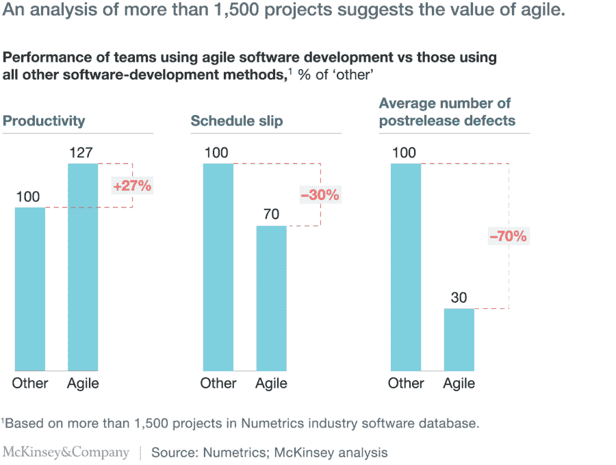
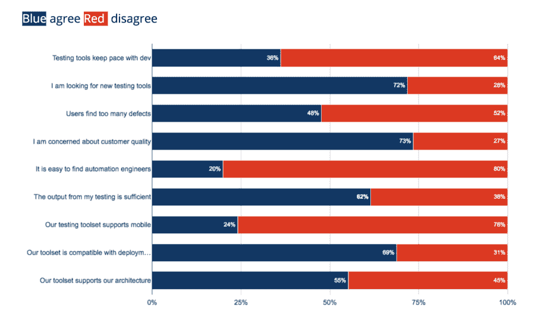
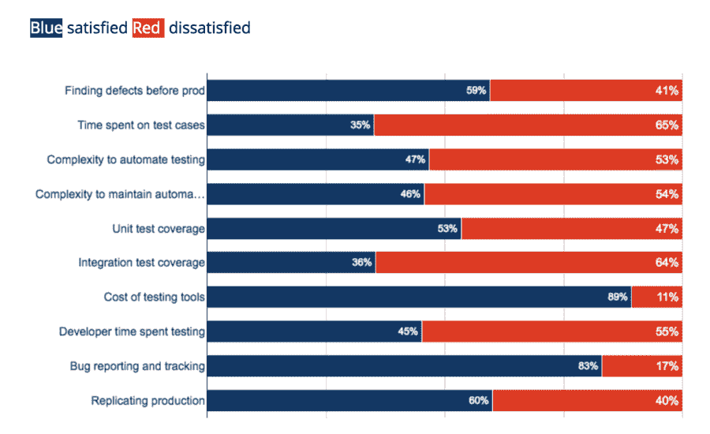

# 智能测试时代

> 原文：<https://devops.com/the-era-of-intelligent-testing/>

在过去的 10 年中，软件测试的技术水平没有跟上软件开发的发展。现代质量保证(QA)团队努力在一个持续交付的世界中发挥他们的作用，导致生产中更多的缺陷，QA 士气低落和过多的测试开销。令人欣慰的是，机器智能和测试自动化方面的创新为更好的模型奠定了基础——这种模型将允许 QA 跟上开发的步伐，提高生产率，改善产品质量，并提高整个软件行业的客户满意度。

# 为什么我们需要新的 QA 工具集

现有的 QA 解决方案是为这样一个世界而构建的，在这个世界中，软件很少改变，功能被高度指定和记录。现在情况不再是这样了。

## **产品比以往发展得更快**

几股力量正在汇聚起来加速发展。软件即服务(SaaS)解决了在安装软件时代耗费大量开发时间的操作系统兼容性、打包、部署和版本控制等问题。想想看，2016 年亚马逊网络服务交付了【1,000 多项新功能和服务——这一速度对于打包软件来说是不可能的。

| ***“Development cycles are getting shorter and new features are coming faster than ever…There simply isn’t enough time to test.”******——财富 250 强公司*** 的 QA 主管 |

开源和基于云的[功能作为服务](https://venturebeat.com/2016/03/06/features-as-a-service-is-changing-the-game-for-app-makers/)的激增也减少了开发人员构建通用功能所花费的时间。例如，在 [mabl](https://www.mabl.com) ，我们从未想过构建自己的认证引擎；我们使用 [Auth0](https://www.auth0.com) 。我们没有构建自己的数据处理管道，而是使用了 [Apache Beam](https://beam.apache.org/) 和 [Google Cloud Dataflow](https://cloud.google.com/dataflow/) 。我们没有构建自己的 ML 框架，而是使用 [Tensorflow](https://www.tensorflow.org) 。这份名单还在继续；可重用组件和基于云的服务节省了我们多年的工程工作，使我们的开发人员能够快速交付产品功能。

敏捷方法的持续采用进一步提高了开发团队的效率。麦肯锡最近对 1500 个软件项目的研究表明，敏捷团队比那些遵循瀑布等方法的团队生产率高 27%。

最后，持续集成和持续交付正在加速软件变革的步伐。Atlassian 最近的一项调查表明，超过 50%的软件团队已经在使用持续集成和/或交付，超过 32%的团队计划转向 CI/CD。同一调查表明，超过 50%的组织能够每天推动生产变革。

最终，开发人员生产力的提高意味着软件产品比以往发展得更快。不幸的是，这增加了 QA 职能的压力。正如一位来自财富 250 强公司的 QA 领导在最近接受 mabl 采访时说的那样，“开发周期越来越短，新功能比以往任何时候都来得快。我们为每个 QA 工程师配备了五名高效的开发人员。根本没有足够的时间来测试。”

## **现有的自动化框架带来了过多的开销**

QA 合理地依赖自动化框架来提高生产率；像 [Selenium](http://www.seleniumhq.org/) 、 [Appium](http://appium.io/) 和 [JUnit](http://junit.org/junit4/) 这样的工具现在被广泛采用。在最近的 mabl 调查中，超过 80%的受访者现在都在使用 Selenium，QA 经理也一直面临着增加自动化的压力。不幸的是，尽管与手工测试相比，Selenium 和其他框架已经帮助许多公司提高了 QA 速度，但是这些框架有严重的缺陷:

*   它们都需要专门的脚本专家，并且由于缺乏可用的人才，团队在 QA 自动化方面的能力非常有限。
*   它们在测试结果中提供有限的上下文，这使得团队几乎没有信息来帮助他们分类和解决问题。
*   在规模上，他们需要自己的基础架构，这需要时间来调配、操作和扩展。
*   它们与测试中频繁变化的产品属性(xPath、CSS 等)紧密相关。)，导致维护不断，误报不断。

随着开发和变更速度的加快，这些缺陷只会变得更加令人痛苦，迫使许多团队限制它们的使用或者完全放弃它们，从而导致更低的产品质量。

**mabl 调查——对现有测试工具和流程的满意度(n = 104)**

***“请指出您对以下陈述的同意程度”***

## **时间压力导致不健康的团队动态**

测试角色中的人越来越与他们开发中的同伴不一致。无法跟上不断发展的步伐，QA 成为产品速度的瓶颈，导致与开发同行的紧张关系。这种持续的压力也使 QA 无力在自动化和流程改进方面进行投资，而这些正是提高产量所需要的。总是落后且几乎没有改进希望的感觉通常会导致团队士气低落。

对团队来说，在质量标准上达成共识也变得很困难，因为敏捷团队经常避开每个版本的详细功能规范，而更喜欢关注用户目标和需求(参见:[敏捷宣言](http://agilemanifesto.org/))。因为用户的目标和需求对更多的解释是开放的，QA 和开发不仅在缺陷的严重性上有分歧，而且在测试本身的有效性上也有分歧。

现代软件团队也更容易接受给定发布周期中不断发展的需求(参见敏捷宣言中的“响应变化”)。不断发展的需求应该驱动更新的测试用例，但是这需要已经捉襟见肘的人员的深入参与和协调。我们更多地依赖特别的和人工密集型的探索性测试来寻找缺陷，而不是测试质量和指定的行为。

# QA 有希望

虽然更快的功能开发、更短的发布周期、不断发展的需求和端到端质量的不明确责任都给 QA 带来了真正的挑战，但新一代 QA 工具正在兴起，以正面应对这些挑战。

## **创建和维护测试将会很容易**

与现有的测试自动化框架不同，下一代 QA 工具不需要专门的脚本专家。相反，它们将提供直观的界面，允许任何人快速创建和管理测试。这将有助于团队扩展他们的测试覆盖范围，并随着他们产品的发展快速地发展他们的测试。

## **测试将无缝适应变化**

因为他们在自动化测试中使用更复杂、更持久的方法来模拟用户行为，下一代 QA 工具将不会遭受与现有自动化框架相关的脆弱性。测试不会被紧密地绑定到前端代码库中频繁变化的单个元素上。相反，他们将使用机器智能来创建和维护复杂的测试模型，使测试能够适应测试，而不是在 xPaths 和其他定位器改变时失败。

## **QA 将在云中运行**

如今，团队正在努力解决内部测试系统的性能、成本和运营开销问题。下一代 QA 工具将利用按需云计算资源来更快、更高效地执行测试。他们将利用强大的数据处理和分析服务来分析测试结果并提供见解。它们将完全作为服务交付，将管理和运营负担转移给工具供应商。

## **质量保证将成为交付管道的一部分**

下一代 QA 工具将紧密集成到由[詹金斯](https://jenkins.io/)、[大三角帆](https://www.spinnaker.io/)、 [CircleCI](https://circleci.com/) 和 [CodeShip](https://codeship.com/) 编排的自动化 CI/CD 管道中。每当团队根据测试和需求对产品进行变更时，测试就会自动触发。当存在潜在问题时，这些工具将通知团队成员，以便他们能够在影响用户之前解决这些问题。跨构建和环境运行测试和比较结果将会很简单。关于发布、部署、推广和回滚的决策将在很大程度上实现自动化。

## **质量的定义将会演变**

除了验证测试中的特定断言，下一代 QA 工具将使用机器智能来自动检测和突出应用程序中的潜在回归。因此，我们将更少地考虑测试“通过”和“失败”，而更多地考虑变化在多大程度上改善或降低了用户体验。我们将更少地关注代码覆盖率，而更多地关注产品覆盖率。我们将超越通过和失败测试的基本计数，支持更全面的方法来评估与给定构建或部署相关的风险。

## **工具将深深嵌入我们的团队**

下一代 QA 工具将有效地作为开发团队的扩展。他们将通过 [Slack](https://www.slack.com) 、[吉拉](https://www.atlassian.com/software/jira)电子邮件和其他常见的沟通渠道分享测试结果和见解。他们将从整个团队——包括产品、开发、QA 和客户成功——获得反馈和培训，并将他们学到的东西融入到他们的测试中。最重要的是，下一代工具将用简单的语言描述测试和结果，它们将提供有用的上下文来帮助开发人员重现和修复问题，就像一个有效的 QA 队友一样。

# 智能测试时代

软件质量保证从来都不容易，近年来软件开发速度的加快使得它更具挑战性。幸运的是，新一代工具正在出现，以应对这一挑战。这些工具结合了尖端的机器智能，从云交付并嵌入到现代开发工作流中，将极大地提高 QA 的有效性，开创整个软件行业效率和创新的新时代。

**mabl 调查——用户情绪(n = 104。为简单起见，将“同意”和“非常同意”合并为“同意”类别，将“不同意”、“非常不同意”合并为“不同意”类别。)**

***“您对贵公司测试流程的以下方面有多满意？”***

— [Dan Belcher](https://devops.com/author/dan-belcher/)