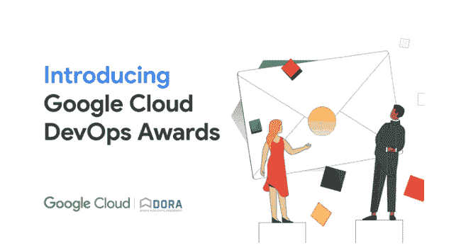

# Google Cloud DevOps 大奖:立即申请！

> 原文：<https://devops.com/the-google-cloud-devops-awards-apply-now/>

DevOps 仍然是我们客户的主要业务加速器，我们不断看到客户成功地将 DevOps 研究和评估( [DORA](https://www.devops-research.com/research.html) )原则和发现应用到他们的组织中。 [DevOps 奖](https://cloud.google.com/awards/devops/?eligible_for_cloud_free_trial=true) 旨在表彰与 DORA 一起塑造 DevOps 未来的客户。分享你的励志故事，辅以业务转型和卓越运营的实例， [今日](https://docs.google.com/forms/d/e/1FAIpQLSf-snxW4cHlgfer-PFjE4zlEcQmnzdh-1X0KyvhNHmfZgm4-g/viewform?resourcekey=0--ZNhM1YPl4fuaZcODoNgug) ！

凭借全球 33，000 多名专业人士的投入和八年的研究， [加速发展运维状况报告](https://cloud.google.com/blog/products/devops-sre/dora-2022-accelerate-state-of-devops-report-now-out) 是同类研究中规模最大、持续时间最长的发展运维研究。不同类别的 [DevOps 奖项](https://cloud.google.com/awards/devops/?eligible_for_cloud_free_trial=true) 与 [报告](https://cloud.google.com/devops/state-of-devops/) 中确定的推动高绩效的实践和能力密切相关。

无论规模、行业和地区如何，组织都可以申请一个或所有十个类别。请在下面找到类别及其描述:

*   **利用松耦合架构:**该奖项表彰一位成功从紧耦合 [架构](https://cloud.google.com/architecture/devops/devops-tech-architecture) 过渡到松耦合(面向服务；微服务)架构。
*   **设计未来的工具:**该奖项表彰一位对开源 DevOps 工具或开源安全 DevOps 工具做出有意义贡献的客户。

*   **在您的整个组织中发展 DevOps:**该奖项表彰在一个团队中采用 devo PS 最佳实践，并在一段时间内成功扩展到整个组织中更多团队的客户。
*   **DevOps 实践社区奖:**该奖项旨在表彰一位在组织中创建了 [社区结构](https://cloud.google.com/architecture/devops/devops-culture-transform%23build_community_structures_to_spread_knowledge) 的客户，该社区结构使团队能够更轻松地分享在其组织中工作的 DevOps 最佳实践，并使他们更能适应重组和产品变更。
*   **超越四大关键:**该奖项旨在表彰一位客户，他不仅展示了他们如何在整个团队中实施 [四大关键指标](https://cloud.google.com/blog/products/devops-sre/using-the-four-keys-to-measure-your-devops-performance) ，还展示了他们如何超越四大关键，展示了推动业务成功的持续迭代。
*   **培育团队文化:**该奖项旨在表彰一位实施有效流程来改善工作/生活平衡、培养健康的 [DevOps 文化](https://cloud.google.com/architecture/devops/devops-culture-westrum-organizational-culture) 、并最终防止倦怠的客户。
*   **释放云的全部力量** : 该奖项旨在表彰一家利用云计算的全部五种能力来提高软件交付和组织绩效的客户。
    *   按需自助服务
    *   宽带接入
    *   测量服务
    *   快速弹性
    *   资源池

了解更多关于 [云计算的五大本质特征](https://cloud.google.com/architecture/devops/devops-tech-cloud-infrastructure)

*   **揭开开发运维的秘密:**该奖项旨在表彰一位能够展示采用开发运维所带来的外部优势的客户——除了运营和组织绩效的提升。此奖项表彰一位客户:

例如，开始推动 DevOps 转型，并发现 DEI 代表的增加更多地出现在他们的团队中(增加代表不足群体的 PPT)

——或者

讨论您的组织如何创建独特的解决方案来帮助为您的客户构建一个更加多样化、包容和无障碍的工作场所，从而提高参与度、生产力和创新水平。

*   **DORA 持续改进:**该奖项 表彰一位前 DevOps 奖获得者 继续使用 Google 云平台工具将 DORA 实践和指导集成到他们的工作流中，并能够以更快的速度和更好的稳定性交付软件，以快速满足最终用户的需求。

这是你在全球展示你的创新并成为行业改进榜样的机会。获奖者将收到圆桌会议和讨论的邀请、新闻材料、特别公告，甚至是奖杯！

我们很高兴看到你所有的优秀作品。申请截止到 2023 年 1 月 31 日，请申请最适合贵公司的职位，敬请关注我们 2022 年 3 月的颁奖晚会！

有关奖项的更多信息，请访问我们的 [网页](https://cloud.google.com/awards/devops/?eligible_for_cloud_free_trial=true) 并查看 [谷歌云 DevOps 奖项指南](https://services.google.com/fh/files/misc/2022_devops_awards_guidebook.pdf) 。  随时查看 [2021 年 DevOps 奖获奖者电子书](https://services.google.com/fh/files/misc/devops_awards_fullebook_final.pdf) 向首届谷歌云大奖获奖者学习！