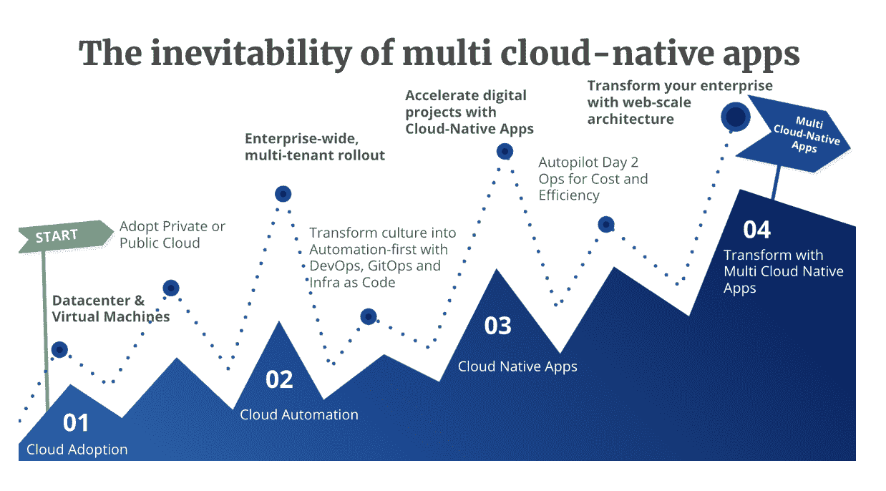

# 多云原生应用的必然性

> 原文：<https://devops.com/the-inevitability-of-multi-cloud-native-apps/>

我们都知道这个故事:企业迁移到了云上。他们了解了数据中心虚拟化、多租户和自助式开发人员配置。随着 Kubernetes 的出现，他们转向了原生云，在那里他们了解了自动化、开发运维以及基础设施即代码(IaC)。现在，尽管大多数企业仍在想办法大规模实现云原生，但他们必须掌握一项新的要务:多云原生应用。对于几乎所有拥有全球业务的企业来说，迁移到多云原生应用程序不是可选的，而是不可避免的。

但是在我们探究为什么会这样之前，让我们先回顾一下我们的步骤。对于几乎所有企业来说，云计算之旅都是从采用公共或私有自助式基础架构配置和管理模式开始的。这些企业很快意识到，这种新的 IT 模式需要一套新的工具来解决他们从未面临过的挑战，让他们的开发人员能够自助供应、管理和操作基础架构。企业已经发现了这一点，但是一旦他们发现了云，他们就必须迅速为第二阶段做好准备:在其整个开发人员组织中自动化和操作化云操作模型的企业范围部署。

当然，这个阶段有自己的一系列挑战，一个丰富的工具生态系统应运而生。即便如此，我们都同意大多数主流企业仍处于第二阶段。他们采用了云，扩大了云的使用范围，并且正在努力应对多租户、安全性、开发合作和治理方面的挑战。与此同时，成本管理面临着一系列全新的挑战。突然间，企业面临着管理公共云基础架构的可变成本:优化计算基础架构、利用率和容量，以控制[云支出](https://devops.com/?s=cloud+costs)。这是王予柔和马丁·卡萨多在他们对 [万亿美元悖论](https://a16z.com/2021/05/27/cost-of-cloud-paradox-market-cap-cloud-lifecycle-scale-growth-repatriation-optimization/) 的研究中直面的一个问题。

因此，企业转向了云，并且在很大程度上成功地解决了扩展问题。但是没有什么是一成不变的，企业推动 IT 创新。这就是 cloud-native 发挥作用的地方，它帮助企业软件开发团队变得更加敏捷，并帮助企业进行转型，以更快地提供新的服务和体验。事实上，这种模式带来的消费者体验已经迅速成为常态。

在全球范围内持续交付快速软件迭代迫使 DevOps 组织努力应对一系列全新的技术挑战:在跨多个地理区域运行的多个 Kubernetes 集群的生产中利用容器化应用和微服务架构。客户想要按需体验。这个第三阶段就是我们所说的 multi-cloud-native，它是由 Google、AWS、Azure 和腾讯等超大规模 IaaS 玩家开创的。

当然，现实是，超大规模并不是唯一知道如何交付多云原生应用的人。像 Doordash、优步、Twitter 和网飞这样的网络规模创新者也做到了。为了实现这一目标，他们必须在客户居住的每个地区制作和共享他们的多云端应用。反过来，为了实现这一目标，他们必须应对一系列新的挑战:开发新的工具和技术，如地理上分散的全球规模的数据库和分析引擎，以及以多云原生方式在靠近消费者的后端运行应用程序的应用程序架构。这使他们能够在跨地区的基础设施容量车队之间进行套利，同时为客户提供他们越来越期待的即时体验。

企业必须认识到，消费者对网络定标者的这种期望正在迅速变成他们在访问银行账户、保险应用和税务记录时的同样体验。对于几乎每一个全球规模的企业来说，这都带来了一系列全新的挑战:要跨越多个云和多个地理区域运行多个 Kubernetes 集群，您现在必须考虑新的方法来实现自动扩展、自我修复、灾难恢复、运营管理和成本优化，所有这些都是您刚刚为单个区域中的虚拟机(VM)和集群找到的。

企业必须面对现实，云原生应用模型不是目的地，而是成为多云原生的旅程中的一个中途站。因为 webscalers 提供的消费者体验使其成为不可避免的目的地。

## 企业之旅:云、云原生和多云原生

不要相信我的话。

和 [Twitter](https://www.alibabacloud.com/blog/twitter-announced-switch-from-mesos-to-kubernetes_595156) 公开披露的信息描述了多云原生模式是其战略游戏计划不可或缺的一部分。混合云和多云也是其中的一部分，利用 Kubernetes 作为集群管理器，但他们仍然需要工具来管理全球多个地区多个环境中的所有集群。

底线是，webscale 公司今天使用的架构与企业明天需要采用的架构相同，以保持竞争力。或者，这些企业将把市场份额和相关性让给下一个 webscale 创新者，以颠覆一个行业。在采用这种构建多云原生应用的模式时，企业将不得不处理统一访问管理、控制多个集群、资源管理等，所有这些都跨多个区域和集群的容量，聚合而非分解集群资源，使用跨云的逻辑服务而非跨单个集群的命名空间。

## 企业解决方案:全球规模的集群管理器

他们需要一个全球规模的集群管理器来完成这项工作；能够通过单一控制台观察跨集群、跨公共云和私有云、跨虚拟机和 Kubernetes 的成本、运营、性能和 SLA，以便它们能够以自动化、易于使用的方式在云之上运行。像运行多个电子表格模型来找出如何优化这样的权宜之计是不可扩展的。我们需要机器学习等工具来大规模自动化和优化，bin 打包技术来智能和自动优化全球规模的基础设施车队，以及高水平的自动化(无论是否有人类参与)。超大规模和 webscalers 已经在这么做了。

每个全球规模的企业都是多云原生的，运行数据驱动的应用。这不是虚构的:这已经在网络规模的公司中发生，而不仅仅是超大规模公司。如果每个企业想要转型以与下一个 webscale 新贵竞争，多云原生是他们需要遵循的路径。好消息是，先驱者给我们留下了一张地图。

* * *

要了解更多关于云原生的话题，请加入[云原生计算基金会](https://cncf.io/?utm_content=sponsor-disclosure)和云原生社区，地址:[kube con+CloudNativeCon North America 2021–2021 年 10 月 11 日至 15 日](https://events.linuxfoundation.org/kubecon-cloudnativecon-north-america/)