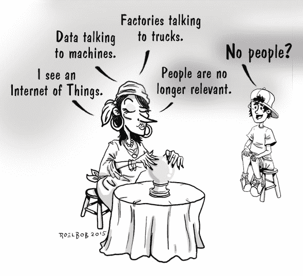

# 物联网

> 原文：<https://devops.com/the-internet-of-things/>

## 这里有一些你可能会喜欢的其他角色

### [一个单元测试 Dillema](https://devops.com/2015/11/04/unit-testing-dilemma/)

### [解雇通知书](https://devops.com/2015/10/23/roelbob-pink-slip-10-22-2015/)

### [又一张解雇通知书](https://devops.com/2015/11/13/another-pink-slip-devops-in-a-box/)

## 新闻热点-其他伟大的 DevOps.com 内容

### [成功的技术领导者将拥抱公民开发者](https://devops.com/2015/11/16/successful-technology-leaders-will-embrace-the-citizen-developer/)

### [你的 DevOps 亚文化](https://devops.com/2015/11/16/your-devops-subculture/)

## 即将到来的 DevOps.com 活动

### [devo PS Connect:CD summit SoCal](https://devops.com/2015/10/28/devops-connect-cdsummit-socal/ "Permalink to DevOps Connect: cdSummit SoCal")

### [开发运维的安全自动化](https://devops.com/2015/11/03/webinar-security-automation-for-devops/)

*   [https://www.facebook.com/v2.3/plugins/share_button.php?app_id=249643311490&channel=http%3A%2F%2Fstatic.ak.facebook.com%2Fconnect%2Fxd_arbiter%2FTlA_zCeMkxl.js%3Fversion%3D41%23cb%3Df5c9cc2b8%26domain%3Ddevops.com%26origin%3Dhttp%253A%252F%252Fdevops.com%252Ff16c0838d8%26relation%3Dparent.parent&container_width=0&href=http%3A%2F%2Fdevops.com%2F2015%2F11%2F23%2Fsystem-redundancy-distributed-cafe%2F&layout=button_count&locale=en_US&sdk=joey](https://www.facebook.com/v2.3/plugins/share_button.php?app_id=249643311490&channel=http%3A%2F%2Fstatic.ak.facebook.com%2Fconnect%2Fxd_arbiter%2FTlA_zCeMkxl.js%3Fversion%3D41%23cb%3Df5c9cc2b8%26domain%3Ddevops.com%26origin%3Dhttp%253A%252F%252Fdevops.com%252Ff16c0838d8%26relation%3Dparent.parent&container_width=0&href=http%3A%2F%2Fdevops.com%2F2015%2F11%2F23%2Fsystem-redundancy-distributed-cafe%2F&layout=button_count&locale=en_US&sdk=joey)

    
*   [https://platform.twitter.com/widgets/tweet_button.html?url=http%3A%2F%2Fdevops.com%2F2015%2F11%2F23%2Fsystem-redundancy-distributed-cafe%2F&counturl=http%3A%2F%2Fdevops.com%2F2015%2F11%2F23%2Fsystem-redundancy-distributed-cafe%2F&count=horizontal&text=System%20Redundancy%20at%20the%20Distributed%20Cafe%3A&via=devopsdotcom](https://platform.twitter.com/widgets/tweet_button.html?url=http%3A%2F%2Fdevops.com%2F2015%2F11%2F23%2Fsystem-redundancy-distributed-cafe%2F&counturl=http%3A%2F%2Fdevops.com%2F2015%2F11%2F23%2Fsystem-redundancy-distributed-cafe%2F&count=horizontal&text=System%20Redundancy%20at%20the%20Distributed%20Cafe%3A&via=devopsdotcom)

    
*   分享16

— [罗尔泊](https://devops.com/author/breselman/)