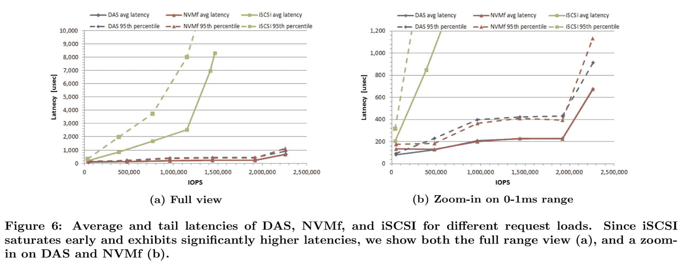

# NVMF 布吉舞:Kubernetes 和 NVMF 将如何摇滚

> 原文：<https://devops.com/the-nvmf-boogie-how-kubernetes-and-nvmf-will-rock/>

我最近写了一篇关于 Kubernetes 如何创建一个提供前所未有的计算灵活性的全球计算网格的博客。然后我写了一篇关于完全成为库伯内特人的重要性的博客[。在今天的博客中，我想深入探讨 NVMe over Fabrics (NVMe-oF 或简称 NVMF)标准在实现 Kubernetes 基础设施灵活性方面将发挥的作用。](https://medium.com/@chuck1.piercey/the-power-of-k8s-native-architecture-ed1186b57dba)

## 什么是 NVMe？

NVMe 是一种协议，它规定了 CPU 如何通过 PCI 总线将内存移动到存储设备。NVMe 通过一组环(每个 CPU)进行通信，命令从任何 CPU 提交到底层的 NVMe 设备。NVMe 的设计消除了 CPU 和存储设备之间的中间层。NVMe 设备由控制器、队列、名称空间、名称空间 id 和带有某种形式接口的实际存储介质组成。

存储媒体可以分组到称为命名空间的部分中，并带有一个 ID。在 NVMF 环境中，命名空间提供了一种对磁盘/消费者实施访问控制的方式。名称空间类似于 OS 分区，只是分区是由控制器而不是 OS 在硬件中完成的(您仍然可以在名称空间上有 OS 分区)。一些 NVMe 命名空间可能对用户隐藏(例如，为了安全隔离)。控制器通过队列连接到端口，通过名称空间 ID 连接到名称空间。一个控制器被允许连接到多个名称空间，并且一个名称空间被允许由多个控制器(因此也是多个端口)控制。

想象一下，在多台计算机上涂抹这个 NVMe 设备，你会得到下一个重要的概念，存储结构。

## 什么是 NVMF？

当您在 PCI 总线和存储设备之间放置网络时，您使用的是基于光纤的 NVMe(又名 NVMe-oF 或简称 NVMF)。NVMF 支持通过网络在主机和存储系统之间快速访问。与 iSCSI 相比，NVMF 具有低得多的访问延迟，实际上仅增加了本地和远程存储之间的微小延迟差异。与传统的设备连接存储相比，NVMF 在吞吐量和寻道时间方面实现了突破:

来源:[三星](https://www.samsung.com/us/labs/pdfs/nvmf-disaggregation-preprint.pdf)。

这是可能的，因为 NVMF 使用 RDMA 有效地访问另一台计算机的内存，而不使用 CPU 或操作系统。RDMA 是一种传输协议，它绕过内核堆栈，将工作负载卸载到网络硬件上。这意味着传输层发生在 RDMA 网卡本身，因此数据直接传输到应用内存或从应用内存传输，而不必涉及正常的操作系统级网络堆栈，从而实现低延迟和低 CPU 消耗。

当然，NVMF 性能取决于所使用的网络基础设施，无论是以太网、Infiniband 还是光纤通道。2018 年 11 月， [NVMe/TCP 传输规范](https://nvmexpress.org/welcome-nvme-tcp-to-the-nvme-of-family-of-transports/)的最终批准加快了 NVMF 的采用，因为它允许在标准网络硬件上部署存储结构。

NVMF 可以与白标存储系统(JBOD)、功能丰富的块存储系统(SAN)以及使用上一代(SATA)设备构建的存储系统配合使用。这意味着数据中心可以同时利用低延迟设备，同时还可以使用更传统的存储子系统。NVMF 还支持在数据中心计算层级中将存储类内存用作缓存。

## 为什么 NVMF 很重要？

把 NVMe 想象成 SCSI 的替代品，把 NVMF 想象成 iSCSI 和伊瑟尔的替代品。NVMF 有几个与众不同的技术属性，它们在存储基础架构层提供了巨大的性能可扩展性:

*   **协议效率**:NVMe 协议是专为大规模高效内存传输而设计的。NVMe 协议是专为可扩展性而设计的，它大大减少了序列化 I/O 所需的内部锁定，并提高了中断处理的效率。NVMe-oF 还支持 MSI-X 和中断导向，这可以防止 CPU 级别的瓶颈，并在系统扩展时实现巨大的可扩展性。结合现代处理器中的大量内核，NVMe 能够为互联设备提供巨大的并行性，从而提高 I/O 吞吐量并降低 I/O 延迟。
*   **命令集效率** : NVMe-oF 拥有简化的命令集，其处理 I/O 请求的 CPU 指令数量不到 SAS 或 SATA 的一半，可提供更高的每 CPU 指令周期 IOPS 和更低的主机软件堆栈 I/O 延迟。NVMe-oF 还支持预留等企业功能和电源管理等客户端功能，将提高的效率扩展到 I/O 之外。NVMEOF 设备可以接近 [DDR4](https://www.techarp.com/computer/8tb-ssd-ddr4-speed-guide/) 的性能水平，并通过 [SCM](https://blocksandfiles.com/2018/11/28/2019-the-year-of-storage-class-memory/) 成为计算内存层次结构中不可或缺的组成部分。
*   **队列并行**:NVMe oF 拥有 65，535 个并行队列，每个队列深度为 65，535 个条目，支持大规模并行。每个 CPU 都有一个专用队列来与数据设备通信，并且能够实现高速度，因为位于不同内核上的队列之间没有锁。因为每个控制器的每个 CPU 都有自己的一组队列，所以 I/O 吞吐量会随着可用内核数量的增加而线性增加。
*   **集成安全性** : NVMe-oF 包括一个隧道协议，提供由可信计算组织(TCG)和其他相关社区开发的安全特性。为 NVMe 设备和系统规划的功能包括简单访问控制、静态数据保护、加密擦除、清除级擦除等。关于 NVMe 安全性的更多信息，请参见[可信计算集团和 NVM Express 联合发布的白皮书:TCG 存储、Opal 和 NVMe](https://nvmexpress.org/white-papers/) 。

NVMe 不仅旨在解决横向扩展存储的局限性，还旨在为可根据工作负载需求动态变化的存储结构奠定基础。

## 是什么让 NVMF 对 Kubernetes 如此重要？

Kubernetes 应用程序隐含地需要 NVMF 支持的基础设施灵活性。NVMF 和 Kubernetes 使站点内的分布式计算变得更加容易。

我的 Kubernetes-native [博客](https://medium.com/@chuck1.piercey/the-power-of-k8s-native-architecture-ed1186b57dba)的要点是“(Kubernetes-native)应用程序分解成它们的组成元素，并可以在它们最适合的延迟金字塔中部署和扩展。这些元素跟随它们的成员在基础架构中起舞，我将其想象为一场容器化的‘芭蕾’，专注于以尽可能低的延迟提供尽可能好的用户体验。”

然而，对于以企业规模(或更大规模)运营 Kubernetes 的组织来说，多云、多站点和边缘部署带来了显著的额外复杂性。业务需求正在推动 IT 团队在站点、云、WAN 边缘之间移动工作负载，并根据需要快速克隆、爆发和销毁世界各地的工作负载。然而，Kubernetes 跨多个地区、站点、云和广域网边缘的部署仍然存在问题。

[OpenEBS](https://openebs.io/) 是针对需要通用数据灵活性的延迟敏感型有状态 Kubernetes 工作负载的解决方案。基于 NVMF 的分解存储物理结构与 [OpenEBS](https://openebs.io/) 提供的分解数据灵活性软件基础设施完美匹配。NVMF 允许数据在单个存储结构中物理浮动，而 OpenEBS 允许有状态工作负载在多个存储基础架构中松散耦合。OpenEBS [MayaStor](https://github.com/openebs/MayaStor) 项目原生集成到 NVMF 以简化开发者体验。

NVMF 和 OpenEBS 一起成为这些 Kubernetes-native 应用程序组件的舞池，来完成它们的基础设施感知(和基础设施智能)芭蕾。然而，考虑到它的性能和可伸缩性，也许称它为 NVMF Boogie 更好。

要了解更多关于集装箱化基础设施和云原生技术的信息，请考虑参加 11 月 18 日至 21 日在圣地亚哥举办的 [KubeCon + CloudNativeCon NA](https://events.linuxfoundation.org/events/kubecon-cloudnativecon-north-america-2019/) 。

查尔斯·皮尔斯