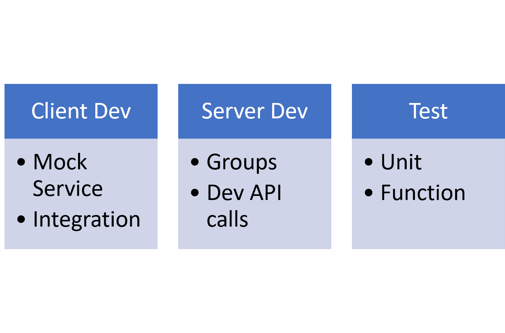

# 邮递员送的更多

> 原文：<https://devops.com/the-postman-delivers-more/>

我们大多数人在 API 开发过程中使用 Postman。该公司声称拥有 300 万用户，作为其中一员，这个数字并没有让我感到惊讶。但是如果你像我一样，你已经弄清楚了集合，如何备份你的数据，也许看了测试，但是没有做更多。作为一个 API 开发工具，Postman 是强大而有用的，但这意味着我们中的许多人并没有看到建立一个浏览器外测试环境来评估请求/响应是多么的快速和简单。

我们使用集合来分离项目，但实际上只是作为一种方式来将呼叫分组在一起，并在历史列表滚动多个副本时将每个呼叫的一个副本保存在手边。

但是对于 DevOps 来说，还有更多。他们刚刚又加入了。

## 包装在特征中

例如，组可以用于将调用与测试进行分组，命令行工具可以执行自动化测试。如果像我们一样，在开发 API 时使用 Postman 进行测试，并使用组将这些调用集中在一个地方，那么从已经包含整个 API 的源代码中进行测试是有意义的。

而且截至本周，Postman 还包括了服务器端。Postman 模拟服务允许您模拟 API 调用并指定有效的返回值。这意味着客户端开发人员可以使用 Postman Mock 来测试他们的应用程序/页面，而服务器端开发人员则使用原始帖子

*   [所有帖子](https://devops.com/wp-admin/edit.php)

开发模拟仿真和测试的 API 的人正在从现实世界的 API 中运行测试，这些 API 已经在 Postman 中用于开发目的。

## 开发、开发运维、测试和运营:人人都有

所以一个简单的图表显示了整个开发过程有一点邮递员在其中，如果这是你选择的工具的话:

虽然所有这些都有助于敏捷开发，但对于 DevOps 来说，最有益的部分是与组和新的模拟服务相结合的测试。只要为一组调用配置了模拟服务，test 就可以调用它们，并且记录的输出可以反映测试成功，但是通过模拟服务运行。一旦服务完成，组被指向服务器，测试将针对真正的 API 运行测试。使用 Newman 命令行工具，这些测试可以集成到您的构建工具集中。

如果您正在从 SOAP 调用转换或者使用 SOAPui 进行 REST，并且正在转移到 Postman，那么 Mock 服务可以从 SOAPui 获取导入。我被告知 Postman 工具集也支持 SOAP 调用，但是说实话，我从未想过如何实现这一点。这两种工具我都用过，但是从来没有在同一个项目上用过。

## 有成本，但也有价值

接下来这一点听起来有点虚假，我尽量不这么做。但就价格而言，没有很多增值工具能提供这种价值。Lori 和我正在讨论成为专业人士，因为我们都在项目中使用 Postman。考虑到我们是普通用户，我想如果我们不知道这些功能中的大多数，你们中的许多人也不会知道。

Mock 是 Postman Pro 包的一部分，还有可共享的团队集合和 API 文档工具。这意味着它会花你一点钱，但如果你在一个团队中，并且一直在拼凑一种共享集合的方式，团队集合和相关的协作工具是值得的——特别是因为内置的审计将显示对 Postman 集合项目所做的所有更改。这意味着在邮递员端修复基于变化的错误更容易。

在撰写本文时，Postman Pro 的成本是每个用户每月 8 美元。我的猜测是，在许多情况下，共享组(或者更糟，每个团队成员重新创建/维护它们)的成本比每月的成本高。考虑到文档可以被生成并共享到一个私有的 URL，以及模拟服务支持并行开发的事实，8 美元看起来确实很便宜。最后，Pro 提供了 API 监控，因此可以跟踪性能和正常运行时间，以便更好地适应生产的实际情况。还有更多(例如与一些优秀的开发/运营/开发运维工具的集成)，但我不会再说了。

## 摘要

设计、开发(客户端和服务器并行)、测试、监控……只要你能部署好，Postman 可以帮你完成剩下的工作。Postman Pro 为其提供的功能提供了合理的价格，模拟服务的引入使敏捷开发、紧凑的时间表和一致的“开始部署”测试变得更加容易。我敢说这值得一看。如果你正在开发没有它的 API，跳出去，获得免费版本，你会很快发现为什么我们这么多人使用它。

你可以在邮差的[产品](https://www.getpostman.com/products)页面了解更多关于邮差的各种版本。

唐·麦克维蒂