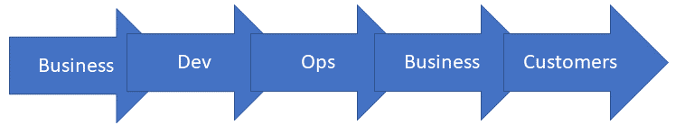
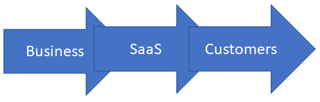

# 真正的管道

> 原文：<https://devops.com/the-real-pipeline/>

我毫不掩饰这样一个事实，即 DevOps 是改变 IT 业务运作方式的重大进步。但是人们倾向于对方法论过于虔诚，而忘记了这一点。没关系，DevOps 的根源就在于这种心态。多年来，我一直认为凤凰计划(Phoenix Project)的作者把任何减缓进程的事情——比如代码质量或安全性——都描绘得很糟糕，我已经开始接受推动市场前进需要绝对的东西。“我们一直是这样做的！”他是公司的国王，但是其他的公司已经厌倦了。这本书让事情有了进展，我们缓慢但肯定地抵制了这种心态，即在一般企业中增加几毫秒(甚至一周)的构建时间会产生任何值得一提的影响。哦，有些人仍然声称确实如此，但是我们可以令人信服地提出代码质量/安全性的论点。

对我来说有趣的是，DevOps 最初几年的重点是“我们要改变你的宗教！”—想要彻底改变整个 IT 组织结构，却没有考虑到您仍然需要存储、运营等方面的专家。让灯一直亮着。人们的想法是，发展问题是人的问题。在很大程度上，他们是对的；他们只是漏掉了方程组中的一个人的问题。让我们看看真正的管道，我们都不谈论，但真的应该:

注意这个链中没有工具。取而代之的是一群群*人*。可悲但真实的是，最后两个——代表验收测试和客户展示——几乎总是在除了少数组织之外的所有组织中被合并。

这是没有争议的。我们仍然主要在运营之前做开发部分；企业必须决定我们想向客户提供什么，而客户就在这条线的末端。这是关键。顾客在队伍的末端。现在，我开始让你不舒服了。除了第一个和最后一个箭头之外，上图中没有任何东西是重要的。这样想吧:

我们所做的事情中最重要的可以归结为两个问题:“业务部门想要为客户提供什么？”以及“客户对业务部门有什么期望？”从这个意义上说，“业务部门”可能是 it，“客户”可能是同事。这改变不了什么。业务部门提供什么和客户想要什么才是最重要的。剩下的就是实现细节了。

不相信我？这是一个容易证明的案件。让我们试试这一个，有或没有 IT 的参与，这取决于要解决的问题和组织:

业务部门决定他们想要提供什么，客户让他们的需求为人所知(以这种或那种方式),企业提供他们认为适合客户的解决方案。就像我上面说的，剩下的就是实现细节了。

你的观点是什么？

这让我得出了一个不可避免的结论。测试和安全性包括:

*   完全在用户意料之中。他们不想要漏洞百出的软件，他们也不想输入信息，因为他们担心这些信息会被黑客窃取。这里没有妥协；用户并不“想要一个有用的产品”，也不想要一个“可能安全，但我们不确定”的产品。
*   业务所需。他们对什么是合理的有所限制——切断网络电缆的服务器的旧迷因之所以有趣，是因为它展示了极端。但是他们绝对希望他们提供给客户的产品或服务是稳定和安全的。“我们可以推出一个新版本”只能在这么长的时间内经常奏效。

因此，您的工具链需要包括稳定性和安全性工具——我会在过程的每一步提出异议，但在哪里以及多少才是真正的业务需求。我的保安会不高兴，因为我把保安称为业务电话，但它是。你可以选择不合规，没有安全感；这些决策对您的组织的影响完全取决于您。OTOH，在组织(通常包括业务和 IT)关注的所有事情中，您可以放弃一些，并在第一时间获得正确的安全性和稳定性。

与此同时，在我们讨论这种事情的时候，你要让事情正常进行。虽然我反复提到我的大部分目标受众是“实现细节”，但我相信你们都知道我(和许多其他人)是多么欣赏你们为保持 IT 组织支持更大的组织所做的工作。