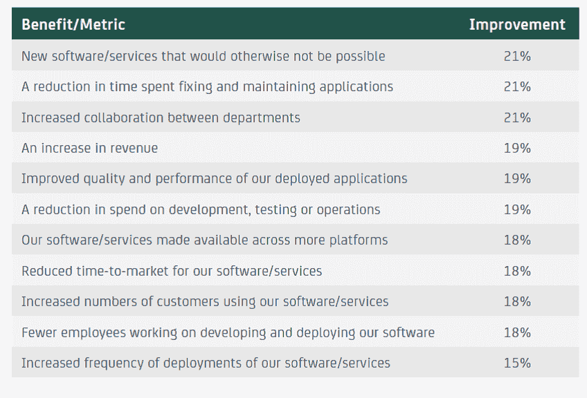
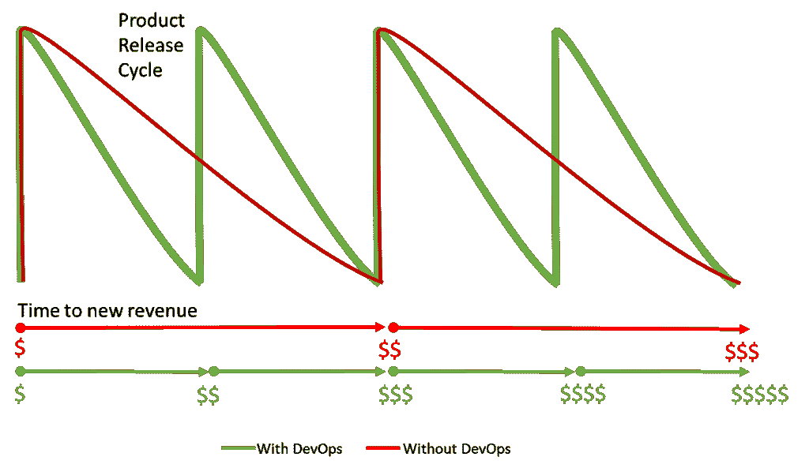
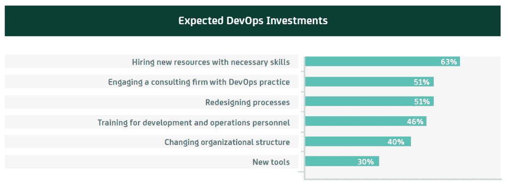

# 企业开发的投资回报

> 原文：<https://devops.com/the-roi-of-enterprise-devops/>

自从 1996 年的电影《杰里·马奎尔》(Jerry Maguire)(T1)以来，每当我想到任何技术发展，都会听到职业足球运动员小古巴·古丁(Cuba Gooding Jr)罗德·蒂德威尔(Rod Tidwell)大喊，“ ***给我钱！*** “因此，当一家大型企业的首席信息官最近问我企业高管版的那句名言时，我并不感到惊讶:

**问:企业开发运维的投资回报在哪里？**

幸运的是，有大量的证据表明，企业高管在试图确定 DevOps 的投资回报率时，应该从哪里入手。

***“把钱给我看看！”***

在 DevOps.com，Rajat Bhargava 在[上发布了与首席财务官谈论债务](https://devops.com/features/talk-cfo-devops/)，概述了财务影响的四个关键领域:创造现金、减少支出、促进增长和长期稳定。在 Erica Chickowski 的一篇很棒的文章中，我也有一些关于[为 DevOps](https://devops.com/features/turn-executives-devops-champions/) 获得高管支持的财务方面的想法。网站编辑 Alan Shimel 发表了一些关于厂商赞助的来自 IDC 的[关于避免停机成本效益的研究的精彩见解。](https://devops.com/blogs/real-cost-downtime/)

“给我钱！”

不够？我们还对与小型企业和大型企业采用 DevOps 相关的 ROI 因素进行了多年的研究。我所在的公司 CA Technologies 从 2013 年开始委托[独立第三方对企业开发运维的采用情况进行研究](http://rewrite.ca.com/us/articles/devops/research-report--devops-the-worst-kept-secret-to-winning-in-the-application-economy.aspx)；Puppetlabs 已经运行了类似的[研究](https://puppetlabs.com/sites/default/files/2014-state-of-devops-report.pdf) [PDF],收集了所有规模组织的良好数据，尤其是中型企业。

在下面的图表中，您可以看到通过采用 DevOps 而获益的领域(摘自 2014 年 11 月发布的[CA Technologies/Vanson Bourne research](http://rewrite.ca.com/us/articles/devops/research-report--devops-the-worst-kept-secret-to-winning-in-the-application-economy.aspx)):

还需要更多吗？没问题！也有很好的数据表明你可以从 DevOps 获得多少回报。同样，下面的图表来自同一个[CA Technologies/Vanson Bourne research](http://rewrite.ca.com/us/articles/devops/research-report--devops-the-worst-kept-secret-to-winning-in-the-application-economy.aspx):

*图 2 受访者表示在关键技术和业务领域看到了两位数的进步。总额因福利而异。图 1 & 2 资料来源:Vanson Bourne/CA Technologies 2014*

**“把钱给我看看！”**

好的，我明白了——你仍然想要更多，你想要一个直接的答案——一个简单的启发。在与许多企业 cxo 的交谈中，更快的应用交付是一个紧迫的目标，因此仅这一个因素就可以作为一个关键的 ROI 驱动因素。在 10 月哥本哈根的[连续交付(代码)会议上，](http://www.codecph.dk) [Jan Bosch](http://www.janbosch.com/) (查尔姆斯科技大学软件工程教授)非常优雅地展示了更快的交付如何减少(即缩短)投资回报期。

他的理论是基于这样一个前提，对许多人(大多数？全部？)业务中，收益时间很大程度上取决于产品发布周期。最大收入是在产品发布前后产生的，然后在下一个新产品发布前逐渐减少。例如，智能手机制造商将在 6 个月的高峰和低谷周期中获得收入，因为他们每年发布两次新设备；软件供应商将随着新游戏的发布获得收入高峰，直到新的 DLC 发布或新游戏上市。

Jan 认为，因为开发运维可以加速业务周期，业务可以更快地带来收入，这反过来会使基于开发运维的业务在中长期内更有利可图。这在现代应用经济中尤其重要，因为几乎所有的业务都是软件业务。

因此，举例来说，如果 DevOps 允许一个企业以两倍的速度发布，他们就可以有效地将年收入翻倍，如下所示。

*图 3 通过 DevOps 使产品发布频率翻倍带来的成比例收入增长*

本图夸大了这种影响，但根据实际数据(见上文)，年收入增长 20%与企业平均水平相当。

“给我看看……成本！?"

当然，任何关于 ROI 的讨论也必须真实地反映成本。在大型企业中采用 DevOps 并不是免费的——它需要在人员、流程和技术上进行投资。在人员方面，即使只是一个小的文化变化也经常需要新的活动和其他行为塑造。流程变革需要培训，并且通常会影响短期收入。技术投资包括采购[自动化和测量解决方案](https://devops.com/features/critical-devops-tools/)——开发运维 CAMS(文化、自动化、测量和共享)方法的关键组成部分，尤其是在大型企业中。

许多投资因素可以在下面的图表中看到，同样使用 CA Technologies/Vanson Bourne research:

*图 4 作为 DevOps 方法实施的一部分，您的组织在接下来的一年中可能会投资以下哪一项？总计= 499 名 ITDMs 已经或计划在未来两年内实施 DevOps。来源:Vanson Bourne/CA Technologies 2014 年*

“给我看看…我自己的投资回报率！”

这些 ROI 因素当然是平均值、研究数据点和轶事的组合。和所有的概括一样，当涉及到一个特定的企业时，你的里程可能会有所不同。然而，在构建业务案例以证明您的组织的预期 ROI 时，这无疑是一个很好的起点。

您可能还会发现其他投资回报领域——上游是项目管理办公室、数据库管理员，下游是网络安全、培训、文档。如果您有更多关于开发运维投资回报的数据，我很乐意倾听。在评论中加入你的想法，或者在推特上联系我和/或 DevOps.com——分别在[@安迪曼](https://twitter.com/andimann)和 [@DevOpsDotCom](https://twitter.com/devopsdotcom) 联系。