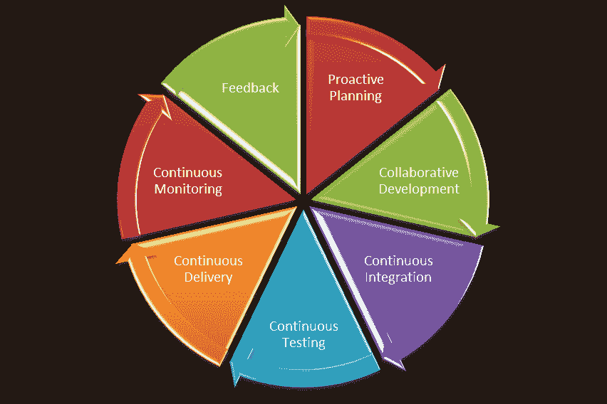
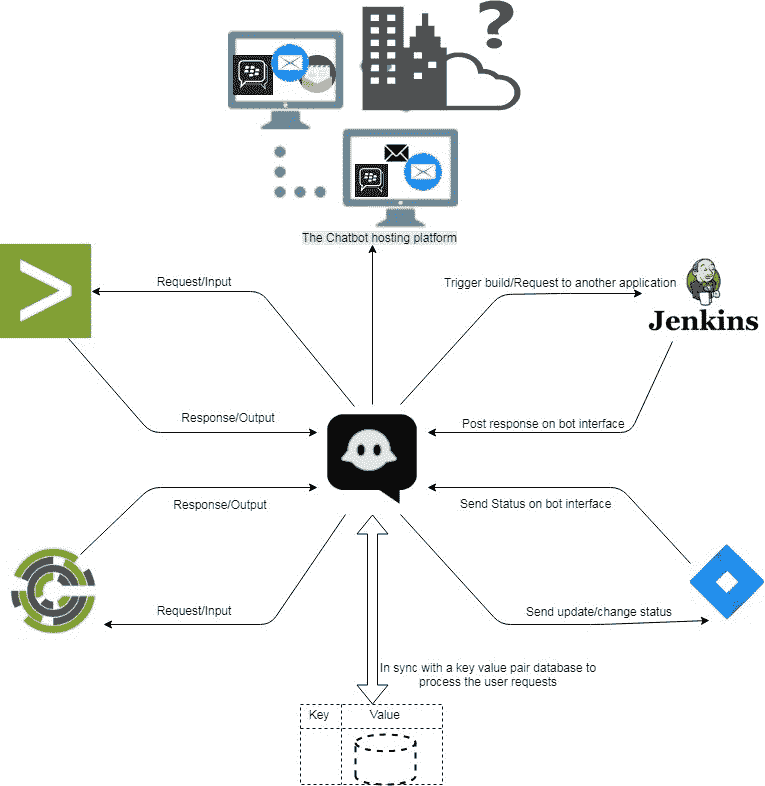

# 机器人在 DevOps 中的作用

> 原文：<https://devops.com/the-role-of-bots-in-devops/>

对于大多数首席信息官来说，开发运维已经从起步阶段发展成为主流关注领域。DevOps 已经成为一个主要焦点，并在过去几年中塑造了软件和基础设施工程和运营的世界。

devo PS 的一些主要趋势包括:

*   DevOps 装配线自动化。
*   来自监控工具的智能、可行的警报。
*   监控和协调基础设施。

## 改善协作

随着 DevOps 采用率的增加，当今的组织在端到端服务交付生命周期中面临着许多挑战。

*   对于具有复杂环境配置的应用程序，创建、设置和部署新环境成本高昂、耗时且容易出错。
*   由于手动干预，跨环境移动/提升代码会带来风险，并可能导致停机。
*   开发团队希望通过编写新代码或增强现有代码来最大化变更，而运营团队则希望最小化变更，以满足关键绩效指标(KPI)和服务水平协议(SLA)的要求。这些目标本质上是对立的，并在开发和运营团队之间形成了一种相互指责的文化。
*   由于流程和工具的差距，组织无法保持开发、测试和生产的同步。手动流程无法弥补一致性方面的差距；因此，生产中断是常见的。

各种协作机制让团队一起工作和学习，以产生更好的结果。下图描绘了 DevOps 的端到端生命周期。跨阶段协作对于企业开发运维转型的成功至关重要。

## 什么是聊天工具和机器人？

ChatOps 是 GitHub 创造的一个术语，用来描述“在对话中使用工具”在一个典型的 CI/CD 管道中，您可以与具有不同功能的多个工具进行交互，例如源代码管理(SCM)、缺陷管理、持续集成、持续部署等等。这些都是独立的工具，但是没有任何东西将它们连接在一起。这就是聊天工具发挥作用的地方。

bot 是协作工具和 DevOps 工具之间的桥梁。该机器人通过协作工具接收来自用户的聊天命令形式的请求，分析该请求并在目标 DevOps 工具上执行一组命令。

ChatOps 和 bot 的主要组件有:

**聊天应用/协作工具:**这是连接各种利益相关者的前端聊天系统，使他们能够在自己和周围的系统之间进行交互。

**bot:**这是 ChatOps 的核心。机器人是协作工具和系统之间的粘合剂。它提供了一个双向的沟通渠道，您可以从系统中获取相关信息，并根据收到的信息采取行动。bot 介于您的协作工具和 DevOps 工具之间，例如 Hubot、Lita、ErrBot 或 AWS Lex。

**目标平台/基础设施:**与目标平台/DevOps 工具的集成是成功实现机器人的关键因素。这些是目标工具和平台，机器人将在其上执行所需的命令。工具集成允许您的 bot 与工具进行通信，并直接从聊天窗口执行操作，如构建、部署、测试、供应和扩展基础架构。

## 机器人在 DevOps 管道中的位置

机器人可以在 CI/CD 渠道的各个阶段成为加速器。以下是在生命周期的每个阶段与各种 DevOps 工具集成的详细信息:

*   前瞻性规划–JIRA
*   需求管理-JIRA
*   持续集成–詹金斯
*   持续部署–负责人，负责人
*   持续监控——Nagios、Grafana、Splunk
*   持续反馈——JIRA

聊天机器人在将不同的团队聚集到一个单一的、持续的聊天室中，以筛选和解决手头的问题方面发挥着重要作用。除了故障诊断和问题分类，机器人还可以用于其他各种日常工作，包括:

*   清理服务器。
*   开始构建和部署工作。
*   旋转服务器日志。
*   监控工具上的车载应用。
*   从 Nagios 或 AppDynamics 等工具收集指标。

## Bot 技术蓝图

为了实现上述目标，我们需要一个支持性的 bot 平台。工具与 bot 的紧密集成确保了实现的质量，并为自动化提供了新的机会。

如图所示，聊天机器人托管在一个聊天工具上，如 [Slack](https://slack.com/lp/three?utm_medium=ppc&utm_source=google&utm_campaign=d_ppc_google_us_en_brand-hv&utm_term=slack&ds_rl=1249094&cvosrc=ppc.google.slack&cvo_campaign=&cvo_crid=257483843270&Matchtype=e&utm_source=google&utm_medium=ppc&c3api=5523,257483843270,slack&gclid=EAIaIQobChMIoayJroee4gIVAqvsCh3alwzmEAAYASAAEgKRHPD_BwE&gclsrc=aw.ds) 。这可以在云平台或现有的聊天/通信应用程序上。该 bot 与一个键-值对参考数据库集成在一起，该数据库根据提供给它的活动或功能提供响应。该键可以是从中检索数据的应用程序的名称，也可以是任何可以减少读取次数的唯一 ID。在响应数据库上执行对应于二级密钥的已定义密钥的查找，并将响应发送回聊天机器人。根据输出的数量，可以定义查询并将其存储在响应数据库中。

## DevOps 机器人:用例

下面是一些机器人使用案例的例子。这包括 DevOps 的完整生命周期:

**主动规划** 在 sprint 规划工具中创建新的用户故事，并将 sprint 分配给团队。更新 sprints 和产品积压。

**构建和持续集成** 执行构建任务并报告构建任务的统计数据。执行每日/每夜的构建，并向相关团队报告构建的状态。

**持续部署** 运行部署作业，跨环境执行部署。发生故障时回滚部署，状态检查，执行部署后操作，如 JVM 重启。

**基础设施供应和配置管理** 开始主厨工作，供应基础设施或供应应用程序环境。启用监视和重新启动服务和服务器。

**持续监控** 提供应用程序统计数据或执行每日数据查找和获取指标。

**持续反馈** 监控应用运行状况并执行分析。

## 关键测量指标

要实现连续交付流程的优化并提高其性能，度量测量是关键。这些指标将有助于根据结果采取某些纠正和预防措施。以下是一些可以衡量的关键度量指标。

**工作量减少** 表示任务的人力/手工工作量的减少，例如触发构建或部署或从监控工具收集指标。

**人为错误减少率** 因人为错误造成的返工所需工作量的减少。

**减少问题分类时间** 表示解决涉及多方且需要进行问题分类的问题所需的时间。

## 结论

DevOps 机器人可以显著提高团队效率，以及团队应对紧急情况的能力。它们节省时间和金钱，构建和使用起来很有趣，并且可以对团队士气产生积极的影响，还可以提高团队的整体生产力。这适用于工程和运营团队。接受数字化的企业正在寻找具有工程思维的合作伙伴，他们知道如何引入具有开源平台和 DevOps 工具链最新知识的协作敏捷团队。

## 联系作者

更多详情请联系 LinkedIn @
[Shriniwas Sathe](https://www.linkedin.com/in/shriniwas-sathe-devops)
[Saswati Mohan ty](https://www.linkedin.com/in/saswati-mohanty-48379447/)上的作者

— [神龛萨特](https://devops.com/author/shriniwas-sathe/)