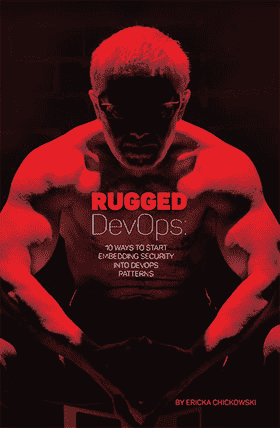

# 您是否正在为坚固的 DevOps 体验嵌入安全性？

> 原文：<https://devops.com/the-rugged-devops-ebook/>

当安全思考者试图思考当今安全架构和流程中的漏洞时，开发运维及持续交付模式对于已经不堪重负的风险管理人员来说似乎是另一个潜在的问题。但是，一旦安全专家们克服了在快速迭代周期内工作的威胁，他们很可能会发现持续交付模型实际上可以为修复当今的安全问题提供一个蓝图。

与运营、开发人员、架构师、QA 和团队的其他成员合作以建立持续交付势头的安全领导者正在帮助他们的组织开发更坚固的开发生命周期，不仅生产更安全的软件，还支持在发现安全问题时更快地修复。

在我们的第一本电子书 ***Rugged DevOps:开始将安全性嵌入 DevOps 模式的 10 种方法*** 中，了解更多关于如何开始走向 Rugged DevOps 心态的信息。在本期特刊中，安全和 DevOps 专家与我们的记者 Ericka Chickowski 分享了一些见解:

*   坏人已经在不断地发布恶意代码。通过在 DevOps 模式内工作，安全性可以更快地做出响应。
*   安全性可以从 DevOps 的智能自动化倾向中学到很多。
*   DevOps 模型确实可以兼容法规遵从性。
*   DevOps 范式的转变可能会给安全专家一个机会，最终将安全性融入到 IT 流程中，而不是作为一种事后想法添加进来。

我们将在本周 RSA 大会的 DevOps Connect 活动上分发这本书的印刷本，以及周二上午在 Jillians 举行的特别坚固的 DevOps 早餐会上分发。但是你不必在 RSA 下载你自己的拷贝。填写下表下载一份。

该电子书由 [Evident.io](http://www.evident.io) 和 [Incapsula](http://www,incapsul.com) 赞助。感谢他们的支持。

尽情享受吧！

### 下载加固的 DevOps 电子书